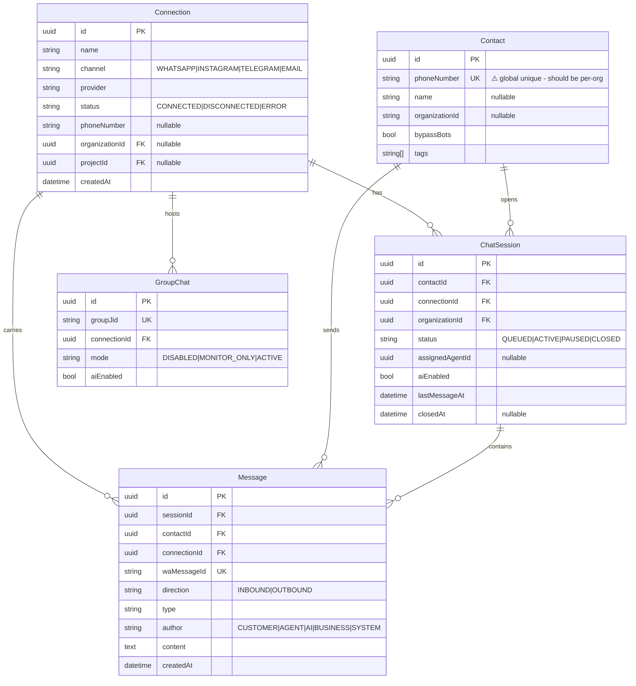

# ERD — Quayer Database Schema

> Updated: 2026-03-14 | Engine: PostgreSQL (Supabase)
> Rendered automatically by GitHub (Mermaid)

---

## Domain 1: Auth & Identity

```mermaid
erDiagram
    Organization {
        uuid id PK
        string name
        string slug UK
        string document UK "nullable"
        string type "pf|pj"
        string billingType "free|basic|pro"
        string geoAlertMode "off|notify|block"
        bool isActive
        datetime createdAt
        datetime updatedAt
    }

    User {
        uuid id PK
        string email UK
        string password "nullable bcrypt"
        string name
        string phone "nullable"
        bool phoneVerified
        string role "admin|user"
        bool isActive
        bool twoFactorEnabled
        bool onboardingCompleted
        string currentOrgId FK "nullable"
        datetime createdAt
        datetime updatedAt
    }

    UserOrganization {
        uuid id PK
        uuid userId FK
        uuid organizationId FK
        string role "master|manager|user"
        uuid customRoleId FK "nullable"
        bool isActive
    }

    CustomRole {
        uuid id PK
        uuid organizationId FK
        string name
        string slug
        json permissions
        bool isSystem
        int priority "3=master 2=manager 1=user"
    }

    Session {
        uuid id PK
        uuid userId FK
        string token UK
        datetime expiresAt
    }

    RefreshToken {
        uuid id PK
        uuid userId FK
        string token UK
        datetime expiresAt
        datetime revokedAt "nullable"
    }

    VerificationCode {
        uuid id PK
        uuid userId FK "nullable"
        string email "stores email OR phone"
        string code
        string type "OTP|MAGIC_LINK|RESET_PASSWORD|EMAIL_VERIFICATION"
        string token "nullable JWT for magic links"
        bool used
        datetime expiresAt
    }

    TempUser {
        uuid id PK
        string email UK
        string name
        string code
        datetime expiresAt
    }

    Invitation {
        uuid id PK
        string email
        string token UK
        string role
        uuid organizationId FK
        uuid invitedById FK
        datetime usedAt "nullable"
        datetime expiresAt
    }

    PasskeyCredential {
        uuid id PK
        uuid userId FK
        string credentialId UK
        bytes publicKey "COSE"
        bigint counter
        string name
        datetime lastUsedAt "nullable"
    }

    PasskeyChallenge {
        uuid id PK
        string challenge UK
        uuid userId FK "nullable"
        string email "nullable"
        string type "registration|authentication"
        datetime expiresAt
    }

    TotpDevice {
        uuid id PK
        uuid userId FK
        string secret "encrypted"
        string name
        bool verified
    }

    RecoveryCode {
        uuid id PK
        uuid userId FK
        string code "bcrypt hash"
        datetime usedAt "nullable"
    }

    DeviceSession {
        uuid id PK
        uuid userId FK
        string deviceName "nullable"
        string ipAddress "nullable"
        string userAgent "nullable"
        string countryCode "nullable"
        datetime lastActiveAt
        bool isRevoked
        datetime revokedAt "nullable"
    }

    IpRule {
        uuid id PK
        string type "ALLOW|BLOCK"
        string ipAddress
        uuid organizationId FK "nullable"
        uuid createdById FK
        bool isActive
        datetime expiresAt "nullable"
    }

    VerifiedDomain {
        uuid id PK
        uuid organizationId FK
        string domain
        string verificationMethod "DNS_TXT|EMAIL"
        datetime verifiedAt "nullable"
        bool autoJoin
    }

    ScimToken {
        uuid id PK
        uuid organizationId FK
        string name
        string tokenHash "bcrypt"
        datetime lastUsedAt "nullable"
        datetime expiresAt "nullable"
        datetime revokedAt "nullable"
    }

    Organization ||--o{ UserOrganization : "has members"
    Organization ||--o{ CustomRole : "owns"
    Organization ||--o{ Invitation : "sends"
    Organization ||--o{ VerifiedDomain : "verifies"
    Organization ||--o{ ScimToken : "has"
    Organization ||--o{ IpRule : "has rules"
    User ||--o{ UserOrganization : "belongs to"
    User ||--o{ Session : "has"
    User ||--o{ RefreshToken : "has"
    User ||--o{ VerificationCode : "has"
    User ||--o{ Invitation : "invites"
    User ||--o{ PasskeyCredential : "registers"
    User ||--o{ TotpDevice : "sets up"
    User ||--o{ RecoveryCode : "owns"
    User ||--o{ DeviceSession : "has"
    User ||--o{ IpRule : "creates"
    UserOrganization }o--|| CustomRole : "assigned"
```

---

## Domain 2: Connections & Messaging

---

## Domain 3: Tokens & Security (summary)

| Table | Key Relation | Purpose |
|-------|-------------|---------|
| `Session` | `userId → User` | Legacy session (JWT-based, may be unused) |
| `RefreshToken` | `userId → User` | JWT rotation — active |
| `VerificationCode` | `userId? → User` | OTP + Magic Links + Email verification |
| `DeviceSession` | `userId → User` | Trusted device tracking |
| `IpRule` | `organizationId? → Org` | Allow/Block IP lists |
| `ApiKey` | `organizationId` | Programmatic API access |
| `ScimToken` | `organizationId → Org` | SCIM 2.0 (Okta / Entra ID) |

---

## Deprecated Tables

> These tables exist in the DB but should NOT be used in new code:

| Table | Replacement | Status |
|-------|-------------|--------|
| `AccessLevel` | `CustomRole` | Orphaned — no User/Org FK |
| `SystemConfig` | `SystemSettings` | Duplicate key-value store |

---

## Migration Timeline

| Date | Migration | Change |
|------|-----------|--------|
| 2025-10-11 | `add_onboarding_and_business_hours` | Onboarding flow |
| 2025-12-25 | `add_autopause_and_group_settings` | AutoPause + Groups |
| 2025-12-26 | `add_session_notes` | SessionNote model |
| 2025-12-26 | `add_quick_replies` | QuickReply model |
| 2026-03-12 | `add_device_sessions_and_ip_rules` | DeviceSession + IpRule (raw SQL) |
| 2026-03-12 | `add_user_phone` | User.phone + phoneVerified (raw SQL) |
| 2026-03-12 | `make_document_optional` | Organization.document nullable |
| 2026-03-13 | `add_geo_alert_and_country_code` | geoAlertMode + countryCode (raw SQL) |
| 2026-03-13 | `add_totp_2fa` | TotpDevice + RecoveryCode |
| 2026-03-13 | `add_custom_roles` | CustomRole + UserOrganization.customRoleId |
| 2026-03-13 | `add_verified_domains` | VerifiedDomain |
| 2026-03-13 | `add_scim_tokens` | ScimToken |
| 2026-03-14 | `make_password_optional` | User.password nullable |
| 2026-03-14 | `add_invitation_org_fk` | FK: Invitation.organizationId → Organization |
