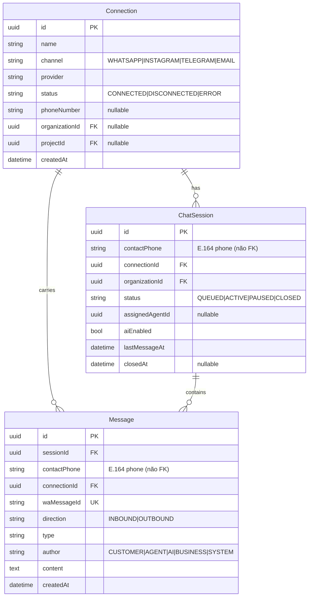
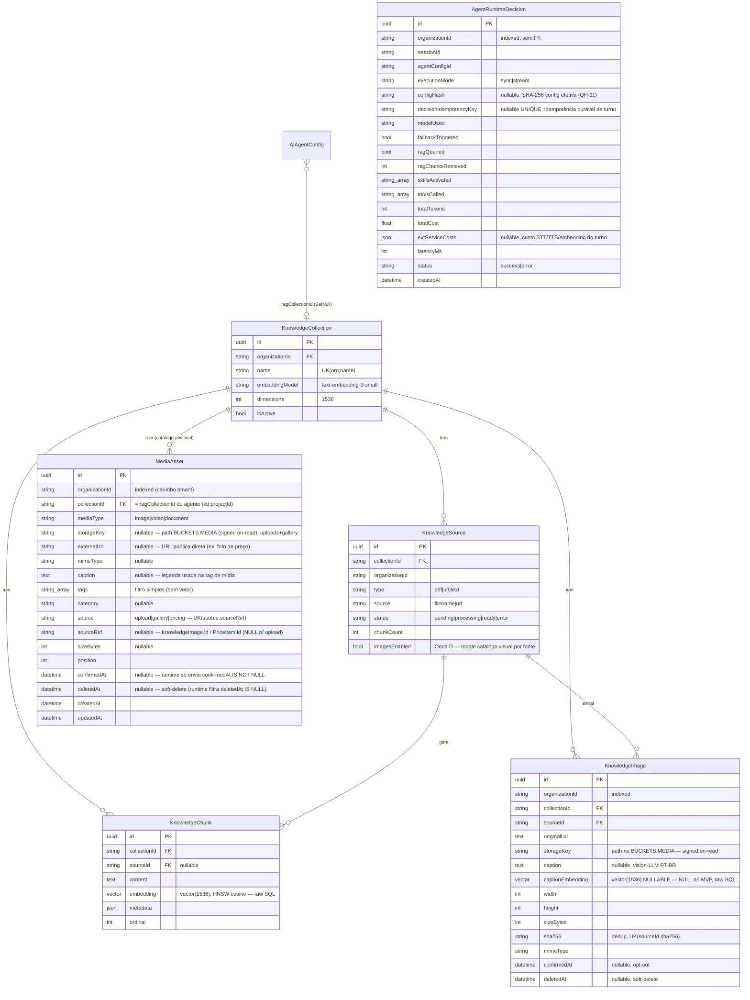
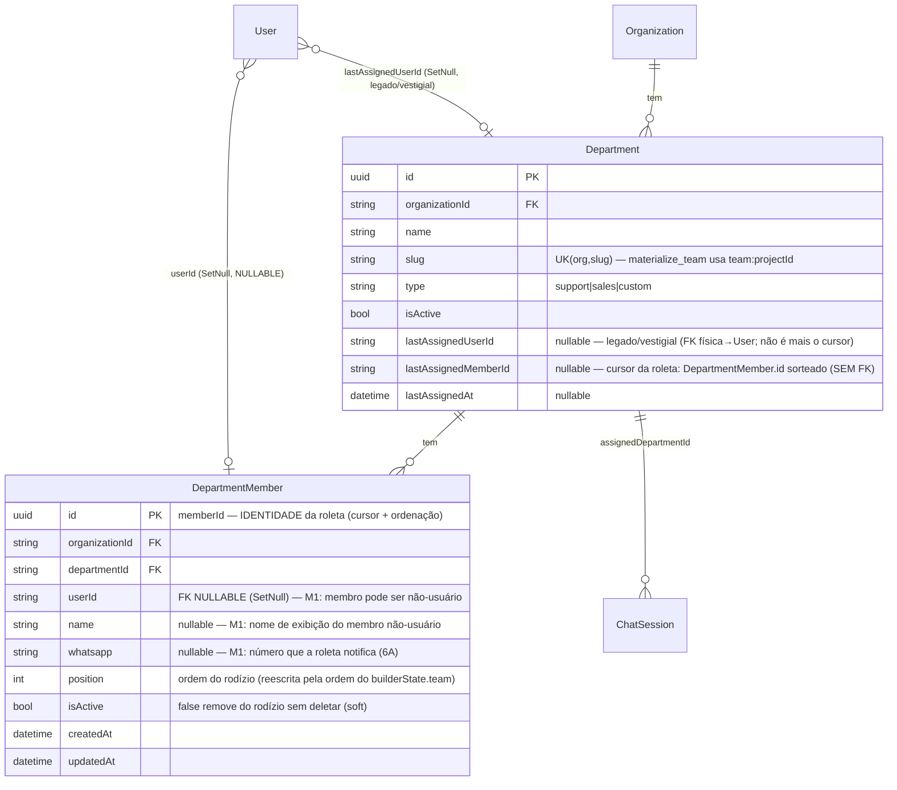

# ERD — Quayer Database Schema

> Updated: 2026-06-11 | Engine: PostgreSQL (Supabase + pgvector 0.8)
> Rendered automatically by GitHub (Mermaid)
>
> **Mudanças desde 2026-03-14:** CRM/Inbox nukados (Abr/13) — `Contact`, `GroupChat`, `KanbanBoard`, `QuickReply`, `SessionNote` e ~15 tabelas removidas; Builder IA adicionado (`BuilderProject` família, Abr/9 + Abr/12); `UserIdentity` para login federado (Mai/10); role normalizado lowercase (Mai/10); `OTP disabled flags` em UserPreferences (Abr/30). `IpRule`, `ScimToken` foram removidos junto com admin surface.
>
> **Jun/04 (Wave Orayon):** RAG/base de conhecimento — `KnowledgeCollection` / `KnowledgeSource` / `KnowledgeChunk` (coluna `embedding vector(1536)` + índice HNSW `vector_cosine_ops`, escrita/leitura via raw SQL); observabilidade `AgentRuntimeDecision` (1 registro por turno, **sem FK** — tabela de log de alta escrita); canais Cloud API/Instagram (colunas novas em `Connection`); `CalendarConnection` (connect-link Google Calendar, refresh_token encriptado em `OrganizationProvider`); `Department` + `DepartmentMember` (roleta/round-robin). Modelos novos abaixo no Domain "RAG & Observability".
>
> **Jun/06 (M1 — roleta 6A):** `department_members` ganhou `userId` NULLABLE (FK SetNull — membro pode ser "nome + WhatsApp", não-usuário) + `name` + `whatsapp`. A saga de deploy materializa o `builderState.team` (Onda A) em Department/DepartmentMember (`materialize_team`) e a roleta — re-chaveada por `memberId` — notifica o atendente sorteado por WhatsApp (decisão 6A) com fallback in-app. Domain dedicado "Roleta / Departamentos" no fim.
>
> **Jun/06 (Fase E — catálogo de mídia):** novo `media_assets` — catálogo de mídia ENVIÁVEL pelo agente (foto/vídeo/PDF; áudio fora). FK→`KnowledgeCollection` (`collectionId = ragCollectionId = kb:projectId`). Origens: `upload` (dono sobe), `gallery` (espelha `KnowledgeImage`), `pricing` (espelha `PriceItem.imageUrl`) — as duas últimas materializadas pelo passo de saga `materialize_media`. A tool de RETRIEVAL `buscar_media` devolve URLs reais ao LLM; o envio é do pipeline outbound (tag de mídia). Modelo no Domain "RAG & Observability".
>
> **Jun/11 (Jornada v2 — funil):** novo `builder_journey_events` — log de eventos repetíveis do funil de progresso do usuário no Builder. **Sem FK** (como `BuilderToolCall.messageId`; tabela de alta escrita, limpeza por retenção): `projectId` + `organizationId` por tenant, `journeyVersion` (1\|2, congelado no evento), `event` (`@db.VarChar(60)`, vocabulário fechado em TS — `journey-events.ts`), `metadata` Json tipado sem campos livres de PII (NFR-02/LGPD). Índices `(organizationId,event,createdAt)` (funil por org) + `(projectId,createdAt)` (linha do tempo por projeto). Modelo no Domain "Builder IA".

---

## Domain 1: Auth & Identity

```mermaid
erDiagram
    Organization {
        uuid id PK
        string name
        string slug UK
        string document UK "nullable"
        string type "pf|pj"
        string billingType "free|basic|pro"
        string geoAlertMode "off|notify|block"
        bool isActive
        datetime createdAt
        datetime updatedAt
    }

    User {
        uuid id PK
        string email UK
        string password "nullable bcrypt"
        string name
        string phone "nullable"
        bool phoneVerified
        string role "admin|user"
        bool isActive
        bool twoFactorEnabled
        bool onboardingCompleted
        string currentOrgId FK "nullable"
        datetime createdAt
        datetime updatedAt
    }

    UserOrganization {
        uuid id PK
        uuid userId FK
        uuid organizationId FK
        string role "master|manager|user"
        uuid customRoleId FK "nullable"
        bool isActive
    }

    CustomRole {
        uuid id PK
        uuid organizationId FK
        string name
        string slug
        json permissions
        bool isSystem
        int priority "3=master 2=manager 1=user"
    }

    Session {
        uuid id PK
        uuid userId FK
        string token UK
        datetime expiresAt
    }

    RefreshToken {
        uuid id PK
        uuid userId FK
        string token UK
        datetime expiresAt
        datetime revokedAt "nullable"
    }

    VerificationCode {
        uuid id PK
        uuid userId FK "nullable"
        string email "stores email OR phone"
        string code
        string type "OTP|MAGIC_LINK|RESET_PASSWORD|EMAIL_VERIFICATION"
        string token "nullable JWT for magic links"
        bool used
        datetime expiresAt
    }

    TempUser {
        uuid id PK
        string email UK
        string name
        string code
        datetime expiresAt
    }

    Invitation {
        uuid id PK
        string email
        string token UK
        string role
        uuid organizationId FK
        uuid invitedById FK
        datetime usedAt "nullable"
        datetime expiresAt
    }

    PasskeyCredential {
        uuid id PK
        uuid userId FK
        string credentialId UK
        bytes publicKey "COSE"
        bigint counter
        string name
        datetime lastUsedAt "nullable"
    }

    PasskeyChallenge {
        uuid id PK
        string challenge UK
        uuid userId FK "nullable"
        string email "nullable"
        string type "registration|authentication"
        datetime expiresAt
    }

    TotpDevice {
        uuid id PK
        uuid userId FK
        string secret "encrypted"
        string name
        bool verified
    }

    RecoveryCode {
        uuid id PK
        uuid userId FK
        string code "bcrypt hash"
        datetime usedAt "nullable"
    }

    DeviceSession {
        uuid id PK
        uuid userId FK
        string deviceName "nullable"
        string ipAddress "nullable"
        string userAgent "nullable"
        string countryCode "nullable"
        datetime lastActiveAt
        bool isRevoked
        datetime revokedAt "nullable"
    }

    VerifiedDomain {
        uuid id PK
        uuid organizationId FK
        string domain
        string verificationMethod "DNS_TXT|EMAIL"
        datetime verifiedAt "nullable"
        bool autoJoin
    }

    UserIdentity {
        uuid id PK
        uuid userId FK
        string provider "google|whatsapp"
        string providerUserId "google sub or E.164 phone"
        string identifier "display label"
        datetime connectedAt
        datetime lastUsedAt
    }

    UserPreferences {
        uuid id PK
        uuid userId FK UK
        json messageSignature
        bool aiSuggestionsEnabled
        bool otpEmailDisabled
        bool otpPhoneDisabled
    }

    Organization ||--o{ UserOrganization : "has members"
    Organization ||--o{ CustomRole : "owns"
    Organization ||--o{ Invitation : "sends"
    Organization ||--o{ VerifiedDomain : "verifies"
    User ||--o{ UserOrganization : "belongs to"
    User ||--o{ Session : "has"
    User ||--o{ RefreshToken : "has"
    User ||--o{ VerificationCode : "has"
    User ||--o{ Invitation : "invites"
    User ||--o{ PasskeyCredential : "registers"
    User ||--o{ TotpDevice : "sets up"
    User ||--o{ RecoveryCode : "owns"
    User ||--o{ DeviceSession : "has"
    User ||--o{ UserIdentity : "federated logins"
    User ||--|| UserPreferences : "has"
    UserOrganization }o--|| CustomRole : "assigned"
```

---

## Domain 2: Connections & Messaging

> **Mudança Abr/13:** `Contact`, `GroupChat`, `GroupParticipant`, `GroupMessage` removidos. `ChatSession.contactId` e `Message.contactId` foram trocados por `contactPhone: String` (sem FK). CRM nukado junto.

```mermaid
erDiagram
    Connection {
        uuid id PK
        string name
        string channel "WHATSAPP|INSTAGRAM|TELEGRAM|EMAIL"
        string provider
        string status "CONNECTED|DISCONNECTED|ERROR"
        string phoneNumber "nullable"
        uuid organizationId FK "nullable"
        uuid projectId FK "nullable"
        datetime createdAt
    }

    ChatSession {
        uuid id PK
        string contactPhone "E.164 phone (não FK)"
        uuid connectionId FK
        uuid organizationId FK
        string status "QUEUED|ACTIVE|PAUSED|CLOSED"
        uuid assignedAgentId "nullable"
        bool aiEnabled
        datetime lastMessageAt
        datetime closedAt "nullable"
    }

    Message {
        uuid id PK
        uuid sessionId FK
        string contactPhone "E.164 phone (não FK)"
        uuid connectionId FK
        string waMessageId UK
        string direction "INBOUND|OUTBOUND"
        string type
        string author "CUSTOMER|AGENT|AI|BUSINESS|SYSTEM"
        text content
        datetime createdAt
    }

    Connection ||--o{ ChatSession : "has"
    Connection ||--o{ Message : "carries"
    ChatSession ||--o{ Message : "contains"
```

---

## Domain 3: Builder IA (Design-time)

> **Adicionado Abr/9 + Abr/12.** Produto principal — meta-agente para criar agentes WhatsApp. Ver `src/server/ai-module/builder/`.

```mermaid
erDiagram
    BuilderProject {
        uuid id PK
        uuid organizationId FK
        uuid userId FK
        string type "ai_agent (futuro: wa_campaign, ig_automation, etc)"
        string name
        string status "draft|publishing|published|archived"
        uuid aiAgentId FK "nullable 1:1 com AIAgentConfig"
        json metadata
        datetime archivedAt "nullable"
    }

    BuilderProjectConversation {
        uuid id PK
        uuid projectId FK UK "1:1"
        json contextSnapshot
        datetime updatedAt
    }

    BuilderProjectMessage {
        uuid id PK
        uuid conversationId FK
        string role "user|assistant|tool|system_banner"
        text content
        json toolCalls
        json toolResults
        json metadata "tokens, model, latency"
    }

    BuilderPromptVersion {
        uuid id PK
        uuid projectId FK
        int version
        text systemPrompt
        json tools
        bool isCurrent
        datetime createdAt
    }

    BuilderDeployment {
        uuid id PK
        uuid projectId FK
        uuid aiAgentId
        uuid promptVersionId FK
        string instanceId "nullable WhatsApp UAZ instance"
        string connectionId "nullable"
        string status "pending|publishing|published|failed|rolled_back"
        string failureStep "publish|create_instance|attach"
        bool rolledBack
        datetime startedAt
        datetime completedAt "nullable"
    }

    BuilderToolCall {
        uuid id PK
        uuid messageId FK
        string toolName
        json input
        json output
        string status "pending|running|success|error"
        int latencyMs
    }

    BuilderContextSnapshot {
        uuid id PK
        uuid projectId FK
        json snapshot "compressed context for token economy"
        datetime createdAt
    }

    BuilderJourneyEvent {
        uuid id PK
        string organizationId "indexed, sem FK"
        string projectId "BuilderProject.id, sem FK"
        int journeyVersion "1|2 — congelado no evento"
        string event "VarChar(60), vocabulário fechado TS (journey-events.ts)"
        json metadata "nullable, tipado sem PII (NFR-02/LGPD)"
        datetime createdAt
    }

    BuilderProject ||--|| BuilderProjectConversation : "has"
    BuilderProjectConversation ||--o{ BuilderProjectMessage : "contains"
    BuilderProject ||--o{ BuilderPromptVersion : "versions"
    BuilderProject ||--o{ BuilderDeployment : "deploys"
    BuilderProject ||--o{ BuilderContextSnapshot : "snapshots"
    BuilderProjectMessage ||--o{ BuilderToolCall : "logs"
```

> `BuilderJourneyEvent` (`builder_journey_events`, Jornada v2) é **tabela de log SEM FK** (eventos repetíveis do funil de progresso do usuário no Builder; alta escrita, desacoplada, limpeza por retenção — mesmo padrão de `AgentRuntimeDecision`). `projectId` referencia `BuilderProject.id` por convenção (não há constraint física, igual a `BuilderToolCall.messageId`); toda query filtra por `organizationId` (NFR-01). `journeyVersion` (1\|2) é congelado no evento; `event` usa vocabulário fechado em TS (`journey-events.ts`); `metadata` é Json tipado sem campos livres de PII (NFR-02/LGPD). Dois índices: `(organizationId,event,createdAt)` para o funil por org e `(projectId,createdAt)` para a linha do tempo por projeto.

---

## Domain 4: Tokens & Security (summary)

| Table | Key Relation | Purpose |
|-------|-------------|---------|
| `Session` | `userId → User` | Legacy session (JWT-based, may be unused) |
| `RefreshToken` | `userId → User` | JWT rotation — active |
| `VerificationCode` | `userId? → User` | OTP + Magic Links + Email verification |
| `DeviceSession` | `userId → User` | Trusted device tracking |
| `UserIdentity` | `userId → User` | Federated logins (Google, WhatsApp phone) |
| `ApiKey` | `organizationId` | Programmatic API access |

> **Removidos com admin nuke (Mai/2026):** `IpRule`, `ScimToken`. Endpoints API correspondentes também eliminados.

---

## Migration Timeline

| Date | Migration | Change |
|------|-----------|--------|
| 2025-10-11 | `add_onboarding_and_business_hours` | Onboarding flow (página depois removida em Mai/10) |
| 2025-12-25 | `add_autopause_and_group_settings` | AutoPause + Groups |
| 2025-12-26 | `add_session_notes` | SessionNote (depois removido em Abr/13) |
| 2025-12-26 | `add_quick_replies` | QuickReply (depois removido em Abr/13) |
| 2026-03-13 | `add_totp_2fa` | TotpDevice + RecoveryCode |
| 2026-03-13 | `add_custom_roles` | CustomRole + UserOrganization.customRoleId |
| 2026-03-13 | `add_verified_domains` | VerifiedDomain |
| 2026-03-13 | `add_scim_tokens` | ScimToken (depois removido com admin nuke) |
| 2026-03-14 | `make_password_optional` | User.password nullable |
| 2026-03-14 | `add_invitation_org_fk` | FK: Invitation.organizationId → Organization |
| **2026-04-09** | **`add_builder_projects`** | **Builder IA: BuilderProject + conversation + messages + prompt versions + deployments + tool calls + context snapshots** |
| 2026-04-12 | `add_boards_table` | Kanban boards (depois removido em Abr/13) |
| **2026-04-13** | **`remove_crm_and_inbox`** | **Pivot: CRM (Contact, Lead, etc) e Inbox (GroupChat, QuickReply, SessionNote) removidos. ChatSession.contactId → contactPhone string.** |
| 2026-04-30 | `add_otp_disabled_flags` | UserPreferences.otpEmailDisabled + otpPhoneDisabled |
| 2026-05-10 | `normalize_role_lowercase` | UPDATE User.role para lowercase (fix UserRole enum case) |
| **2026-05-10** | **`add_user_identities`** | **UserIdentity para login federado (Google, WhatsApp) — usado em `/conta/linked-accounts`** |
| 2026-05-12 | `add_agent_deployments` | AgentDeployment (vínculo agente↔Connection) |
| **2026-06-03** | **`add_channel_credentials`** | **Connection: + cloudApiVerifyToken + colunas Instagram (igAccountId/igPageAccessToken/igAppSecret/igVerifyToken) — Wave 2 (3 canais)** |
| **2026-06-03** | **`add_department_round_robin`** | **Department estendido (lastAssignedUserId/At + FK→Organization) + novo `department_members` + ChatSession FKs assignedAgent/assignedCustomer — Wave 4a (roleta/departamentos)** |
| **2026-06-03** | **`add_calendar_connections`** | **Novo `calendar_connections` + enum CalendarConnectionStatus (estado do link público de conexão do Google Calendar; refresh_token vai no OrganizationProvider) — Wave 4b** |
| **2026-06-03** | **`add_knowledge_rag`** | **`CREATE EXTENSION vector` + `knowledge_collections`/`knowledge_sources`/`knowledge_chunks` (coluna `embedding vector(1536)` + índice HNSW) + FK reativada `AIAgentConfig.ragCollectionId` — Wave RAG** |
| **2026-06-04** | **`add_agent_runtime_decisions`** | **Novo `agent_runtime_decisions` (1 registro/turno: modelo/fallback, RAG, skills, tools, tokens, custo, latência, status). Sem FK (log de alta escrita) — Wave Orayon** |
| **2026-06-04** | **`add_pricing_catalog`** | **`price_lists` + `price_items` (catálogo DB-first da tool get_pricing) + `AIAgentConfig.priceListId` FK. Google Sheets sync = fase 2 — Wave Orayon** |
| **2026-06-05** | **`add_config_hash`** | **`agent_runtime_decisions`: + `config_hash TEXT` nullable (SHA-256 da config efetiva do agente por turno — QH-11)** |
| **2026-06-06** | **`add_decision_idempotency_key`** | **`agent_runtime_decisions`: + `decisionIdempotencyKey TEXT` nullable + índice ÚNICO (sha256 sessionId:inboundMessageId:configHash — idempotência durável de turno; claim 'pending' pré-LLM short-circuita dispatch duplicado)** |
| **2026-06-06** | **`add_ext_service_costs`** | **`agent_runtime_decisions`: + `extServiceCosts JSONB` nullable (custo de serviços externos do turno — STT/TTS/embedding, ex.: `{"stt":0.0086}` — separado do `totalCost` do LLM)** |
| **2026-06-06** | **`add_knowledge_images`** | **Novo `knowledge_images` (catálogo visual extraído das fontes — Onda D/G2: `storageKey` content-addressed, `caption` vision-LLM, `captionEmbedding vector(1536)` NULLABLE/NULL no MVP via raw, `@@unique(sourceId,sha256)` dedup, `confirmedAt`/`deletedAt` curadoria) + `knowledge_sources.imagesEnabled Boolean @default(true)` (toggle por fonte) — Onda D1** |
| **2026-06-06** | **`pricing_runtime_fields`** | **price_lists += `disclosureStyle TEXT NOT NULL DEFAULT 'exact'` (como o agente FALA o preço: exact/from/average/none) + `minTicketCents INTEGER?` (ticket mínimo). price_items += `priceMaxCents INTEGER?` (teto da faixa quando average) + `imageUrl TEXT?` (foto do catálogo visual). Materialização M2: a saga de deploy grava o que o card de preço (Onda B) coletou; get_pricing formata por disclosureStyle. Aditivo, sem data-loss.** |
| **2026-06-06** | **`20260606040000_department_member_whatsapp`** | **department_members: `userId` agora NULLABLE (FK→User SetNull — membro pode ser "nome + WhatsApp", não-usuário) + `name TEXT?` (nome de exibição do não-usuário) + `whatsapp TEXT?` (número da roleta). Materialização M1: a saga de deploy (`materialize_team`) espelha o `builderState.team` (Onda A) em Department/DepartmentMember; a ROLETA (round-robin) re-chaveada por `memberId` notifica o atendente sorteado por WhatsApp (decisão 6A) com fallback in-app. Aditivo, sem data-loss.** |
| **2026-06-06** | **`20260606050000_add_media_assets`** | **Novo `media_assets` (Fase E — catálogo de mídia ENVIÁVEL pelo agente: foto/vídeo/PDF, NÃO áudio). FK→`knowledge_collections` (NOT NULL, Cascade); `source ∈ {upload,gallery,pricing}` com `@@unique(source,sourceRef)` (upload tem sourceRef NULL → N permitido); `storageKey?` (assina on-read em BUCKETS.MEDIA) OU `externalUrl?` (direto); `confirmedAt`/`deletedAt` (runtime só envia confirmedAt IS NOT NULL AND deletedAt IS NULL). Materialização Fase E: `materialize_media` espelha `KnowledgeImage` confirmadas (gallery) + `PriceItem.imageUrl` (pricing); upload via `POST /api/v1/builder/media/upload`. Tool RETRIEVAL `buscar_media` devolve URLs reais ao LLM (NUNCA envia — outbound envia via tag). Aditivo, sem data-loss.** |
| **2026-06-06** | **`add_ai_agent_config_department_id`** | **`AIAgentConfig.departmentId TEXT?` (nullable) — vínculo ESTRUTURADO agente↔departamento. A saga `materialize_team` grava o `Department.id` da roleta nesta coluna (fonte AUTORITATIVA do id); o `dispatch_to_agent` lê via `ctx.agentDepartmentId` como FALLBACK quando o LLM não passa um departmentId — robusto a qual tabela de prompt vence (o bloco ROLETA no `systemPrompt` pode ser sombreado por um AgentPromptVersion ACTIVE). Aditivo, sem data-loss.** |
| **2026-06-07** | **`20260606070000_migrate_handoff_enabled_tools`** | **DATA-only (sem DDL): backfill de `transfer_to_human` no `AIAgentConfig.enabledTools` de agentes que tinham os aliases `notify_team`/`dispatch_to_agent` — prepara a remoção dos aliases (consolidação do handoff). Idempotente (`array_append` + WHERE), não-destrutivo.** |
| **2026-06-07** | **`20260606080000_drop_handoff_aliases`** | **DATA-only: remove os nomes mortos `notify_team`/`dispatch_to_agent` do `enabledTools` (após os tools saírem do código; capacidades agora via `transfer_to_human` routing queue/department/self). `array_remove`, idempotente. NÃO toca a AÇÃO de qualificação `notify_team` (builderState).** |
| **2026-06-07** | **`20260606090000_add_agent_business_hours`** | **`AIAgentConfig.businessHours JSONB?` — horário comercial materializado do `builderState` (card business_hours) pela saga `materialize_team`. O `transfer_to_human` usa `computeBusinessState` p/ devolver `atendimento` (status + `orientacao_resposta`) → o agente diz ao lead QUANDO a equipe responde. Aditivo, nullable, sem data-loss.** |
| **2026-06-07** | **`20260606100000_department_member_connection`** | **`department_members.connectionId TEXT?` — F0 do épico QR/warm-transfer: o membro pode ter uma instância WhatsApp PRÓPRIA (pareada por QR). Quando setado, o handoff `routing:department` faz WARM TRANSFER: a conexão do membro manda a 1ª mensagem ao cliente (atende no app dele). Scalar SEM FK (espelha `lastAssignedMemberId`), resolvido por findUnique, fail-open. Aditivo, nullable, sem data-loss. Pareamento (UI no Builder) = próximo passo.** |
| **2026-06-09** | **`20260609000000_department_warm_transfer_opening`** | **`Department.warmTransferOpeningMessage TEXT?` — B1b do warm transfer: a mensagem de abertura passou a ser EDITÁVEL no card `handoff_pairing` (`builderState.team.openingMessage`). `materialize_team` a grava no Department (clear-on-empty); o `dispatch_to_agent` lê fail-open e o `warm-transfer` interpola `{nome}` antes de enviar ao cliente pela conexão do membro. NULL = texto default de `warm-transfer.ts`. Tabela `Department` é PascalCase (sem @@map). Aditivo, nullable, sem data-loss.** |
| **2026-06-11** | **`add_builder_journey_events`** | **Jornada v2 (Onda 0): novo `builder_journey_events` — log de eventos repetíveis do funil de progresso do usuário no Builder. SEM FK (alta escrita, retenção): `projectId` + `organizationId` (tenant), `journeyVersion INT` (1\|2 congelado), `event VARCHAR(60)` (vocabulário fechado em `journey-events.ts`), `metadata JSONB?` (tipado sem PII — NFR-02/LGPD). Índices `(organizationId,event,createdAt)` (funil) + `(projectId,createdAt)` (timeline). Aditivo, sem data-loss.** |

> Nota: o **Identity Card** (Wave 4.5) NÃO tem migration — vive em `BuilderProject.metadata.identityCard` (Json) + liga os 4 campos já existentes de `AIAgentConfig` (personality/agentTarget/agentBehavior/agentAvatar).

---

## Domain: RAG & Observability (Wave Orayon)

```mermaid
erDiagram
    KnowledgeCollection ||--o{ KnowledgeSource : "tem"
    KnowledgeCollection ||--o{ KnowledgeChunk : "tem"
    KnowledgeCollection ||--o{ KnowledgeImage : "tem"
    KnowledgeCollection ||--o{ MediaAsset : "tem (catálogo enviável)"
    KnowledgeSource ||--o{ KnowledgeChunk : "gera"
    KnowledgeSource ||--o{ KnowledgeImage : "extrai"
    AIAgentConfig }o--o| KnowledgeCollection : "ragCollectionId (SetNull)"

    KnowledgeCollection {
        uuid id PK
        string organizationId FK
        string name "UK(org,name)"
        string embeddingModel "text-embedding-3-small"
        int dimensions "1536"
        bool isActive
    }
    KnowledgeSource {
        uuid id PK
        string collectionId FK
        string organizationId
        string type "pdf|url|text"
        string source "filename|url"
        string status "pending|processing|ready|error"
        int chunkCount
        bool imagesEnabled "Onda D — toggle catálogo visual por fonte"
    }
    KnowledgeChunk {
        uuid id PK
        string collectionId FK
        string sourceId FK "nullable"
        text content
        vector embedding "vector(1536), HNSW cosine — raw SQL"
        json metadata
        int ordinal
    }
    KnowledgeImage {
        uuid id PK
        string organizationId "indexed"
        string collectionId FK
        string sourceId FK
        text originalUrl
        string storageKey "path no BUCKETS.MEDIA — signed on-read"
        text caption "nullable, vision-LLM PT-BR"
        vector captionEmbedding "vector(1536) NULLABLE — NULL no MVP, raw SQL"
        int width
        int height
        int sizeBytes
        string sha256 "dedup, UK(sourceId,sha256)"
        string mimeType
        datetime confirmedAt "nullable, opt-out"
        datetime deletedAt "nullable, soft-delete"
    }
    MediaAsset {
        uuid id PK
        string organizationId "indexed (carimbo tenant)"
        string collectionId FK "= ragCollectionId do agente (kb:projectId)"
        string mediaType "image|video|document"
        string storageKey "nullable — path BUCKETS.MEDIA (signed on-read), uploads+gallery"
        string externalUrl "nullable — URL pública direta (ex: foto de preço)"
        string mimeType "nullable"
        text caption "nullable — legenda usada na tag de mídia"
        string_array tags "filtro simples (sem vetor)"
        string category "nullable"
        string source "upload|gallery|pricing — UK(source,sourceRef)"
        string sourceRef "nullable — KnowledgeImage.id / PriceItem.id (NULL p/ upload)"
        int sizeBytes "nullable"
        int position
        datetime confirmedAt "nullable — runtime só envia confirmedAt IS NOT NULL"
        datetime deletedAt "nullable — soft-delete (runtime filtra deletedAt IS NULL)"
        datetime createdAt
        datetime updatedAt
    }
    AgentRuntimeDecision {
        uuid id PK
        string organizationId "indexed, sem FK"
        string sessionId
        string agentConfigId
        string executionMode "sync|stream"
        string configHash "nullable, SHA-256 config efetiva (QH-11)"
        string decisionIdempotencyKey "nullable UNIQUE, idempotência durável de turno"
        string modelUsed
        bool fallbackTriggered
        bool ragQueried
        int ragChunksRetrieved
        string_array skillsActivated
        string_array toolsCalled
        int totalTokens
        float totalCost
        json extServiceCosts "nullable, custo STT/TTS/embedding do turno"
        int latencyMs
        string status "success|error"
        datetime createdAt
    }
```

> `AgentRuntimeDecision` é **tabela de log sem FK** (desacoplada, alta escrita; limpeza por retenção). `KnowledgeChunk.embedding` nunca é lida/escrita via Prisma tipado — sempre raw SQL (`::vector`). `KnowledgeImage.captionEmbedding` segue a MESMA regra do `KnowledgeChunk.embedding` (sempre raw `::vector`); no MVP da Onda D fica **NULL** (não embeda — popula só na fase E de runtime). O resto de `KnowledgeImage` é CRUD tipado normal (`database.knowledgeImage`); persiste-se o `storageKey` (path content-addressed `knowledge/{org}/{sourceId}/{sha256}.{ext}` no BUCKETS.MEDIA), **nunca** a signed URL (assina on-read).
>
> `MediaAsset` (`media_assets`, Fase E) é o **catálogo de mídia ENVIÁVEL pelo agente** (foto/vídeo/PDF — NÃO áudio, que é TTS dinâmico no outbound). FK → `KnowledgeCollection` (NOT NULL, Cascade): `collectionId = ragCollectionId` do agente (`kb:projectId`). Três `source`s: `upload` (dono sobe via `POST /api/v1/builder/media/upload`, `sourceRef` NULL), `gallery` (espelha `KnowledgeImage` confirmadas) e `pricing` (espelha `PriceItem.imageUrl`); estes dois últimos são materializados pelo passo de saga `materialize_media` (upsert idempotente por `@@unique(source,sourceRef)` + soft-deactivate reconciliado; `upload` nunca é tocado). `storageKey` assina on-read (BUCKETS.MEDIA); `externalUrl` usa direto — **nunca** persiste signed URL. O runtime só envia `confirmedAt IS NOT NULL AND deletedAt IS NULL`; a tool de RETRIEVAL `buscar_media` devolve `{ url, mediaType, caption }` ao LLM (NUNCA envia — quem envia é o pipeline outbound via tag).

---

## Domain: Roleta / Departamentos (round-robin + envio 6A)

```mermaid
erDiagram
    Organization ||--o{ Department : "tem"
    Department ||--o{ DepartmentMember : "tem"
    User }o--o| DepartmentMember : "userId (SetNull, NULLABLE)"
    User }o--o| Department : "lastAssignedUserId (SetNull, legado/vestigial)"
    Department ||--o{ ChatSession : "assignedDepartmentId"

    Department {
        uuid id PK
        string organizationId FK
        string name
        string slug "UK(org,slug) — materialize_team usa team:projectId"
        string type "support|sales|custom"
        bool isActive
        string lastAssignedUserId "nullable — legado/vestigial (FK física→User; não é mais o cursor)"
        string lastAssignedMemberId "nullable — cursor da roleta: DepartmentMember.id sorteado (SEM FK)"
        datetime lastAssignedAt "nullable"
    }
    DepartmentMember {
        uuid id PK "memberId — IDENTIDADE da roleta (cursor + ordenação)"
        string organizationId FK
        string departmentId FK
        string userId "FK NULLABLE (SetNull) — M1: membro pode ser não-usuário"
        string name "nullable — M1: nome de exibição do membro não-usuário"
        string whatsapp "nullable — M1: número que a roleta notifica (6A)"
        int position "ordem do rodízio (reescrita pela ordem do builderState.team)"
        bool isActive "false remove do rodízio sem deletar (soft)"
        datetime createdAt
        datetime updatedAt
    }
```

> **Roleta 6A (M1):** o passo `materialize_team` da saga de deploy espelha o `builderState.team` (Onda A, card team_structure) em `Department`/`DepartmentMember` — upsert do Department por `slug = team:${projectId}` (org-scoped, determinístico) + reconciliação dos membros por IDENTIDADE 3-níveis (`userId` > `whatsapp` normalizado > `nome`), idempotente, NUNCA hard-delete (membro que sai vira `isActive=false`). O vínculo agente↔departamento é ESTRUTURADO na coluna `AIAgentConfig.departmentId` (fonte autoritativa, lida pelo `dispatch_to_agent` via `ctx.agentDepartmentId` como fallback); o bloco no `AIAgentConfig.systemPrompt` (entre `<!--ROLETA:start-->`/`<!--ROLETA:end-->`) é um HINT redundante (ensina o LLM o nome do dept + que pode dispatchar) — robusto a qual prompt vence (o bloco pode ser sombreado por um `AgentPromptVersion` ACTIVE).
>
> **Re-key por `memberId`:** como `userId` virou NULLABLE (membro "nome + WhatsApp"), a roleta NÃO pode mais chavear por `userId` (vários NULL colidem). A identidade/cursor/ordenação passou a ser `DepartmentMember.id` (`memberId`, sempre presente). O cursor é persistido na coluna NOVA `Department.lastAssignedMemberId` (`String?`, **SEM FK**) — NÃO em `lastAssignedUserId`, que tem FK física→`User(id)` e rejeitaria um `memberId` via SQL raw (essa coluna fica vestigial).
>
> **Envio 6A:** ao sortear o próximo membro ATIVO, se ele tiver `whatsapp` o runtime ENVIA a notificação por WhatsApp (uazapi-sender `sendText`), com **rate-limit dedicado** (`ratelimit:roulette-notify`, 10/min por org+atendente, fail-open) e **fallback in-app** (a `Notification` é o piso de auditoria — sempre criada; quando o membro não tem userId, vira org-wide). O envio é **fail-safe total**: NUNCA derruba o turno do agente (best-effort, só auditoria em `customFields.handoff.whatsappNotified`).
