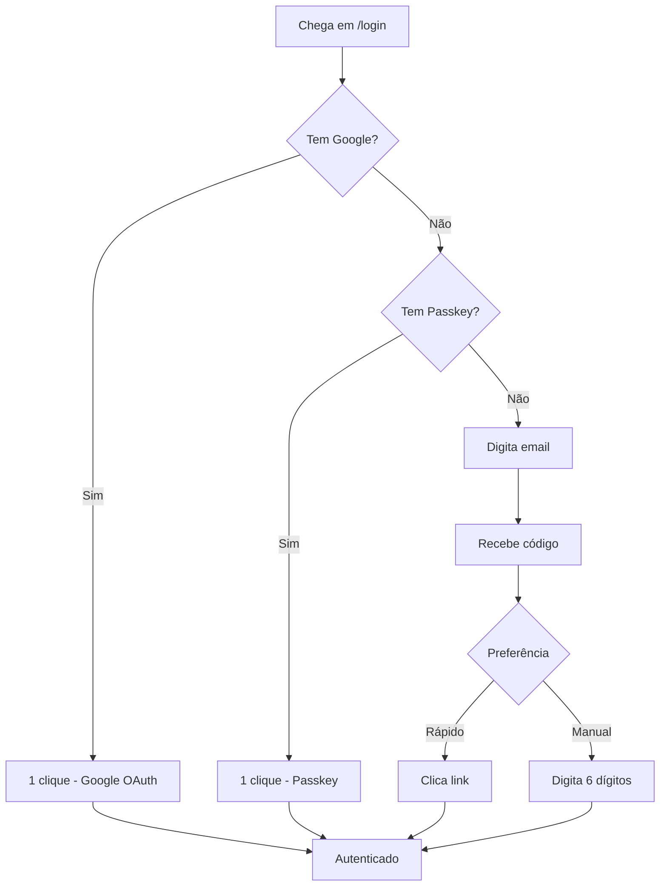
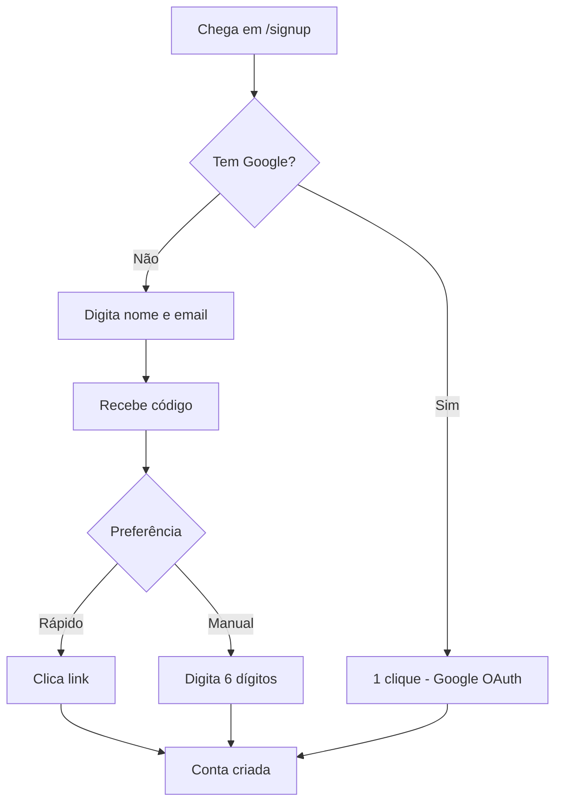

# 🎨 Análise UX/UI - Fluxo de Autenticação

**Data:** 06/10/2025
**Autor:** Lia AI
**Escopo:** Análise completa de UX/UI das telas de login e cadastro

---

## 📊 Resumo Executivo

### ✅ Pontos Fortes
- Layout limpo e minimalista
- Hierarquia visual clara
- Feedback visual adequado (alerts, loading states)
- Consistência de espaçamento em InputOTP
- Autofocus bem implementado

### ⚠️ Áreas de Melhoria Identificadas
1. **Hierarquia de Ações**: Ordem dos métodos de autenticação inconsistente
2. **Espaçamento**: Falta de breathing room em alguns elementos
3. **Microcopy**: Mensagens poderiam ser mais humanas e claras
4. **Accessibility**: Faltam algumas ARIA labels e landmarks
5. **Loading States**: Desabilitação de inputs durante loading não é clara

---

## 🔍 Análise Detalhada por Tela

### 1. Login Form (`login-form-final.tsx`)

#### 🎯 Hierarquia de Ações
**Problema:** Ordem confusa das opções de login
```
Atual:
1. Email (campo + botão "Continuar com Email")
2. Separador "Ou"
3. Google OAuth
4. Passkey

Recomendado (seguindo padrões do mercado):
1. Google OAuth (mais rápido, sem senha)
2. Passkey (futuro, sem senha)
3. Separador "Ou"
4. Email/OTP (tradicional)
```

**Justificativa:**
- Google OAuth é o método mais rápido (1 clique)
- Passwordless first (tendência do mercado)
- Email/OTP como fallback seguro

#### 📏 Espaçamento
**Problemas identificados:**
- Gap entre email input e botão: Adequado ✅
- Gap entre seções: Poderia ter mais breathing room
- Padding do Card: Adequado ✅

**Recomendações:**
```tsx
// Aumentar gap entre Field groups
<FieldGroup className="gap-6"> // Atual: gap padrão (4 = 1rem)

// Adicionar mais espaço ao redor do separador
<div className="my-6"> // Wrap do FieldSeparator
  <FieldSeparator>Ou</FieldSeparator>
</div>
```

#### 💬 Microcopy
**Melhorias sugeridas:**

| Atual | Recomendado | Razão |
|-------|-------------|-------|
| "Bem-vindo" | "Bem-vindo de volta" | Mais pessoal para login |
| "Digite seu email para continuar" | "Faça login para continuar" | Mais direto |
| "Continuar com Email" | "Enviar código por email" | Mais claro sobre a ação |

#### ♿ Acessibilidade
**Faltando:**
- `aria-live="polite"` nos alerts de erro/sucesso
- `role="status"` no loading state
- Melhor contraste em estados disabled

**Adicionar:**
```tsx
<Alert
  variant="destructive"
  role="alert"
  aria-live="polite"
>
  <AlertDescription>{error}</AlertDescription>
</Alert>
```

---

### 2. Signup Form (`signup-form.tsx`)

#### 🎯 Hierarquia de Ações
**Problema:** Google OAuth está no topo, mas form está abaixo

**Atual:**
```
1. Google OAuth
2. Separador "Ou"
3. Nome (input)
4. Email (input)
5. Botão submit
```

**Análise:** Esta ordem está CORRETA ✅
- Social login first é best practice para signup
- Reduz fricção (menos campos para preencher)

#### 📏 Espaçamento
**Observações:**
- Gap entre campos: Adequado ✅
- Separador bem espaçado: ✅
- Falta breathing room entre form e links de navegação

**Recomendações:**
```tsx
// Adicionar margin-top no link "Já tem conta?"
<FieldDescription className="text-center mt-6"> // Atual: sem mt
  Já tem uma conta?{" "}
  <a href="/login">Faça login</a>
</FieldDescription>
```

#### 💬 Microcopy
**Melhorias sugeridas:**

| Atual | Recomendado | Razão |
|-------|-------------|-------|
| "Criar uma conta" | "Criar sua conta grátis" | Reforça benefício |
| "Comece gratuitamente em segundos" | "Comece grátis em menos de 30 segundos" | Mais específico |
| "Enviaremos um código..." | "Você receberá um código de verificação" | Mais pessoal |

#### 🎨 Visual
**Sugestão:** Destacar campo Nome como primeiro passo
```tsx
<Field>
  <FieldLabel htmlFor="name">
    Nome completo
    <span className="text-xs text-muted-foreground ml-2">(Passo 1 de 2)</span>
  </FieldLabel>
  {/* ... */}
</Field>
```

---

### 3. Login OTP Form (`login-otp-form.tsx`)

#### 🎯 Foco e Usabilidade
**Pontos Fortes:**
- InputOTP com autofocus ✅
- Espaçamento consistente (gap-2.5, h-16, w-12) ✅
- Countdown timer claro ✅

#### 📏 Espaçamento
**Problemas:**
- InputOTP poderia ter mais espaço vertical
- Descrição muito próxima do input

**Recomendações:**
```tsx
// Adicionar padding vertical ao container do InputOTP
<Field>
  <FieldLabel htmlFor="otp" className="sr-only">
    Código de login
  </FieldLabel>
  <div className="py-6"> // ADICIONAR WRAPPER
    <InputOTP {...props}>
      {/* ... */}
    </InputOTP>
  </div>
  <FieldDescription className="text-center">
    Digite o código ou clique no link do email
  </FieldDescription>
</Field>
```

#### 💬 Microcopy
**Melhorias sugeridas:**

| Atual | Recomendado | Razão |
|-------|-------------|-------|
| "Verificação" | "Verifique seu email" | Mais acionável |
| "Enviamos um código para..." | "Enviamos um código de 6 dígitos para..." | Expectativa clara |
| "Fazer Login" | "Confirmar código" | Mais específico |
| "Não recebeu?" | "Não recebeu o código?" | Mais claro |

#### 🔄 Loading State
**Problema:** Quando `isLoading`, os inputs ficam disabled mas não fica visualmente claro

**Recomendação:**
```tsx
<InputOTP
  id="otp"
  value={otp}
  onChange={setOtp}
  maxLength={6}
  disabled={isLoading || !email}
  className={cn(isLoading && "opacity-50 cursor-not-allowed")} // ADICIONAR
>
```

---

### 4. Signup OTP Form (`signup-otp-form.tsx`)

#### 🎯 Usabilidade
**Pontos Fortes:**
- Label "Código de verificação" visível (não sr-only) ✅
- Wrapper `py-4` ao redor do InputOTP ✅
- Success state bem desenhado ✅

#### 📏 Espaçamento
**Análise:** MUITO BOM ✅
```tsx
// Bom exemplo de breathing room
<div className="flex justify-center py-4">
  <InputOTP>
    {/* ... */}
  </InputOTP>
</div>
```

**Sugestão:** Aplicar mesmo padrão no Login OTP Form

#### 💬 Microcopy
**Melhorias sugeridas:**

| Atual | Recomendado | Razão |
|-------|-------------|-------|
| "Verificação" | "Confirme seu email" | Mais específico para signup |
| "Verificar código" | "Criar minha conta" | Mais acionável |
| "Conta criada!" | "Bem-vindo! 🎉" | Mais caloroso |

#### 🎨 Success State
**Bom exemplo:** Icon no círculo verde
```tsx
<div className="mx-auto mb-4 flex h-12 w-12 items-center justify-center rounded-full bg-green-100">
  <CheckCircle2 className="h-6 w-6 text-green-600" />
</div>
```

**Sugestão:** Aplicar mesmo padrão no Login OTP success state

---

## 📐 Padrões de Espaçamento Recomendados

### Sistema de Spacing Unificado

```tsx
// Cards
const CARD_PADDING = "p-6"

// Field Groups
const FIELD_GROUP_GAP = "gap-6" // 1.5rem (24px)

// Between Sections
const SECTION_GAP = "gap-8" // 2rem (32px)

// InputOTP Wrapper
const INPUT_OTP_PADDING = "py-6" // Vertical breathing room

// Separator Margins
const SEPARATOR_MARGIN = "my-6" // 1.5rem top/bottom

// Navigation Links
const NAV_LINK_MARGIN = "mt-6" // Separate from main content
```

### Aplicação Consistente

```tsx
// Exemplo: Login Form
<Card>
  <CardHeader className="text-center">
    {/* ... */}
  </CardHeader>
  <CardContent>
    <form onSubmit={handleOTPRequest}>
      <FieldGroup className="gap-6"> {/* PADRÃO */}
        {/* Alerts */}

        <Field>{/* Email input */}</Field>
        <Field>{/* Submit button */}</Field>

        <div className="my-6"> {/* PADRÃO */}
          <FieldSeparator>Ou</FieldSeparator>
        </div>

        <div className="grid grid-cols-1 gap-3">
          {/* Social/Passkey buttons */}
        </div>

        <FieldDescription className="text-center mt-6"> {/* PADRÃO */}
          {/* Navigation links */}
        </FieldDescription>
      </FieldGroup>
    </form>
  </CardContent>
</Card>
```

---

## ♿ Checklist de Acessibilidade

### Aplicar em TODOS os formulários:

- [ ] **ARIA Live Regions**
  ```tsx
  <Alert role="alert" aria-live="polite">
  ```

- [ ] **Loading States**
  ```tsx
  <Button aria-busy={isLoading}>
  ```

- [ ] **Form Landmarks**
  ```tsx
  <form aria-label="Formulário de login">
  ```

- [ ] **Error Association**
  ```tsx
  <Input aria-invalid={!!error} aria-describedby="email-error" />
  {error && <span id="email-error">{error}</span>}
  ```

- [ ] **Focus Management**
  ```tsx
  // Primeiro campo visível sempre com autoFocus
  <Input autoFocus />
  ```

- [ ] **Keyboard Navigation**
  - Tab order lógico ✅ (já está correto)
  - Enter submete form ✅ (já está correto)

---

## 🎨 Melhorias Visuais Sugeridas

### 1. Estados de Disabled mais claros

```tsx
// Adicionar ao theme global ou inline
<Input
  disabled={isLoading}
  className={cn(
    isLoading && "opacity-50 cursor-not-allowed"
  )}
/>
```

### 2. Animações sutis

```tsx
// Transição suave ao mostrar/esconder elementos
<Alert
  className="animate-in fade-in slide-in-from-top-2 duration-300"
>
```

### 3. Focus Rings mais visíveis

```tsx
// Já tem bom contraste, mas poderia ter cor mais vibrante
// Verificar em theme se focus-ring tem contraste 3:1 mínimo
```

---

## 📱 Responsividade

### Mobile (< 640px)

**Problemas identificados:**
- InputOTP slots podem ficar muito pequenos em telas pequenas
- Botões de OAuth poderiam ter melhor touch target

**Recomendações:**

```tsx
// InputOTP: Ajustar tamanho para mobile
<InputOTPGroup className="gap-2.5 *:data-[slot=input-otp-slot]:h-16 *:data-[slot=input-otp-slot]:w-12 sm:*:data-[slot=input-otp-slot]:h-20 sm:*:data-[slot=input-otp-slot]:w-16">
```

```tsx
// Botões: Garantir min-height de 44px (Apple HIG)
<Button className="w-full min-h-[44px]">
```

---

## 🔄 Fluxo do Usuário

### Jornada Ideal (Login)



### Jornada Ideal (Signup)



---

## 💡 Recomendações Priorizadas

### 🔴 Prioridade ALTA (Impacto grande, Esforço baixo)

1. **Inverter hierarquia de login** (Google/Passkey primeiro)
   - Impacto: Reduz fricção, melhora taxa de conversão
   - Esforço: 30min

2. **Adicionar breathing room** (py-6 no InputOTP wrapper)
   - Impacto: Melhora legibilidade
   - Esforço: 15min

3. **Melhorar microcopy** (textos mais claros e humanos)
   - Impacto: Reduz confusão, melhora UX
   - Esforço: 30min

### 🟡 Prioridade MÉDIA (Bom ter)

4. **Adicionar ARIA labels** (acessibilidade)
   - Impacto: Compliance WCAG 2.1 AA
   - Esforço: 1h

5. **Melhorar disabled states** (opacity + cursor)
   - Impacto: Clareza visual
   - Esforço: 30min

6. **Padronizar success states** (mesmo design em todos)
   - Impacto: Consistência
   - Esforço: 45min

### 🟢 Prioridade BAIXA (Nice to have)

7. **Animações sutis** (fade-in, slide-in)
   - Impacto: Polish, delight
   - Esforço: 1h

8. **Responsive improvements** (touch targets maiores)
   - Impacto: UX mobile
   - Esforço: 1h

---

## 📊 Métricas de Sucesso Sugeridas

Após implementar melhorias, medir:

1. **Taxa de Conversão**
   - Login bem-sucedido / Tentativas
   - Meta: > 85%

2. **Tempo para Login**
   - Tempo médio do início ao sucesso
   - Meta: < 30 segundos

3. **Taxa de Erro**
   - Erros de validação / Total de submits
   - Meta: < 10%

4. **Uso por Método**
   - % Google OAuth vs Email/OTP vs Passkey
   - Objetivo: Entender preferência dos usuários

5. **Taxa de Abandono**
   - % que sai antes de completar
   - Meta: < 20%

---

## 🎯 Conclusão

O fluxo de autenticação está **funcional e bem estruturado**, mas pode ser **significativamente melhorado** com ajustes relativamente simples em:

1. ✅ **Hierarquia visual** (ordem das opções)
2. ✅ **Espaçamento** (breathing room)
3. ✅ **Microcopy** (clareza e humanização)
4. ✅ **Acessibilidade** (ARIA, contraste)
5. ✅ **Feedback visual** (estados mais claros)

**Próximo passo:** Implementar melhorias de prioridade ALTA primeiro (2-3 horas de trabalho), depois medir impacto antes de prosseguir.
