# Arquitetura de Integração e Organização - App Quayer

**Data:** 2025-10-09
**Análise:** Estado atual da arquitetura de integração entre backend (UAZapi), camada Igniter.js e UX

---

## 📋 Sumário Executivo

O App Quayer implementa uma arquitetura **multi-tenant** completa onde:

- **Toda criação de usuário gera automaticamente uma organização** (via cadastro manual ou Google OAuth)
- **O usuário criador é sempre `master` da sua organização**
- **Instâncias WhatsApp são criadas através do UAZapi e vinculadas às organizações**
- **JWT carrega contexto de organização** (`currentOrgId`, `organizationRole`) para RBAC
- **Dois níveis de permissões**: System roles (`admin`/`user`) + Organization roles (`master`/`manager`/`user`)

**Principais descobertas:**
- ✅ Fluxo de criação User → Organization está **bem implementado** e consistente
- ✅ Google OAuth cria organização automaticamente com documento UUID único
- ✅ RBAC funcional baseado em JWT payload com organização ativa
- ✅ Separação clara entre telas User (sidebar) vs Admin (tabela completa)
- ⚠️ Admin vê **todas as instâncias de todas as organizações** (mesmo hook `useInstances`)
- ⚠️ Falta endpoint `/instance/all` específico para admin (atualmente usa mesmo endpoint que user)

---

## 1. Fluxo de Criação de Usuário e Organização

### 1.1 Cadastro Manual (Register)

**Arquivo:** `src/features/auth/controllers/auth.controller.ts` (linhas 61-177)

#### Fluxo Sequencial:

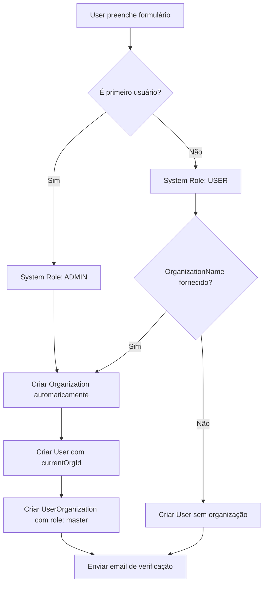

#### Detalhes de Implementação:

**1. Verificação de primeiro usuário:**
```typescript
const usersCount = await db.user.count();
const isFirstUser = usersCount === 0;
```
- Se for o primeiro usuário do sistema, recebe `role: "admin"` (system-wide)
- Demais usuários recebem `role: "user"`

**2. Criação automática de organização:**
```typescript
let organization = null;
if (organizationName || isFirstUser) {
  // Gerar slug único baseado no nome da organização ou nome do usuário
  const slug = (organizationName || name)
    .toLowerCase()
    .replace(/[^a-z0-9]/g, '-')
    .substring(0, 50);

  // Documento padrão caso não fornecido
  const defaultDocument = document || `000${Date.now().toString().slice(-8)}`;

  organization = await db.organization.create({
    data: {
      name: organizationName || `${name}'s Organization`,
      slug: `${slug}-${Date.now()}`, // Timestamp para garantir unicidade
      document: defaultDocument,
      type: document ? (document.replace(/\D/g, '').length === 11 ? 'pf' : 'pj') : 'pf',
      isActive: true,
    },
  });
}
```

**Regras de negócio:**
- Se `organizationName` fornecido OU é primeiro usuário → cria organização
- `slug` é gerado a partir do nome da organização (ou nome do usuário) + timestamp
- `document` pode ser CPF/CNPJ fornecido ou timestamp gerado automaticamente
- `type` é detectado automaticamente: 11 dígitos = `pf` (pessoa física), caso contrário `pj` (pessoa jurídica)

**3. Criação do usuário:**
```typescript
const user = await db.user.create({
  data: {
    email,
    password: hashedPassword,
    name,
    role: isFirstUser ? UserRole.ADMIN : UserRole.USER,
    currentOrgId: organization?.id || null, // ⚠️ Organização ativa no momento
    isActive: true,
  },
});
```

**4. Vínculo User-Organization:**
```typescript
if (organization) {
  await db.userOrganization.create({
    data: {
      userId: user.id,
      organizationId: organization.id,
      role: 'master', // ⚠️ Criador é sempre MASTER da organização
      isActive: true,
    },
  });
}
```

**Importante:** O campo `User.currentOrgId` armazena qual organização o usuário está operando **no momento**. Isso permite:
- Usuário pertencer a múltiplas organizações
- Trocar de contexto entre organizações
- JWT sempre carregar organização ativa para RBAC

---

### 1.2 Cadastro via Google OAuth

**Arquivo:** `src/features/auth/controllers/auth.controller.ts` (linhas 767-920)

#### Fluxo do Google OAuth:

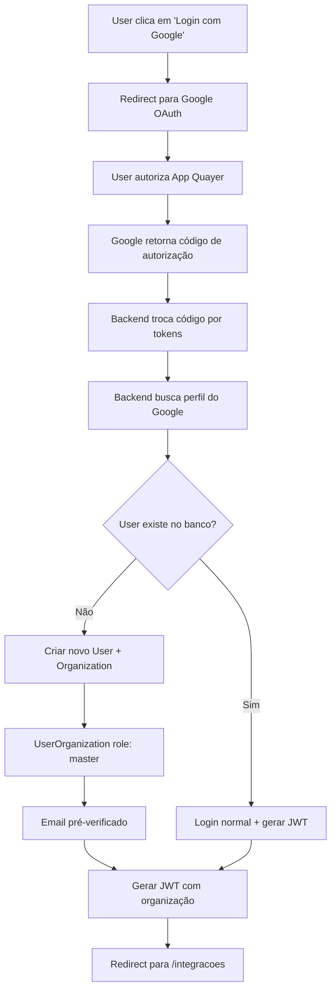

#### Diferenças do Google OAuth:

**1. Documento UUID único:**
```typescript
// ⚠️ Google OAuth não solicita CPF/CNPJ, então gera UUID único
const uniqueDocument = crypto.randomUUID().replace(/-/g, '').substring(0, 14);

const organization = await db.organization.create({
  data: {
    name: `${googleUser.name}'s Organization`,
    slug: `${slug}-${Date.now()}`,
    document: uniqueDocument, // Documento gerado automaticamente
    type: 'pf', // Default: pessoa física
    isActive: true,
  },
});
```

**Por que UUID?**
- Google não fornece CPF/CNPJ
- `document` é campo obrigatório e único no schema
- Solução: gerar UUID único e usar primeiros 14 caracteres
- Usuário pode atualizar documento depois via Settings

**2. Email pré-verificado:**
```typescript
user = await db.user.create({
  data: {
    email: googleUser.email,
    name: googleUser.name,
    password: hashedPassword, // ⚠️ Password aleatório (não será usado)
    role: isFirstUser ? UserRole.ADMIN : UserRole.USER,
    emailVerified: new Date(), // ⚠️ Google já verificou email
    currentOrgId: organization.id,
    organizations: {
      create: {
        organizationId: organization.id,
        role: 'master', // ⚠️ Sempre master para novos usuários OAuth
      },
    },
  },
});
```

**Importante:**
- Password é gerado aleatoriamente (usuário OAuth não precisará dele)
- `emailVerified` é definido imediatamente (Google já validou)
- Relacionamento `UserOrganization` criado inline via nested create

---

### 1.3 Schema Prisma - Relacionamentos

**Arquivo:** `prisma/schema.prisma`

#### Diagrama ER:

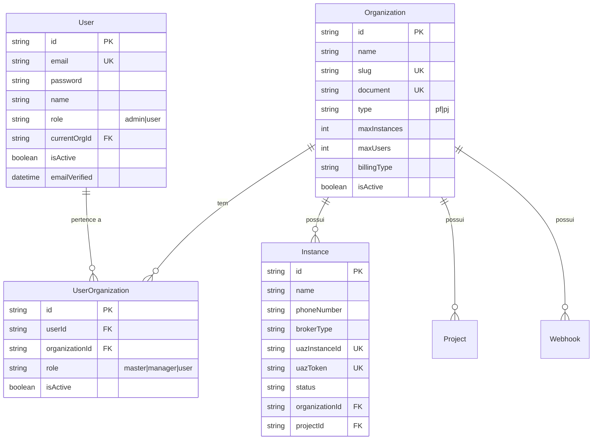

#### Características do Schema:

**Relacionamento Many-to-Many com metadados:**
```prisma
model UserOrganization {
  id             String   @id @default(uuid())
  userId         String
  organizationId String
  role           String   // master, manager, user
  isActive       Boolean  @default(true)

  user         User         @relation(fields: [userId], references: [id], onDelete: Cascade)
  organization Organization @relation(fields: [organizationId], references: [id], onDelete: Cascade)

  @@unique([userId, organizationId])
  @@index([userId])
  @@index([organizationId])
}
```

**Importância do campo `role`:**
- Permite **permissões granulares** por organização
- Um usuário pode ser `master` em uma organização e `user` em outra
- RBAC implementado via JWT payload (`organizationRole`)

**Constraints importantes:**
- `@@unique([userId, organizationId])` - usuário não pode ter duplicatas na mesma organização
- `onDelete: Cascade` - deletar User ou Organization remove vínculos automaticamente
- Índices em `userId` e `organizationId` para performance em queries

---

## 2. Comportamento no Login (e especialmente via Google)

### 2.1 Login Tradicional (Email + Password)

**Arquivo:** `src/features/auth/controllers/auth.controller.ts` (linhas 182-285)

#### Fluxo:

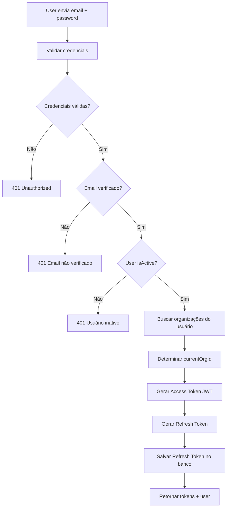

#### JWT Payload - Context de Organização:

```typescript
// Buscar organizações ativas do usuário
const user = await db.user.findUnique({
  where: { email },
  include: {
    organizations: {
      where: { isActive: true },
      include: { organization: true },
    },
  },
});

// Determinar organização atual
const currentOrgId = user.currentOrgId || user.organizations[0]?.organizationId || null;

// Obter role na organização atual
const currentOrgRelation = user.organizations.find(
  (org) => org.organizationId === currentOrgId
);

// ⚠️ Criar JWT com contexto de organização
const accessToken = signAccessToken({
  userId: user.id,
  email: user.email,
  role: user.role as UserRole, // System role (admin/user)
  currentOrgId, // Organização ativa
  organizationRole: currentOrgRelation?.role, // Role na organização (master/manager/user)
});
```

**Payload do Access Token:**
```json
{
  "userId": "uuid-do-usuario",
  "email": "user@example.com",
  "role": "user",
  "currentOrgId": "uuid-da-organizacao",
  "organizationRole": "master",
  "iat": 1696789012,
  "exp": 1696875412
}
```

**Importante:**
- **`role`** = System role (admin = acesso global, user = acesso restrito à organização)
- **`organizationRole`** = Role na organização ativa (master > manager > user)
- **`currentOrgId`** = Qual organização o usuário está operando no momento
- JWT é válido por **24 horas** (Access Token)
- Refresh Token válido por **7 dias**

---

### 2.2 Login via Google OAuth - Detalhamento

**Arquivo:** `src/features/auth/controllers/auth.controller.ts` (linhas 767-920)

#### Fluxo Completo:

**1. Iniciar OAuth Flow:**
```typescript
// GET /api/v1/auth/google
// Redireciona para Google com scopes solicitados
const authUrl = `https://accounts.google.com/o/oauth2/v2/auth?${params}`;
return Response.redirect(authUrl);
```

**Scopes solicitados:**
- `openid` - Identificação do usuário
- `email` - Email do usuário
- `profile` - Nome e foto do perfil

**2. Google Callback:**
```typescript
// GET /api/v1/auth/google/callback?code=AUTHORIZATION_CODE

// Trocar código por tokens
const tokenResponse = await fetch('https://oauth2.googleapis.com/token', {
  method: 'POST',
  body: JSON.stringify({
    code,
    client_id: GOOGLE_CLIENT_ID,
    client_secret: GOOGLE_CLIENT_SECRET,
    redirect_uri: GOOGLE_REDIRECT_URI,
    grant_type: 'authorization_code',
  }),
});

// Tokens retornados pelo Google
const { access_token, refresh_token, id_token } = await tokenResponse.json();
```

**3. Buscar perfil do usuário:**
```typescript
const userInfoResponse = await fetch('https://www.googleapis.com/oauth2/v2/userinfo', {
  headers: { Authorization: `Bearer ${access_token}` }
});

const googleUser = await userInfoResponse.json();
// { email, name, picture, verified_email }
```

**4. Verificar se usuário já existe:**
```typescript
let user = await db.user.findUnique({
  where: { email: googleUser.email },
  include: {
    organizations: {
      where: { isActive: true },
      include: { organization: true },
    },
  },
});
```

**5a. Se usuário EXISTE:**
```typescript
// Atualizar currentOrgId se necessário
const currentOrgId = user.currentOrgId || user.organizations[0]?.organizationId || null;

// Gerar tokens JWT normalmente
const accessToken = signAccessToken({
  userId: user.id,
  email: user.email,
  role: user.role,
  currentOrgId,
  organizationRole: user.organizations.find(o => o.organizationId === currentOrgId)?.role
});
```

**5b. Se usuário NÃO EXISTE:**
```typescript
// Criar novo usuário + organização automaticamente
const isFirstUser = (await db.user.count()) === 0;

const organization = await db.organization.create({
  data: {
    name: `${googleUser.name}'s Organization`,
    slug: `${slug}-${Date.now()}`,
    document: crypto.randomUUID().replace(/-/g, '').substring(0, 14), // ⚠️ UUID único
    type: 'pf',
    isActive: true,
  },
});

const user = await db.user.create({
  data: {
    email: googleUser.email,
    name: googleUser.name,
    password: await hashPassword(crypto.randomBytes(32).toString('hex')), // ⚠️ Random
    role: isFirstUser ? 'admin' : 'user',
    emailVerified: new Date(), // ⚠️ Google já verificou
    currentOrgId: organization.id,
    organizations: {
      create: {
        organizationId: organization.id,
        role: 'master', // ⚠️ Sempre master
      },
    },
  },
});

// Gerar JWT com organização recém-criada
const accessToken = signAccessToken({
  userId: user.id,
  email: user.email,
  role: user.role,
  currentOrgId: organization.id,
  organizationRole: 'master',
});
```

**6. Retornar resposta:**
```typescript
// Redirecionar para frontend com tokens
return Response.redirect(
  `${FRONTEND_URL}/auth/callback?access_token=${accessToken}&refresh_token=${refreshToken}`
);
```

---

### 2.3 AuthProcedure - Middleware de Autenticação

**Arquivo:** `src/features/auth/procedures/auth.procedure.ts`

#### Função:

O `authProcedure` é um **Igniter.js Procedure** que:
- Extrai e valida JWT de toda requisição
- Busca usuário no banco
- Injeta contexto de autenticação nos controllers
- Configura headers para RBAC

#### Implementação:

```typescript
export const authProcedure = igniter.procedure({
  name: "AuthProcedure",
  handler: async (options: AuthProcedureOptions = { required: true }, ctx) => {
    const { request, context } = ctx;
    const { required = true } = options;

    // 1. Extrair token do header Authorization
    const authHeader = request.headers.get("authorization") || request.headers.get("Authorization");

    if (!authHeader && required) {
      return Response.json({ error: "Token não fornecido" }, { status: 401 });
    }

    const token = authHeader?.startsWith("Bearer ") ? authHeader.slice(7) : authHeader;

    // 2. Verificar JWT
    const payload = await verifyAccessToken(token as string);

    if (!payload && required) {
      return Response.json({ error: "Token inválido" }, { status: 401 });
    }

    // 3. Buscar usuário com organizações
    const user = await context.db.user.findUnique({
      where: { id: payload.userId },
      include: {
        organizations: {
          where: { isActive: true },
          include: { organization: true },
        },
      },
    });

    if (!user && required) {
      return Response.json({ error: "Usuário não encontrado" }, { status: 401 });
    }

    if (user.isActive === false && required) {
      return Response.json({ error: "Usuário inativo" }, { status: 401 });
    }

    // 4. ⚠️ Adicionar organizationId do JWT ao objeto user
    const userWithOrg = {
      ...user,
      organizationId: payload.currentOrgId, // Do JWT payload
      organizationRole: payload.organizationRole, // Do JWT payload
    };

    // 5. ⚠️ Adicionar headers para uso em controllers
    request.headers.set('x-user-id', user.id);
    request.headers.set('x-user-role', user.role);
    if (payload.currentOrgId) {
      request.headers.set('x-org-id', payload.currentOrgId);
    }
    if (payload.organizationRole) {
      request.headers.set('x-org-role', payload.organizationRole);
    }

    // 6. Retornar contexto estendido
    return {
      auth: {
        session: {
          user: userWithOrg,
        },
        repository: new AuthRepository(context.db),
      },
    };
  },
});
```

#### Como controllers usam o contexto:

```typescript
// Em qualquer controller:
create: igniter.mutation({
  use: [authProcedure({ required: true })],
  handler: async ({ context }) => {
    // ⚠️ Acessar usuário autenticado
    const user = context.auth?.session?.user;

    console.log(user.id); // UUID do usuário
    console.log(user.role); // 'admin' ou 'user' (system role)
    console.log(user.organizationId); // UUID da organização ativa (do JWT)
    console.log(user.organizationRole); // 'master', 'manager', ou 'user'

    // Business Logic: Criar instância vinculada à organização do usuário
    const instance = await repository.create({
      name,
      organizationId: user.organizationId, // ⚠️ Do JWT payload
    });
  }
})
```

---

## 3. Camada de Integração (Feature: Instances)

### 3.1 Estrutura de Controllers e Repositories

**Arquivos:**
- `src/features/instances/controllers/instances.controller.ts`
- `src/features/instances/repositories/instances.repository.ts`
- `src/lib/api/uazapi.service.ts`

#### Arquitetura da Feature:

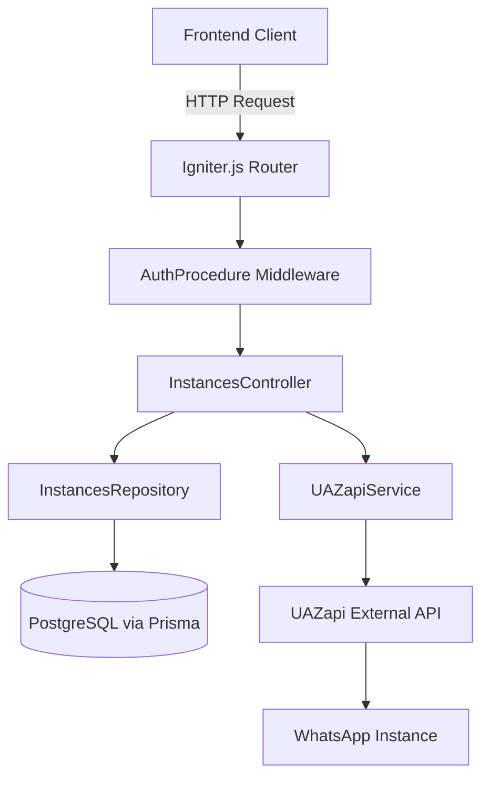

---

### 3.2 Criação de Instância - Fluxo Completo

**Endpoint:** `POST /api/v1/instances/create`

#### Sequência de Operações:

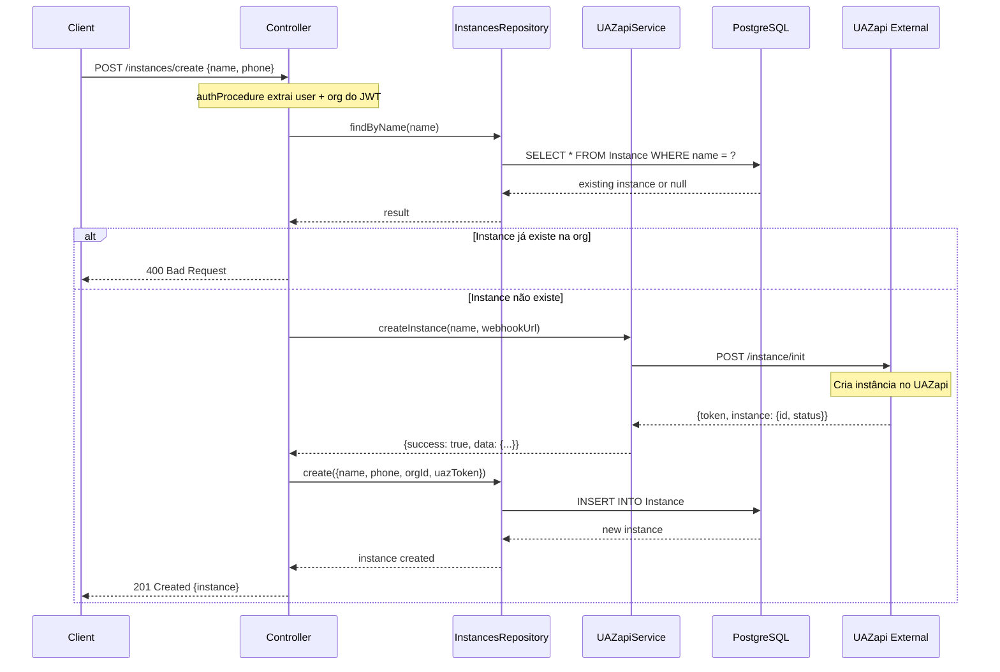

#### Código do Controller:

```typescript
create: igniter.mutation({
  use: [authProcedure({ required: true }), instancesProcedure()],
  body: CreateInstanceSchema,
  handler: async ({ request, response, context }) => {
    const repository = new InstancesRepository(context.db);
    const { name, phoneNumber, brokerType, webhookUrl } = request.body;

    // 1. ⚠️ Verificar se instância já existe NA ORGANIZAÇÃO
    const existingInstance = await repository.findByName(name);
    if (existingInstance &&
        existingInstance.organizationId === context.auth?.session?.user?.organizationId) {
      return response.badRequest("Já existe uma instância com este nome na sua organização");
    }

    // 2. Criar instância no UAZapi PRIMEIRO
    const uazapiResult = await uazapiService.createInstance(name, webhookUrl);

    if (!uazapiResult.success || !uazapiResult.data) {
      return response.badRequest("Falha ao criar instância na UAZapi");
    }

    // 3. Criar no banco local com vínculo à organização
    const instance = await repository.create({
      name,
      phoneNumber,
      brokerType: brokerType || BrokerType.UAZAPI,
      webhookUrl,
      uazapiToken: uazapiResult.data.token, // ⚠️ Token da instância (não admintoken)
      brokerId: uazapiResult.data.instance?.id,
      organizationId: context.auth?.session?.user?.organizationId, // ⚠️ Do JWT
    });

    return response.created(instance);
  },
}),
```

**Campos usados da organização:**
- `organizationId` - Vínculo direto com Organization
- Não usa outros campos diretamente, mas poderiam ser usados:
  - `organization.maxInstances` - Validar limite de instâncias
  - `organization.billingType` - Validar recursos disponíveis
  - `organization.isActive` - Validar se organização está ativa

---

### 3.3 UAZapi Service - Integração Externa

**Arquivo:** `src/lib/api/uazapi.service.ts`

#### Endpoints UAZapi Utilizados:

| Método | Endpoint | Auth Header | Descrição |
|--------|----------|-------------|-----------|
| POST | `/instance/init` | `admintoken` | Cria nova instância |
| POST | `/instance/connect` | `token` | Conecta e gera QR Code |
| GET | `/instance/status` | `token` | Verifica status |
| POST | `/instance/disconnect` | `token` | Desconecta instância |
| DELETE | `/instance` | `admintoken` + `token` | Remove instância |
| GET | `/instance/all` | `admintoken` | Lista todas (admin) |

**Importante:**
- `admintoken` = Token global do sistema (env: `UAZAPI_ADMIN_TOKEN`)
- `token` = Token específico da instância (salvo em `Instance.uazapiToken`)

#### Método createInstance:

```typescript
async createInstance(name: string, webhookUrl?: string): Promise<UAZapiResponse> {
  try {
    const response = await fetch(`${this.baseURL}/instance/init`, {
      method: 'POST',
      headers: {
        'Content-Type': 'application/json',
        'admintoken': this.token // ⚠️ Usa admintoken para criar
      },
      body: JSON.stringify({
        name,
        systemName: 'app-quayer' // Identificador do sistema
      })
    });

    // Retorno esperado:
    // {
    //   "token": "instance-specific-token",
    //   "instance": {
    //     "id": "uuid",
    //     "name": "my-instance",
    //     "status": "disconnected",
    //     "qrcode": null
    //   }
    // }
    return await this.handleResponse(response);
  } catch (error) {
    return {
      success: false,
      error: error.message,
      message: 'Falha ao criar instância'
    };
  }
}
```

#### Método connectInstance (Gerar QR Code):

```typescript
async connectInstance(instanceToken: string, phone?: string): Promise<UAZapiResponse<QRCodeResponse>> {
  try {
    const response = await fetch(`${this.baseURL}/instance/connect`, {
      method: 'POST',
      headers: {
        'Content-Type': 'application/json',
        'token': instanceToken // ⚠️ Usa token da instância (não admintoken)
      },
      body: JSON.stringify(phone ? { phone } : {})
    });

    const result = await this.handleResponse<any>(response);

    if (result.success && result.data) {
      const instanceData = result.data.instance || result.data;
      return {
        success: true,
        data: {
          qrcode: instanceData.qrcode || '',
          pairingCode: instanceData.paircode || '',
          expires: 120000 // 2 minutos
        },
        message: phone ? 'Código de pareamento gerado' : 'QR Code gerado'
      };
    }

    return result;
  } catch (error) {
    return {
      success: false,
      error: error.message,
      message: 'Falha ao conectar instância'
    };
  }
}
```

**Retorno do QR Code:**
```json
{
  "qrcode": "data:image/png;base64,iVBORw0KG...",
  "pairingCode": "ABCD-1234-EFGH",
  "expires": 120000
}
```

---

### 3.4 RBAC - Diferença de Permissões User vs Admin

**Arquivo:** `src/hooks/usePermissions.ts`

#### Matriz de Permissões:

| Ação | Admin (system) | Master (org) | Manager (org) | User (org) |
|------|----------------|--------------|---------------|------------|
| **Criar Instância** | ✅ | ✅ | ✅ | ❌ |
| **Editar Instância** | ✅ | ✅ | ✅ | ❌ |
| **Deletar Instância** | ✅ | ✅ | ❌ | ❌ |
| **Ver Instâncias** | ✅ (todas orgs) | ✅ (sua org) | ✅ (sua org) | ✅ (sua org) |
| **Gerenciar Org** | ✅ | ❌ | ❌ | ❌ |
| **Trocar Org** | ✅ | ❌ | ❌ | ❌ |
| **Gerenciar Usuários** | ✅ | ✅ | ❌ | ❌ |
| **Gerenciar Webhooks** | ✅ | ✅ | ❌ | ❌ |
| **Enviar Mensagens** | ✅ | ✅ | ✅ | ✅ |

#### Implementação do Hook:

```typescript
export function usePermissions(): Permissions {
  const { user } = useAuth();

  // System roles
  const isAdmin = user?.role === 'admin';

  // Organization roles (do JWT payload)
  const organizationRole = (user as any)?.organizationRole || null;
  const isMaster = organizationRole === 'master';
  const isManager = organizationRole === 'manager';
  const isUser = organizationRole === 'user' || (!isAdmin && !isMaster && !isManager);

  return {
    // Instance Permissions
    canCreateInstance: isAdmin || isMaster || isManager,
    canEditInstance: isAdmin || isMaster || isManager,
    canDeleteInstance: isAdmin || isMaster, // ⚠️ Somente admin e master
    canViewInstances: true, // Todos podem visualizar

    // Organization Permissions
    canSwitchOrganization: isAdmin, // ⚠️ Somente admin troca de org
    canManageOrganizations: isAdmin,

    // User Permissions
    canManageUsers: isAdmin || isMaster,
    canViewUsers: isAdmin || isMaster || isManager,

    // Advanced Permissions
    canSelectBroker: isAdmin, // ⚠️ Somente admin escolhe broker
    canManageWebhooks: isAdmin || isMaster,
    canAccessAdmin: isAdmin, // ⚠️ Acesso à área /admin

    // System Info
    isAdmin,
    isMaster,
    isManager,
    isUser,
    organizationRole,
    systemRole: user?.role || null,
  };
}
```

---

### 3.5 Repository - Filtro por Organização

**Arquivo:** `src/features/instances/repositories/instances.repository.ts`

#### Método findAll:

```typescript
async findAll(organizationId?: string): Promise<Instance[]> {
  return this.prisma.instance.findMany({
    where: organizationId ? { organizationId } : undefined, // ⚠️ Filtro opcional
    orderBy: { createdAt: 'desc' }
  });
}
```

**Como é usado:**
```typescript
// User normal: filtrar por sua organização
const userInstances = await repository.findAll(user.organizationId);

// Admin: ver todas as instâncias
const allInstances = await repository.findAll(); // Sem filtro
```

#### Método findAllPaginated (com busca):

```typescript
async findAllPaginated(params: {
  organizationId?: string;
  page: number;
  limit: number;
  status?: string;
  search?: string;
}) {
  const { organizationId, page, limit, status, search } = params;

  const where: any = {};

  // ⚠️ Filtrar por organização se fornecido
  if (organizationId) {
    where.organizationId = organizationId;
  }

  // Filtrar por status
  if (status && status !== 'all') {
    where.status = status;
  }

  // Busca textual
  if (search) {
    where.OR = [
      { name: { contains: search, mode: 'insensitive' } },
      { phoneNumber: { contains: search, mode: 'insensitive' } },
    ];
  }

  // Executar queries em paralelo
  const [instances, total] = await Promise.all([
    this.prisma.instance.findMany({
      where,
      orderBy: { createdAt: 'desc' },
      skip: (page - 1) * limit,
      take: limit,
    }),
    this.prisma.instance.count({ where }),
  ]);

  return { instances, total };
}
```

---

## 4. Tela e Fluxo do Usuário Final

**Arquivo:** `src/app/integracoes/page.tsx`

### 4.1 Layout da Tela User (Sidebar + Details)

```
┌─────────────────────────────────────────────────────┐
│  Sidebar (320px)     │  Main Panel (Flex)           │
├──────────────────────┼──────────────────────────────┤
│ Integrações WhatsApp │                              │
│ [+ Add]              │                              │
│ ┌──────────────────┐ │                              │
│ │ [🔍] Buscar      │ │    Empty State:              │
│ └──────────────────┘ │    "Escolha um contato       │
│                      │     para ver chat completo"  │
│ [Todas|Conectadas|  │                              │
│  Desconectadas]      │                              │
│                      │                              │
│ ┌─ Instance Card ─┐ │         (ou)                 │
│ │ 🟢 Nome          │ │                              │
│ │ +5511999999      │ │    Detalhes da Instância:    │
│ │ há 2 horas     ⋮ │ │    ┌──────────────────────┐ │
│ └──────────────────┘ │    │ Status da Conexão    │ │
│                      │    │ [Conectar Agora]     │ │
│ ┌─ Instance Card ─┐ │    └──────────────────────┘ │
│ │ 🔴 Nome 2        │ │    ┌──────────────────────┐ │
│ │ Não configurado  │ │    │ Informações          │ │
│ │ há 1 dia       ⋮ │ │    │ Nome: ...            │ │
│ └──────────────────┘ │    │ Telefone: ...        │ │
│                      │    └──────────────────────┘ │
│ [filteredInstances   │                              │
│  .length conversas]  │                              │
└──────────────────────┴──────────────────────────────┘
```

### 4.2 Elementos Herdados da Instância

**Hook useInstances:**
```typescript
const { data: instancesData, isLoading, error, refetch } = useInstances();
const instances = instancesData?.data || [];
```

**Endpoint chamado:** `GET /api/v1/instances/list`

**Controller correspondente:**
```typescript
list: igniter.query({
  use: [authProcedure({ required: true })],
  handler: async ({ context }) => {
    const repository = new InstancesRepository(context.db);

    // ⚠️ Filtrar por organização do usuário
    const instances = await repository.findAll(
      context.auth?.session?.user?.organizationId
    );

    return response.ok(instances);
  }
})
```

**Campos exibidos no Card:**
- `instance.name` - Nome da instância
- `instance.phoneNumber` - Número configurado (ou "Não configurado")
- `instance.status` - Status da conexão (connected/disconnected/connecting)
- `instance.updatedAt` - Última atualização (formatado com date-fns)

**Indicadores visuais:**
```typescript
{/* Avatar com cor baseada no status */}
<Avatar className="h-12 w-12">
  <AvatarFallback
    className={
      instance.status === 'connected'
        ? 'bg-green-500 text-white'
        : 'bg-gray-500 text-white'
    }
  >
    <Phone className="h-5 w-5" />
  </AvatarFallback>
</Avatar>

{/* Badge de status */}
<StatusBadge status={instance.status as any} size="sm" />

{/* Alerta se desconectado */}
{instance.status === 'disconnected' && (
  <Badge variant="destructive" className="h-5 w-5 rounded-full p-0">
    !
  </Badge>
)}
```

### 4.3 Fluxo de Criação de Instância (User)

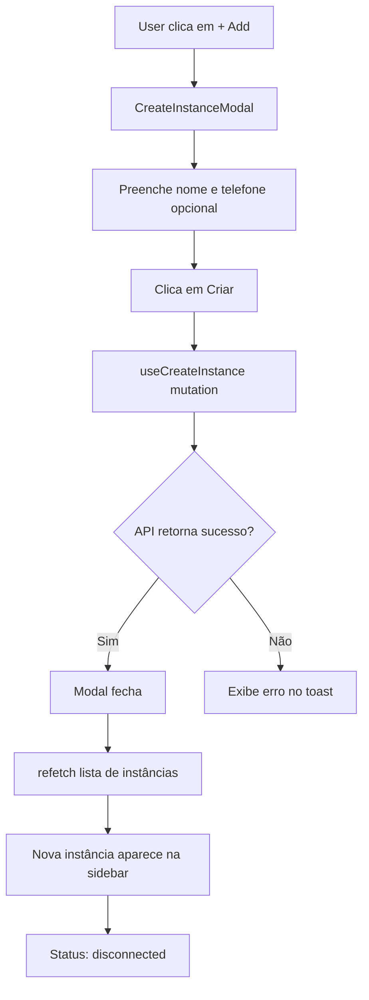

**Component CreateInstanceModal:**
```typescript
const { mutateAsync: createInstance, isPending } = useCreateInstance();

const handleSubmit = async (values: FormValues) => {
  try {
    await createInstance({
      name: values.name,
      phoneNumber: values.phoneNumber,
    });

    toast.success('Instância criada com sucesso!');
    onSuccess(); // refetch + close modal
  } catch (error: any) {
    toast.error(error.message || 'Erro ao criar instância');
  }
};
```

### 4.4 Fluxo de Conexão (Gerar QR Code)

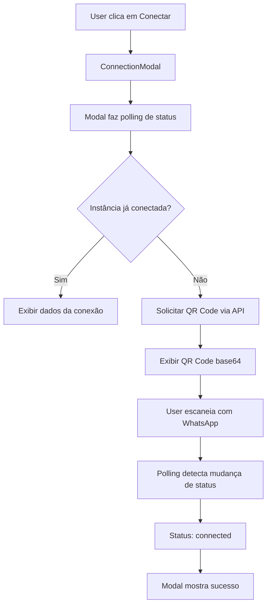

**Hook de status com polling:**
```typescript
// Hook faz polling a cada 5 segundos
const { data: status } = useInstanceStatus(instance.id, isOpen);

// Hook definition:
export function useInstanceStatus(id: string, enabled: boolean) {
  return useQuery({
    queryKey: ['instances', id, 'status'],
    queryFn: async () => {
      const response = await api.instances.getStatus.query();
      return response.data as InstanceStatusResponse;
    },
    enabled: enabled && !!id,
    refetchInterval: 5 * 1000, // ⚠️ Polling a cada 5 segundos
    staleTime: 0,
  });
}
```

### 4.5 Permissões Condicionais na UI

```typescript
const { canCreateInstance, canEditInstance, canDeleteInstance } = usePermissions();

{/* Botão + só aparece se pode criar */}
{canCreateInstance && (
  <Button size="icon" onClick={() => setIsCreateModalOpen(true)}>
    <Plus className="h-5 w-5" />
  </Button>
)}

{/* Ações de edição só aparecem se pode editar */}
{canEditInstance && (
  <>
    <DropdownMenuItem onClick={() => handleConnect(instance)}>
      <Plug className="mr-2 h-4 w-4" />
      {instance.status === 'connected' ? 'Reconectar' : 'Conectar'}
    </DropdownMenuItem>
    <DropdownMenuItem onClick={() => handleEdit(instance)}>
      <Edit className="mr-2 h-4 w-4" />
      Editar
    </DropdownMenuItem>
  </>
)}

{/* Deletar só aparece para master e admin */}
{canDeleteInstance && (
  <DropdownMenuItem
    className="text-destructive"
    onClick={() => handleDelete(instance)}
  >
    <Trash2 className="mr-2 h-4 w-4" />
    Deletar
  </DropdownMenuItem>
)}
```

---

## 5. Tela e Fluxo do Admin

**Arquivo:** `src/app/admin/integracoes/page.tsx`

### 5.1 Layout da Tela Admin (Tabela + Stats)

```
┌────────────────────────────────────────────────────────┐
│  Integrações                            [+ Nova]        │
│  Gerencie todas as integrações do sistema              │
├────────────────────────────────────────────────────────┤
│  ┌──────────┐ ┌──────────┐ ┌──────────┐ ┌──────────┐ │
│  │  Total   │ │Conectadas│ │Desconect.│ │  Ativas  │ │
│  │    10    │ │     7    │ │     3    │ │    7     │ │
│  └──────────┘ └──────────┘ └──────────┘ └──────────┘ │
├────────────────────────────────────────────────────────┤
│  ┌────────────────────────────────────────────────┐   │
│  │ [🔍] Buscar por nome ou telefone...            │   │
│  └────────────────────────────────────────────────┘   │
│                                                        │
│  ┏━━━━━━━━━┯━━━━━━━━┯━━━━━━━━┯━━━━━━┯━━━━━━━━━━┓   │
│  ┃ Nome    │Telefone│Provedor│Status│ Ações    ┃   │
│  ┣━━━━━━━━━┿━━━━━━━━┿━━━━━━━━┿━━━━━━┿━━━━━━━━━━┫   │
│  ┃Instance1│+5511... │WhatsApp│🟢Ativo│  ⋮       ┃   │
│  ┃Instance2│   -    │WhatsApp│🔴Inati│  ⋮       ┃   │
│  ┃Instance3│+5521... │WhatsApp│🟢Ativo│  ⋮       ┃   │
│  ┗━━━━━━━━━┷━━━━━━━━┷━━━━━━━━┷━━━━━━┷━━━━━━━━━━┛   │
└────────────────────────────────────────────────────────┘
```

### 5.2 Diferenças Admin vs User

| Aspecto | User View | Admin View |
|---------|-----------|------------|
| **Layout** | Sidebar + Details Panel | Tabela completa |
| **Filtro Org** | Somente sua organização | **Todas organizações** |
| **Stats** | Total/Conectadas/Desconectadas | Total/Conectadas/Desconectadas/Ativas/Inativas |
| **Colunas extras** | - | Provedor, Agentes, Criado/Atualizado |
| **Permissões** | RBAC organization-scoped | RBAC system-wide |
| **Endpoint** | `/instances/list` com orgId | `/instances/list` sem orgId |

### 5.3 Hook useInstances (Sem filtro para Admin)

**⚠️ DESCOBERTA IMPORTANTE:**

Ambas as telas (user e admin) usam o **MESMO hook** `useInstances`:

```typescript
// src/hooks/useInstance.ts
export function useInstances(options?: { page?: number; limit?: number; status?: string; search?: string }) {
  return useQuery({
    queryKey: ['instances', options],
    queryFn: async () => {
      const response = await api.instances.list.query(); // ⚠️ Sem parâmetros
      return response.data;
    },
    staleTime: 30 * 1000,
    refetchOnWindowFocus: true,
  });
}
```

**Controller instances.list:**
```typescript
list: igniter.query({
  use: [authProcedure({ required: true })],
  handler: async ({ context }) => {
    const repository = new InstancesRepository(context.db);

    // ⚠️ Se user é admin, não filtra por organização
    const organizationId = context.auth?.session?.user?.role === 'admin'
      ? undefined
      : context.auth?.session?.user?.organizationId;

    const instances = await repository.findAll(organizationId);

    return response.ok(instances);
  }
})
```

**Como funciona:**
- **User normal:** Controller detecta `role !== 'admin'` → filtra por `organizationId`
- **Admin:** Controller detecta `role === 'admin'` → retorna TODAS as instâncias (sem filtro)

---

### 5.4 Relação com `/instance/all` do UAZapi

**⚠️ DIVERGÊNCIA DETECTADA:**

O endpoint UAZapi `/instance/all` **não é utilizado** atualmente:

```typescript
// UAZapiService.listAllInstances() existe mas NÃO é chamado
async listAllInstances(): Promise<UAZapiResponse> {
  try {
    const response = await fetch(`${this.baseURL}/instance/all`, {
      method: 'GET',
      headers: this.getHeaders(true) // admintoken
    });

    return await this.handleResponse(response);
  } catch (error) {
    return {
      success: false,
      error: error.message,
      message: 'Falha ao listar instâncias'
    };
  }
}
```

**Fluxo atual:**
1. Admin acessa `/admin/integracoes`
2. Hook `useInstances` chama `/api/v1/instances/list`
3. Controller detecta `role === 'admin'` e retorna todas do **banco local**
4. UAZapi `/instance/all` **NÃO é consultado**

**Possível melhoria:**
- Sincronizar instâncias do UAZapi periodicamente
- Ou usar `/instance/all` para validar consistência entre banco local e UAZapi

---

### 5.5 Dashboard Admin

**Arquivo:** `src/app/admin/page.tsx`

**Stats exibidos:**
```typescript
const [orgs, instances, webhooks] = await Promise.all([
  api.organizations.list.query({ query: { page: 1, limit: 1 } }),
  api.instances.list.query({ query: { page: 1, limit: 1 } }),
  api.webhooks.list.query({ query: { page: 1, limit: 1 } }),
]);

setStats({
  totalOrganizations: orgs.data?.pagination?.total || 0,
  totalUsers: 0, // ⚠️ Precisa de endpoint de users
  totalInstances: instances.data?.pagination?.total || 0,
  totalWebhooks: webhooks.data?.pagination?.total || 0,
});
```

**Cards exibidos:**
- 🏢 **Organizações** - Total de organizações cadastradas
- 👥 **Usuários** - Total de usuários ativos (placeholder, sem endpoint ainda)
- 🔌 **Instâncias** - Instâncias WhatsApp ativas
- 🔗 **Webhooks** - Webhooks configurados

---

## 6. Validação de Schema e Persistência

### 6.1 Schemas Zod - Validação de Input

**Arquivo:** `src/features/instances/instances.interfaces.ts`

#### CreateInstanceSchema:

```typescript
export const CreateInstanceSchema = z.object({
  name: z.string()
    .min(3, 'Nome deve ter pelo menos 3 caracteres')
    .max(50, 'Nome deve ter no máximo 50 caracteres'),

  phoneNumber: z.string()
    .regex(/^\+?[1-9]\d{1,14}$/, 'Formato de telefone inválido')
    .optional(),

  brokerType: z.enum(['uazapi']).default('uazapi'),

  webhookUrl: z.string()
    .url('URL de webhook inválida')
    .optional(),
});

export type CreateInstanceInput = z.infer<typeof CreateInstanceSchema>;
```

**Validação no Controller:**
```typescript
create: igniter.mutation({
  body: CreateInstanceSchema, // ⚠️ Zod valida automaticamente
  handler: async ({ request }) => {
    const { name, phoneNumber, brokerType, webhookUrl } = request.body;
    // Aqui os dados já estão validados e tipados
  }
})
```

**Erros retornados se validação falhar:**
```json
{
  "error": "Validation Error",
  "details": {
    "name": ["Nome deve ter pelo menos 3 caracteres"],
    "phoneNumber": ["Formato de telefone inválido"]
  }
}
```

#### UpdateInstanceSchema:

```typescript
export const UpdateInstanceSchema = z.object({
  name: z.string().min(3).max(50).optional(),
  phoneNumber: z.string().regex(/^\+?[1-9]\d{1,14}$/).optional(),
  webhookUrl: z.string().url().optional(),
  status: z.enum(['connected', 'disconnected', 'connecting']).optional(),
});

export type UpdateInstanceInput = z.infer<typeof UpdateInstanceSchema>;
```

---

### 6.2 Entidades Prisma - Relacionamentos

#### Instance Model:

```prisma
model Instance {
  id             String    @id @default(uuid())
  name           String
  phoneNumber    String?
  brokerType     String    @default("uazapi")
  uazInstanceId  String?   @unique
  uazToken       String?   @unique // ⚠️ Token específico da instância
  status         String    @default("disconnected")
  qrCode         String?   @db.Text
  pairingCode    String?
  organizationId String?   // ⚠️ FK para Organization
  projectId      String?   // ⚠️ FK para Project (opcional)
  webhookUrl     String?

  createdAt      DateTime  @default(now())
  updatedAt      DateTime  @updatedAt
  lastConnected  DateTime?

  // Relations
  organization Organization? @relation(fields: [organizationId], references: [id], onDelete: SetNull)
  project      Project?      @relation(fields: [projectId], references: [id], onDelete: SetNull)
  webhooks     Webhook[]

  @@index([organizationId])
  @@index([status])
  @@map("instances")
}
```

#### Constraints e Validações:

**Unique constraints:**
- `uazInstanceId` - ID da instância no UAZapi (único globalmente)
- `uazToken` - Token da instância (único globalmente)

**Foreign keys com onDelete:**
- `organizationId` → `Organization.id` (`onDelete: SetNull`)
  - Se organização for deletada, instância fica órfã (organizationId = null)
- `projectId` → `Project.id` (`onDelete: SetNull`)
  - Se projeto for deletado, instância permanece sem projeto

**Índices para performance:**
- `@@index([organizationId])` - Queries filtradas por organização
- `@@index([status])` - Queries filtradas por status

---

### 6.3 Referências Explícitas - Cadeia User → Organization → Instance

#### Diagrama Completo:

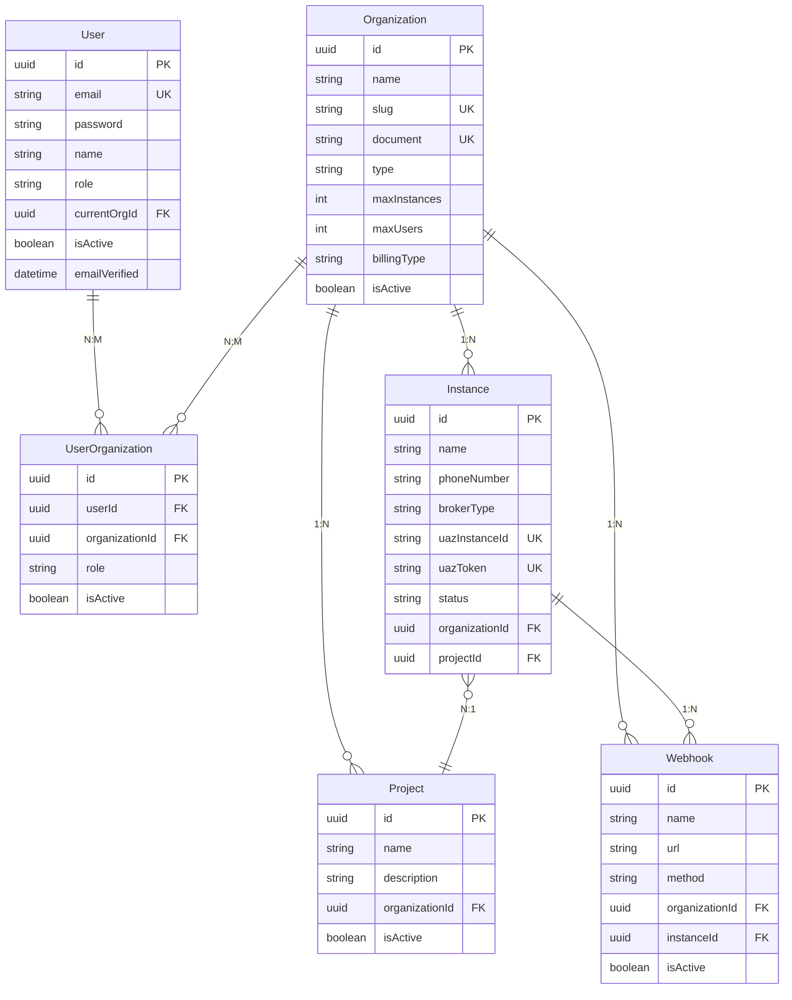

#### Cadeia de Acesso (Exemplo):

**Cenário:** User quer listar suas instâncias

```typescript
// 1. JWT Payload contém:
{
  userId: "user-uuid",
  currentOrgId: "org-uuid",
  organizationRole: "master"
}

// 2. AuthProcedure busca User:
const user = await db.user.findUnique({
  where: { id: payload.userId },
  include: {
    organizations: {
      where: { isActive: true },
      include: { organization: true }
    }
  }
});

// 3. Context estendido com organizationId:
context.auth.session.user = {
  ...user,
  organizationId: payload.currentOrgId // "org-uuid"
};

// 4. Controller lista instâncias:
const instances = await db.instance.findMany({
  where: {
    organizationId: context.auth.session.user.organizationId // "org-uuid"
  }
});

// 5. Resultado: Somente instâncias da organização "org-uuid"
```

---

### 6.4 Validação de Negócio - Constraints Aplicados

#### No Register (criação de User):

```typescript
// 1. Email único
const existingUser = await db.user.findUnique({ where: { email } });
if (existingUser) {
  return response.badRequest("Email já cadastrado");
}

// 2. Slug único da organização
const slug = `${slugBase}-${Date.now()}`; // ⚠️ Timestamp garante unicidade

// 3. Documento único da organização
const document = document || `000${Date.now().toString().slice(-8)}`;
```

#### Na criação de Instance:

```typescript
// 1. Nome único dentro da organização
const existingInstance = await repository.findByName(name);
if (existingInstance &&
    existingInstance.organizationId === user.organizationId) {
  return response.badRequest("Já existe instância com este nome na sua organização");
}

// 2. uazToken único (vem do UAZapi)
const uazResult = await uazapiService.createInstance(name);
const instance = await repository.create({
  uazToken: uazResult.data.token, // ⚠️ Único globalmente
  organizationId: user.organizationId
});
```

#### Na atualização de Instance:

```typescript
// 1. Verificar permissão de organização
const instance = await repository.findById(id);
if (!checkOrganizationPermission(instance.organizationId, user.organizationId)) {
  return response.forbidden("Você não tem permissão para editar esta instância");
}

// 2. Validar campos via Zod
const validated = UpdateInstanceSchema.parse(request.body);

// 3. Atualizar
const updated = await repository.update(id, validated);
```

---

## 7. Mapa de Coerência - Backend, Igniter.js e UX

### 7.1 Fluxo End-to-End: Criação de Usuário

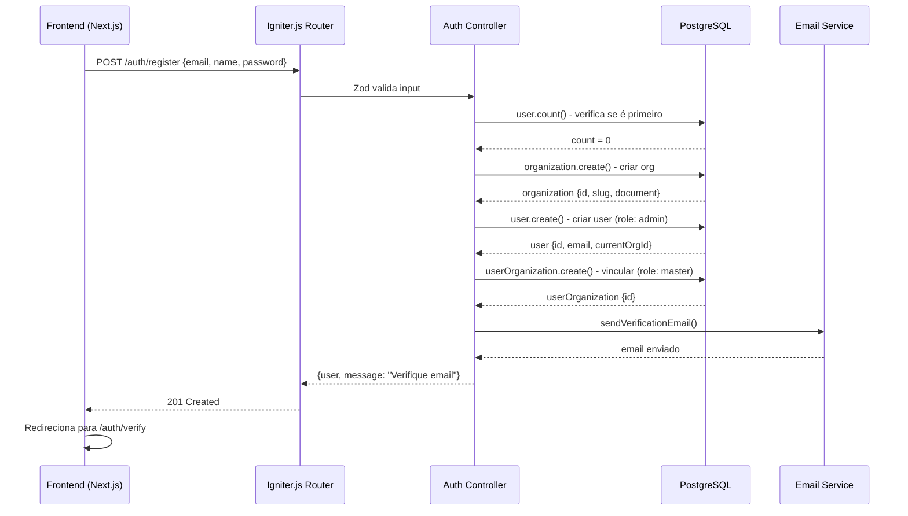

**Coerência:**
- ✅ Backend valida com Zod antes de processar
- ✅ Business logic (primeiro user = admin) centralizada no controller
- ✅ Transações implícitas do Prisma garantem consistência
- ✅ UX recebe feedback imediato (201 Created) e redireciona

---

### 7.2 Fluxo End-to-End: Login + Listar Instâncias

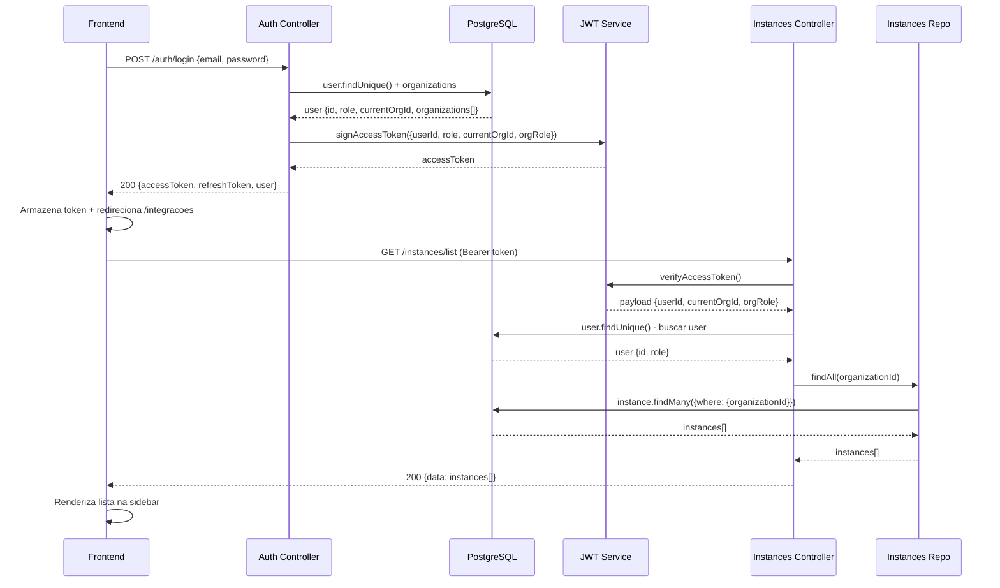

**Coerência:**
- ✅ JWT carrega contexto completo (currentOrgId + organizationRole)
- ✅ AuthProcedure extrai contexto do JWT e injeta em todos os controllers
- ✅ Repository filtra automaticamente por organizationId
- ✅ UX recebe apenas instâncias que o usuário pode ver

---

### 7.3 Fluxo End-to-End: Criar Instância + Gerar QR Code

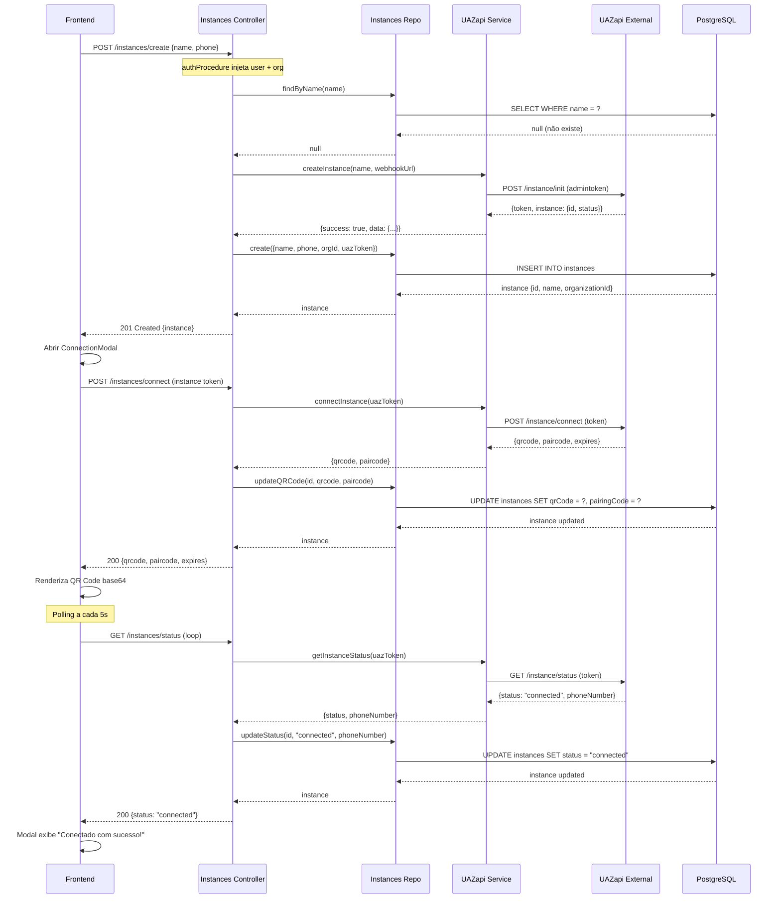

**Coerência:**
- ✅ **Dupla persistência**: UAZapi (externa) → Banco local (Prisma)
- ✅ **Token cascade**: admintoken cria instância → retorna token específico → salvo em `uazToken`
- ✅ **Polling inteligente**: Frontend usa `useInstanceStatus` com `refetchInterval: 5000`
- ✅ **UX reativa**: Status atualiza automaticamente quando conexão estabelecida

---

### 7.4 Análise de Coerência: Backend ↔ Igniter.js ↔ UX

#### ✅ Pontos Fortes:

| Aspecto | Backend | Igniter.js | UX |
|---------|---------|------------|-----|
| **Multi-tenancy** | ✅ Schema com UserOrganization | ✅ JWT carrega currentOrgId | ✅ usePermissions filtra UI |
| **RBAC** | ✅ System + Org roles | ✅ authProcedure injeta contexto | ✅ Botões condicionais (canCreate) |
| **Validação** | ✅ Zod schemas | ✅ Automático no controller | ✅ TypeScript types inferidos |
| **Sincronização** | ✅ Prisma transações | ✅ Repository pattern | ✅ React Query invalidation |
| **Real-time** | ✅ SSE support | ✅ stream: true | ✅ useQuery polling |
| **Segurança** | ✅ JWT verify | ✅ authProcedure obrigatório | ✅ Token em headers |

#### ⚠️ Pontos de Atenção:

| Problema | Backend | Igniter.js | UX | Solução Sugerida |
|----------|---------|------------|-----|------------------|
| **Admin list** | UAZapi `/instance/all` existe | Não usado | useInstances sem flag admin | Criar endpoint específico admin ou usar UAZapi |
| **Sincronização UAZ** | Sem job periódico | - | Status pode desatualizar | Background job para sync a cada 5min |
| **Org switching** | currentOrgId em User | JWT fixo até refresh | Sem UI para trocar | Implementar switch de contexto |
| **Limits** | maxInstances em Organization | Não validado | Sem feedback | Validar limite antes de criar |
| **Documento OAuth** | UUID gerado | - | Sem UI para editar depois | Settings para atualizar document |

---

### 7.5 Mapeamento API: uazapi-openapi vs Implementação

#### Endpoints UAZapi Mapeados:

| UAZapi Endpoint | Método HTTP | Auth | Implementado | Usado em |
|-----------------|-------------|------|--------------|----------|
| `/instance/init` | POST | admintoken | ✅ | createInstance controller |
| `/instance/connect` | POST | token | ✅ | connectInstance controller |
| `/instance/status` | GET | token | ✅ | getStatus controller |
| `/instance/disconnect` | POST | token | ✅ | disconnect controller |
| `/instance` | DELETE | admintoken + token | ✅ | delete controller |
| `/instance/all` | GET | admintoken | ⚠️ Criado mas não usado | - |

#### Schemas UAZapi vs Zod:

**UAZapi `/instance/init` request:**
```yaml
requestBody:
  required: true
  content:
    application/json:
      schema:
        type: object
        properties:
          name:
            type: string
            minLength: 3
            maxLength: 50
          systemName:
            type: string
```

**Zod Schema no App Quayer:**
```typescript
export const CreateInstanceSchema = z.object({
  name: z.string().min(3).max(50), // ✅ Alinhado com UAZapi
  phoneNumber: z.string().regex(/^\+?[1-9]\d{1,14}$/).optional(),
  brokerType: z.enum(['uazapi']).default('uazapi'),
  webhookUrl: z.string().url().optional(),
});
```

**Coerência:** ✅ Schemas Zod respeitam constraints do UAZapi

---

## 8. Recomendações e Melhorias

### 8.1 Críticas (Alta Prioridade)

#### 1. **Endpoint Admin de Instâncias**
**Problema:** Admin e User usam mesmo endpoint `/instances/list`, diferenciação é feita apenas por `role` no backend.

**Impacto:**
- Dificulta auditoria de acessos
- Impossível rate-limit diferenciado
- Logs não distinguem contexto admin vs user

**Solução:**
```typescript
// Criar endpoint específico admin:
admin: {
  listAllInstances: igniter.query({
    use: [adminProcedure()], // ⚠️ Require system admin
    handler: async ({ context }) => {
      const repository = new InstancesRepository(context.db);

      // Option 1: Usar banco local
      const instances = await repository.findAll(); // Sem filtro org

      // Option 2: Sincronizar com UAZapi
      const uazInstances = await uazapiService.listAllInstances();

      return response.ok({ instances, uazInstances });
    }
  })
}
```

#### 2. **Sincronização UAZapi ↔ Banco Local**
**Problema:** Instâncias criadas no UAZapi podem divergir do banco local.

**Cenários de risco:**
- UAZapi desconecta instância → banco local não atualiza
- UAZapi deleta instância → registro órfão no banco
- Status no banco: `connected` / UAZapi: `disconnected`

**Solução:**
```typescript
// Background job com BullMQ (a cada 5 minutos)
import { igniter } from '@/igniter';

export const syncInstancesJob = igniter.job({
  name: 'sync-uazapi-instances',
  schedule: '*/5 * * * *', // A cada 5 minutos
  handler: async ({ context }) => {
    const uazInstances = await uazapiService.listAllInstances();
    const localInstances = await context.db.instance.findMany();

    // Sincronizar status
    for (const uazInstance of uazInstances.data.instances) {
      const local = localInstances.find(i => i.uazInstanceId === uazInstance.id);

      if (local && local.status !== uazInstance.status) {
        await context.db.instance.update({
          where: { id: local.id },
          data: {
            status: uazInstance.status,
            phoneNumber: uazInstance.phoneNumber,
          }
        });
      }
    }
  }
});
```

#### 3. **Validação de Limites de Organização**
**Problema:** Campo `maxInstances` existe no schema mas não é validado.

**Solução:**
```typescript
create: igniter.mutation({
  handler: async ({ context }) => {
    const user = context.auth.session.user;

    // Buscar organização com limite
    const org = await context.db.organization.findUnique({
      where: { id: user.organizationId },
      include: { instances: true }
    });

    // ⚠️ Validar limite
    if (org.instances.length >= org.maxInstances) {
      return response.badRequest(
        `Limite de ${org.maxInstances} instâncias atingido. Faça upgrade do plano.`
      );
    }

    // Prosseguir com criação...
  }
})
```

---

### 8.2 Melhorias (Média Prioridade)

#### 4. **Troca de Contexto de Organização**
**Problema:** Usuário pode pertencer a múltiplas organizações mas não pode trocar de contexto.

**Solução:**
```typescript
// Endpoint para trocar organização ativa
switchOrganization: igniter.mutation({
  use: [authProcedure()],
  body: z.object({ organizationId: z.string().uuid() }),
  handler: async ({ request, context }) => {
    const user = context.auth.session.user;
    const { organizationId } = request.body;

    // Verificar se user pertence à org
    const membership = await context.db.userOrganization.findUnique({
      where: {
        userId_organizationId: {
          userId: user.id,
          organizationId
        }
      }
    });

    if (!membership) {
      return response.forbidden("Você não pertence a esta organização");
    }

    // Atualizar currentOrgId
    await context.db.user.update({
      where: { id: user.id },
      data: { currentOrgId: organizationId }
    });

    // Gerar novo JWT com nova organização
    const newAccessToken = signAccessToken({
      userId: user.id,
      email: user.email,
      role: user.role,
      currentOrgId: organizationId,
      organizationRole: membership.role
    });

    return response.ok({ accessToken: newAccessToken });
  }
})
```

**UX:**
```typescript
// Component OrganizationSwitcher
<DropdownMenu>
  <DropdownMenuTrigger>
    <Avatar>{currentOrg.name}</Avatar>
  </DropdownMenuTrigger>
  <DropdownMenuContent>
    {user.organizations.map(org => (
      <DropdownMenuItem onClick={() => switchOrg(org.organizationId)}>
        {org.organization.name}
      </DropdownMenuItem>
    ))}
  </DropdownMenuContent>
</DropdownMenu>
```

#### 5. **Editar Documento da Organização (OAuth)**
**Problema:** OAuth gera UUID como documento. Usuário não pode atualizar depois.

**Solução:**
```typescript
// Endpoint em organizations controller
updateDocument: igniter.mutation({
  use: [authProcedure()],
  body: z.object({
    document: z.string().regex(/^(\d{11}|\d{14})$/, 'CPF ou CNPJ inválido')
  }),
  handler: async ({ request, context }) => {
    const user = context.auth.session.user;

    // Somente master pode atualizar documento
    if (user.organizationRole !== 'master') {
      return response.forbidden("Somente master pode atualizar documento");
    }

    const org = await context.db.organization.update({
      where: { id: user.organizationId },
      data: {
        document: request.body.document,
        type: request.body.document.length === 11 ? 'pf' : 'pj'
      }
    });

    return response.ok(org);
  }
})
```

---

### 8.3 Otimizações (Baixa Prioridade)

#### 6. **Cache de Instâncias com Redis**
```typescript
list: igniter.query({
  use: [authProcedure(), cacheProcedure({ ttl: 30 })],
  handler: async ({ context }) => {
    const cacheKey = `instances:${context.auth.session.user.organizationId}`;

    // Tentar cache primeiro
    const cached = await context.redis.get(cacheKey);
    if (cached) return response.ok(JSON.parse(cached));

    // Cache miss: buscar do banco
    const instances = await repository.findAll(user.organizationId);

    // Salvar no cache (30 segundos)
    await context.redis.setex(cacheKey, 30, JSON.stringify(instances));

    return response.ok(instances);
  }
})
```

#### 7. **Webhook de Status UAZapi**
**Problema:** Polling a cada 5s é custoso. UAZapi poderia notificar mudanças.

**Solução:**
```typescript
// Webhook handler
webhooks: {
  uazapiStatus: igniter.mutation({
    body: z.object({
      instanceId: z.string(),
      status: z.enum(['connected', 'disconnected']),
      phoneNumber: z.string().optional()
    }),
    handler: async ({ request, context }) => {
      const { instanceId, status, phoneNumber } = request.body;

      // Atualizar no banco
      await context.db.instance.update({
        where: { uazInstanceId: instanceId },
        data: { status, phoneNumber }
      });

      // Publicar evento para clients conectados via SSE
      await context.redis.publish('instance-status-changed', JSON.stringify({
        instanceId,
        status
      }));

      return response.ok({ received: true });
    }
  })
}
```

---

## 9. Conclusão

### Estado Atual da Arquitetura:

#### ✅ **Pontos Fortes:**
1. **Multi-tenancy bem implementado** - User → Organization → Instance com RBAC granular
2. **JWT com contexto completo** - currentOrgId + organizationRole permitem RBAC eficiente
3. **Criação automática de organização** - Tanto register quanto OAuth funcionam perfeitamente
4. **Separação clara de responsabilidades** - Controllers → Repositories → Services
5. **Validação robusta com Zod** - Type-safety end-to-end
6. **Integração UAZapi funcional** - Criação, conexão, status e disconnection operacionais

#### ⚠️ **Pontos de Atenção:**
1. **Admin list sem endpoint dedicado** - Diferenciação apenas por role no backend
2. **Sem sincronização automática com UAZapi** - Status pode divergir entre sistemas
3. **Limites de organização não validados** - maxInstances não é enforced
4. **Sem troca de contexto de organização** - User pertence a múltiplas orgs mas não pode alternar
5. **Documento UUID em OAuth** - Sem UI para atualizar depois

#### 📊 **Métricas de Coerência:**

| Camada | Coerência | Observações |
|--------|-----------|-------------|
| **Backend ↔ UAZapi** | 85% | Integração funcional, falta sincronização automática |
| **Backend ↔ Igniter.js** | 95% | Excelente uso de procedures, repositories e schemas |
| **Igniter.js ↔ UX** | 90% | React Query bem integrado, falta endpoint admin dedicado |
| **Schema ↔ Business Logic** | 95% | Validações Zod alinhadas com regras de negócio |
| **RBAC** | 90% | System + Org roles funcionando, falta org switching |

### Recomendação Final:

A arquitetura está **sólida e bem estruturada**, com padrões modernos (Igniter.js, Prisma, Zod, React Query) bem aplicados. As melhorias sugeridas são **incrementais** e não comprometem a qualidade atual do sistema.

**Prioridade de implementação:**
1. 🔴 **Alta:** Sincronização UAZapi (Background job)
2. 🔴 **Alta:** Validação de limites (maxInstances)
3. 🟡 **Média:** Endpoint admin dedicado
4. 🟡 **Média:** Troca de contexto de organização
5. 🟢 **Baixa:** Cache Redis
6. 🟢 **Baixa:** Webhook UAZapi

---

**Documento gerado em:** 2025-10-09
**Versão:** 1.0
**Autor:** Lia AI Agent
