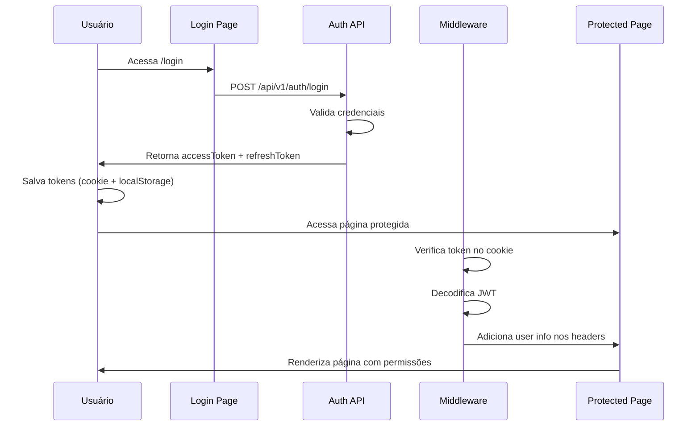

# 📚 Guia Completo do Sistema - Quayer WhatsApp Manager

## 🔐 Sistema de Autenticação e Permissões

### Roles do Sistema

O sistema possui **dois níveis de roles**:

#### 1. **System Role** (Role do Sistema)
- `admin`: Administrador do sistema (Quayer)
- `user`: Usuário comum (pertence a uma organização)

#### 2. **Organization Role** (Role na Organização)
Apenas para usuários com `system role = user`:
- `master`: Dono da organização (acesso total)
- `manager`: Gerente (acesso intermediário)
- `user`: Usuário comum (acesso limitado)

### Fluxo de Autenticação



### Tokens e Storage

**Access Token** (15 minutos de validade):
```json
{
  "userId": "uuid",
  "email": "user@example.com",
  "role": "admin | user",
  "currentOrgId": "uuid | null",
  "organizationRole": "master | manager | user | null",
  "type": "access"
}
```

**Onde os tokens são armazenados:**
1. **Cookie HTTP** (`accessToken`): Usado pelo middleware Next.js
2. **LocalStorage** (`accessToken`): Usado pelo Igniter.js client

**Sincronização automática:**
- O `AuthProvider` copia o token do cookie para localStorage na primeira carga
- O `Igniter.js client` lê o token do localStorage para chamadas API

---

## 📊 Sidebar e Navegação por Role

### 1. Admin do Sistema (`role: admin`)

**Sidebar:**
```
Logo Quayer

📊 Administração
   └─ Dashboard             /admin
   └─ Organizações          /admin/organizations
   └─ Clientes             /admin/clients
   └─ Integrações          /admin/integracoes

👤 Perfil do Admin
```

**Características:**
- ✅ Acesso total ao sistema
- ✅ Gerencia todas as organizações
- ✅ Visualiza todas as integrações de todos os clientes
- ❌ NÃO possui Organization Switcher (não pertence a nenhuma org)
- ❌ NÃO vê menu de usuário comum

---

### 2. Master/Manager (`role: user` + `organizationRole: master|manager`)

**Sidebar:**
```
Logo Quayer

🏢 [Organization Switcher]
   (ACME Corporation ▼)

📊 Dashboard              /integracoes/dashboard
🔌 Integrações           /integracoes
💬 Conversas             /conversas
📩 Mensagens             /integracoes/messages
📋 Projetos              /integracoes/projects
👥 Usuários              /integracoes/users
🔗 Webhooks              /integracoes/webhooks
⚙️  Configurações        /integracoes/settings

👤 Perfil do Usuário
```

**Permissões Master:**
- ✅ Criar, editar, deletar instâncias
- ✅ Gerenciar usuários da organização
- ✅ Gerenciar projetos
- ✅ Configurar webhooks
- ✅ Acessar todas as integrações da organização

**Permissões Manager:**
- ✅ Criar, editar instâncias (não deletar)
- ✅ Visualizar usuários
- ✅ Gerenciar projetos
- ✅ Visualizar webhooks (não editar)
- ✅ Acessar todas as integrações da organização

---

### 3. Usuário Comum (`role: user` + `organizationRole: user`)

**Sidebar:**
```
Logo Quayer

🏢 [Organization Switcher]
   (ACME Corporation ▼)

📊 Dashboard              /integracoes/dashboard
🔌 Minhas Integrações    /integracoes
💬 Conversas             /conversas
📩 Mensagens             /integracoes/messages

👤 Perfil do Usuário
```

**Permissões:**
- ✅ Visualizar suas próprias instâncias
- ✅ Enviar e receber mensagens
- ✅ Ver conversas
- ❌ NÃO pode criar/editar/deletar instâncias
- ❌ NÃO pode gerenciar usuários
- ❌ NÃO pode configurar webhooks

---

## 📱 Páginas e Funcionalidades

### 1. `/login` - Página de Login

**Funcionalidade:**
- Autenticação de usuários
- Salva tokens no cookie + localStorage
- Redireciona para área apropriada baseado no role

**Fluxo:**
```
1. Usuário digita email/senha
2. API valida credenciais
3. API retorna accessToken + refreshToken + user data
4. Frontend salva tokens
5. Redireciona:
   - Admin → /admin
   - User → /integracoes
```

---

### 2. `/admin` - Dashboard Admin

**Acesso:** Apenas `role: admin`

**Funcionalidades:**
- Visão geral de todas as organizações
- Estatísticas globais do sistema
- Gestão de clientes e organizações

**Proteção:**
```typescript
// middleware.ts
if (isAdminOnlyPath && !isSystemAdmin(payload.role)) {
  return NextResponse.redirect('/integracoes')
}
```

---

### 3. `/integracoes` - Gerenciamento de Instâncias WhatsApp

**Acesso:** Todos os usuários autenticados

**Layout:**
```
┌────────────────────────────────────────────────┐
│  Sidebar (320px)         │  Main Area         │
│                          │                     │
│  🔍 Buscar...            │  Detalhes da       │
│                          │  Instância         │
│  ┌─────────────────┐    │  Selecionada       │
│  │ Todas           │    │                     │
│  │ Conectadas (5)  │    │  - Status          │
│  │ Desconectadas(2)│    │  - Informações     │
│  └─────────────────┘    │  - Ações           │
│                          │                     │
│  📱 Instância 1          │                     │
│  📱 Instância 2          │                     │
│  📱 Instância 3          │                     │
│                          │                     │
└────────────────────────────────────────────────┘
```

**Funcionalidades:**
1. **Lista de Instâncias (Sidebar)**
   - Busca por nome ou telefone
   - Filtros: Todas / Conectadas / Desconectadas
   - Indicadores de status em tempo real
   - Avatares coloridos (verde = conectada, cinza = desconectada)

2. **Área Principal**
   - Estado vazio: "Escolha um contato para ver o chat completo"
   - Card de Status da Conexão
   - Informações da Instância
   - Ações Rápidas (Editar, Compartilhar)

3. **Modais**
   - ➕ Criar Nova Instância (`CreateInstanceModal`)
   - 🔌 Conectar Instância / QR Code (`ConnectionModal`)
   - ✏️ Editar Instância (`EditInstanceModal`)
   - 🔗 Compartilhar Instância (`ShareModal`)
   - 📊 Detalhes Completos (`DetailsModal`)

**Permissões por Ação:**
```typescript
// Master/Manager podem:
- Criar instância (canCreateInstance)
- Editar instância (canEditInstance)
- Conectar/Reconectar
- Compartilhar

// Apenas Master pode:
- Deletar instância (canDeleteInstance)

// User comum:
- Apenas visualizar
```

---

### 4. `/conversas` - Interface de Conversas WhatsApp

**Acesso:** Todos os usuários autenticados

**Layout (Inspirado no WhatsApp Web):**
```
┌────────────────────────────────────────────────┐
│  Sidebar (320px)         │  Chat Area         │
│                          │                     │
│  💬 Conversas            │  [Nome do Contato] │
│                          │  ════════════════   │
│  🔍 Buscar...            │                     │
│                          │  Mensagens aqui... │
│  ┌─────────────────┐    │                     │
│  │ Todas           │    │                     │
│  │ Conectadas (3)  │    │                     │
│  │ Desconectadas(1)│    │                     │
│  └─────────────────┘    │                     │
│                          │                     │
│  📱 +55 11 99999-9999    │  ┌──────────────┐  │
│  "Olá, tudo bem?"        │  │ Digite uma   │  │
│  2h                      │  │ mensagem...  │  │
│                          │  └──────────────┘  │
└────────────────────────────────────────────────┘
```

**Funcionalidades:**
1. **Lista de Conversas**
   - Preview da última mensagem
   - Timestamp relativo ("2h", "1d")
   - Filtros por status de conexão
   - Badge de alerta para instâncias desconectadas

2. **Área de Chat**
   - Header com informações da instância
   - Área de mensagens (preparada para Sprint 2)
   - Input de mensagem (desabilitado se desconectado)
   - Enter para enviar (Shift+Enter para quebra de linha)

3. **Estado Futuro (Sprint 2)**
   - Mensagens em tempo real via WebSocket
   - Upload de mídia
   - Templates de mensagem
   - Histórico de conversas

---

### 5. `/integracoes/dashboard` - Dashboard do Usuário

**Acesso:** `role: user` (master/manager/user)

**Funcionalidades:**
- Estatísticas das instâncias do usuário
- Gráficos de mensagens enviadas/recebidas
- Últimas atividades
- Status das conexões

---

### 6. `/integracoes/messages` - Gerenciamento de Mensagens

**Acesso:** Todos os usuários autenticados

**Funcionalidades:**
- Listar mensagens enviadas
- Filtrar por status (enviada, lida, falha)
- Ver detalhes de entrega
- Reenviar mensagens com falha

---

### 7. `/integracoes/webhooks` - Configuração de Webhooks

**Acesso:** Master e Manager (visualizar) | Apenas Master (editar)

**Funcionalidades:**
- Configurar URLs de webhook
- Selecionar eventos (mensagem recebida, status alterado, etc)
- Testar webhooks
- Ver logs de entregas

---

## 🔒 Sistema de Proteção (Middleware)

### Rotas Públicas (sem autenticação)
```typescript
[
  '/login',
  '/register',
  '/connect',
  '/forgot-password',
  '/reset-password',
]
```

### Rotas Protegidas (requerem autenticação)
```typescript
[
  '/integracoes',
  '/conversas',
  '/admin',
  '/dashboard',
  '/instances',
  '/organizations',
  '/projects',
  '/settings',
]
```

### Rotas Admin-Only
```typescript
['/admin']
```

**Fluxo de Proteção:**
```
1. Middleware intercepta requisição
2. Se rota pública → ✅ permite
3. Se rota protegida:
   a. Verifica token no cookie
   b. Se não tem token → redireciona /login
   c. Valida e decodifica token
   d. Se inválido/expirado → redireciona /login
   e. Se admin-only e não é admin → redireciona /integracoes
   f. Adiciona user info aos headers
   g. ✅ permite acesso
```

---

## 🛠️ Hooks e Integrações

### `useAuth()` - Hook de Autenticação

```typescript
const { user, isLoading, isAuthenticated, logout } = useAuth()

// user contém:
{
  id: string
  email: string
  name: string
  role: 'admin' | 'user'
  organizationRole?: 'master' | 'manager' | 'user'
  currentOrgId?: string
}
```

### `usePermissions()` - Hook de Permissões

```typescript
const {
  canCreateInstance,
  canEditInstance,
  canDeleteInstance,
  canManageUsers,
  canAccessAdmin,
  isAdmin,
  isMaster,
  isManager,
  isUser,
} = usePermissions()

// Uso em componentes:
{canCreateInstance && <Button>Criar Instância</Button>}
{canDeleteInstance && <Button variant="destructive">Deletar</Button>}
```

### `useInstances()` - Hook de Instâncias

```typescript
const { data, isLoading, error, refetch } = useInstances()

// data.data contém array de instâncias
// data.pagination contém { page, limit, total, totalPages }
```

### Igniter.js API Client

```typescript
import { api } from '@/igniter.client'

// Em Server Components:
const instances = await api.instances.list.query()

// Em Client Components:
const { data } = api.instances.list.useQuery()

// Mutations:
const result = await api.instances.create.mutate({
  body: { name: 'Nova Instância', phoneNumber: '+55...' }
})
```

**O client automaticamente:**
- ✅ Adiciona token JWT no header `Authorization: Bearer <token>`
- ✅ Lê do localStorage no client-side
- ✅ Type-safe com TypeScript
- ✅ Integra com React Query para cache

---

## 🐛 Troubleshooting

### Erro: "Token não fornecido"

**Causa:** O token não está sendo enviado nas requisições da API

**Solução:**
1. Verificar se o token está no localStorage:
```javascript
localStorage.getItem('accessToken')
```

2. Verificar se o token está no cookie:
```javascript
document.cookie.split(';').find(c => c.includes('accessToken'))
```

3. Se não estiver, fazer login novamente
4. Verificar console do browser para erros de CORS

### Erro: Middleware não encontrado

**Causa:** Rota não está configurada no `matcher` do middleware

**Solução:**
```typescript
// Adicionar rota em src/middleware.ts
const PROTECTED_PATHS = [
  '/integracoes',
  '/conversas', // ← adicionar aqui
  // ...
]
```

### Instâncias não aparecem

**Verificar:**
1. Token válido e não expirado
2. Usuário pertence a uma organização (se não for admin)
3. Instâncias existem no banco para aquela organização
4. Console do browser para erros na API

**Testar API manualmente:**
```bash
# Fazer login
curl -X POST http://localhost:3000/api/v1/auth/login \
  -H "Content-Type: application/json" \
  -d '{"email":"admin@quayer.com","password":"admin123456"}'

# Usar token retornado
curl http://localhost:3000/api/v1/instances \
  -H "Authorization: Bearer <TOKEN>"
```

---

## 📝 Resumo da Arquitetura

```
┌─────────────────────────────────────────────────┐
│             Frontend (Next.js 15)               │
│                                                 │
│  ┌────────────┐  ┌────────────┐  ┌──────────┐ │
│  │ AuthProvider│  │ AppSidebar │  │ Pages    │ │
│  │             │  │            │  │          │ │
│  │ - useAuth() │  │ - Roles    │  │ - Login  │ │
│  │ - JWT Parse │  │ - Perms    │  │ - Admin  │ │
│  └────────────┘  └────────────┘  │ - User   │ │
│                                   └──────────┘ │
│  ┌─────────────────────────────────────────┐  │
│  │      Igniter.js Client (Type-safe)      │  │
│  │      + React Query Cache                │  │
│  └─────────────────────────────────────────┘  │
└─────────────────────────────────────────────────┘
                      ↕ HTTP + JWT
┌─────────────────────────────────────────────────┐
│          Middleware (Next.js Edge)              │
│  - Verifica tokens                              │
│  - Adiciona user info aos headers              │
│  - Redireciona não autenticados                 │
└─────────────────────────────────────────────────┘
                      ↕
┌─────────────────────────────────────────────────┐
│         Backend (Igniter.js + Prisma)           │
│                                                 │
│  ┌──────────────────────────────────────────┐  │
│  │ Auth Controller                          │  │
│  │ - /api/v1/auth/login                     │  │
│  │ - /api/v1/auth/refresh                   │  │
│  └──────────────────────────────────────────┘  │
│  ┌──────────────────────────────────────────┐  │
│  │ Instances Controller                     │  │
│  │ - /api/v1/instances (CRUD)               │  │
│  │ - /api/v1/instances/:id/connect          │  │
│  │ - /api/v1/instances/:id/status           │  │
│  └──────────────────────────────────────────┘  │
│                                                 │
│  ┌──────────────────────────────────────────┐  │
│  │ Procedures (Auth + Permissions)          │  │
│  │ - authProcedure                          │  │
│  │ - instancesProcedure                     │  │
│  └──────────────────────────────────────────┘  │
└─────────────────────────────────────────────────┘
                      ↕
┌─────────────────────────────────────────────────┐
│         Database (PostgreSQL + Prisma)          │
│  - User                                         │
│  - Organization                                 │
│  - Instance                                     │
│  - RefreshToken                                 │
└─────────────────────────────────────────────────┘
```

---

## 🚀 Próximos Passos (Sprint 2)

1. **Integração de Mensagens em Tempo Real**
   - WebSocket com UAZapi
   - Real-time message sync
   - Push notifications

2. **Templates de Mensagens**
   - Criar templates
   - Variáveis dinâmicas
   - Biblioteca de templates

3. **Upload de Mídia**
   - Imagens, vídeos, documentos
   - Preview de arquivos
   - Compressão automática

4. **Relatórios e Analytics**
   - Dashboard com gráficos
   - Métricas de desempenho
   - Exportação de dados

5. **Automações**
   - Respostas automáticas
   - Chatbots
   - Fluxos de atendimento

---

**Documentação gerada em:** 04/10/2025
**Versão do Sistema:** 1.0.0
**Última atualização:** Correção do hook useInstances
