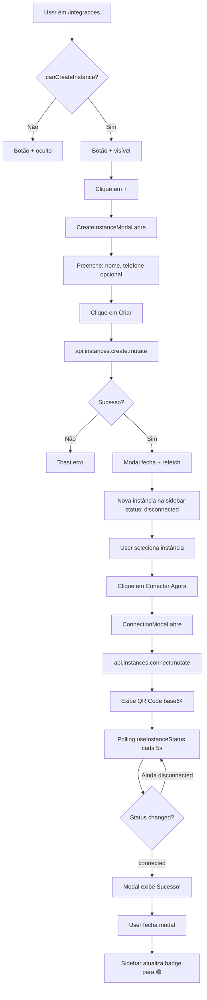
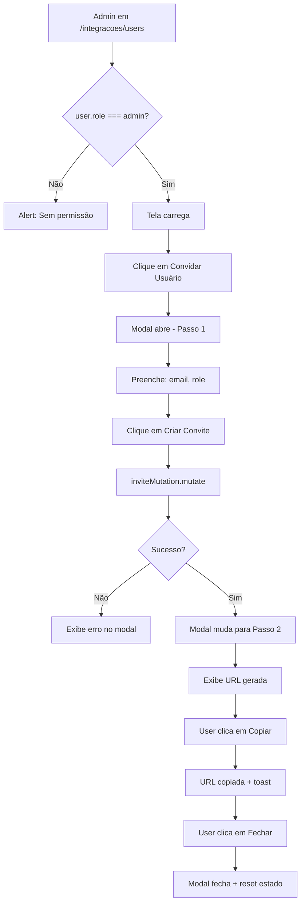

# Layout e UX - Módulo de Integrações | App Quayer

**Data:** 2025-10-09
**Contexto:** Documentação técnica de UX/UI do módulo de integrações WhatsApp
**Tipo:** Análise de layout, comportamento e fluxos de interação

---

## 📋 Sumário

**Usuário Final:**
- [4.1 - Tela Principal: Lista de Instâncias](#41-tela-principal-lista-de-instâncias)
- [4.2 - Dashboard: Métricas e Gráficos](#42-dashboard-métricas-e-gráficos)
- [4.3 - Configurações: Preferências da Conta](#43-configurações-preferências-da-conta)
- [4.4 - Usuários: Gerenciamento de Equipe](#44-usuários-gerenciamento-de-equipe)

**Administrador:**
- [5.1 - Admin: Tabela de Todas as Instâncias](#51-admin-tabela-de-todas-as-instâncias)
- [5.2 - Admin: Visão de Clientes (Sistema)](#52-admin-visão-de-clientes-sistema)

---

## 4. Telas do Usuário Final

### 4.1 Tela Principal: Lista de Instâncias

**Arquivo:** `src/app/integracoes/page.tsx`
**Rota:** `/integracoes`
**Permissões:** Todos os usuários autenticados (filtra por organização)

#### Layout Completo:

```
┌──────────────────────────────────────────────────────────────────────┐
│  Sidebar (320px)              │  Main Panel (flex-1)                 │
├───────────────────────────────┼──────────────────────────────────────┤
│ ┌───────────────────────────┐ │                                      │
│ │ Integrações WhatsApp  [+] │ │                                      │
│ └───────────────────────────┘ │                                      │
│ ┌───────────────────────────┐ │    ┌──────────────────────────────┐ │
│ │ [🔍] Buscar...            │ │    │                              │ │
│ └───────────────────────────┘ │    │    Empty State:              │ │
│                               │    │    📱 Phone Icon             │ │
│ ┌─────────────────────┐       │    │                              │ │
│ │[Todas|Conectadas(7)|       │    │ "Escolha um contato para     │ │
│ │ Desconectadas(3)]   │       │    │  ver o chat completo"        │ │
│ └─────────────────────┘       │    │                              │ │
│                               │    │ "Selecione uma instância..."│ │
│ ┌─ Instance Card ─────────┐  │    │                              │ │
│ │ 🟢 Instance Name        │  │    │  [+ Criar Primeira Integr.] │ │
│ │ +5511987654321         │  │    │     (se vazio + canCreate)   │ │
│ │ há 2 horas          [⋮]│  │    └──────────────────────────────┘ │
│ └─────────────────────────┘  │                                      │
│                               │             OU                       │
│ ┌─ Instance Card ─────────┐  │                                      │
│ │ 🔴 Instance 2           │  │    ┌──────────────────────────────┐ │
│ │ Não configurado         │  │    │ 🟢 Instance Name            │ │
│ │ há 1 dia            [⋮]│  │    │ +5511987654321               │ │
│ └─────────────────────────┘  │    └──────────────────────────────┘ │
│                               │                                      │
│ ┌─ Instance Card ─────────┐  │    ┌──────────────────────────────┐ │
│ │ 🟢 Instance 3           │  │    │  Status da Conexão       ⋮  │ │
│ │ +5521999999999         │  │    ├──────────────────────────────┤ │
│ │ há 5 minutos        [⋮]│  │    │ Status atual: [🟢 Conectado]│ │
│ └─────────────────────────┘  │    │                              │ │
│                               │    │ ⚠️ Esta instância está       │ │
│ ┌─ Instance Card ─────────┐  │    │    desconectada (se disc.)  │ │
│ │ 🔴 Instance 4           │  │    │                              │ │
│ │ Não configurado         │  │    │ [🔌 Conectar Agora]         │ │
│ │ há 3 dias           [⋮]│  │    └──────────────────────────────┘ │
│ └─────────────────────────┘  │                                      │
│                               │    ┌──────────────────────────────┐ │
│                               │    │  Informações                 │ │
│ (scroll se > 5 instâncias)    │    ├──────────────────────────────┤ │
│                               │    │ Nome: Instance Name          │ │
│ ┌───────────────────────────┐ │    │ Telefone: +5511987654321    │ │
│ │ 10 conversação(ões)       │ │    │ Criado: há 5 dias            │ │
│ │ End of list               │ │    │ Atualizado: há 2 horas       │ │
│ └───────────────────────────┘ │    └──────────────────────────────┘ │
│                               │                                      │
│                               │    ┌──────────────────────────────┐ │
│                               │    │  Ações Rápidas               │ │
│                               │    ├──────────────────────────────┤ │
│                               │    │ [✏️ Editar] [🔗 Compartilhar]│ │
│                               │    └──────────────────────────────┘ │
└───────────────────────────────┴──────────────────────────────────────┘
```

#### Comportamento:

**Estado Inicial:**
- Sidebar carrega lista de instâncias filtradas pela `organizationId` do usuário
- Main panel exibe empty state com mensagem "Escolha um contato para ver o chat completo"
- Botão `[+]` visível apenas se `canCreateInstance` (master, manager, admin)

**Filtros de Status:**
- **Todas:** Exibe todas as instâncias (sem filtro)
- **Conectadas (N):** Filtra `status === 'connected'` (badge verde 🟢)
- **Desconectadas (N):** Filtra `status === 'disconnected'` (badge vermelho 🔴 + alerta `!`)

**Busca Textual:**
- Filtra em tempo real por:
  - `instance.name` (case insensitive)
  - `instance.phoneNumber` (case insensitive)

**Clique em Instance Card:**
- Card fica destacado com `bg-accent`
- Main panel atualiza para mostrar detalhes da instância selecionada
- Seções exibidas:
  1. **Header** - Avatar, nome, telefone, menu `[⋮]`
  2. **Status da Conexão** - Badge de status + botão `[Conectar Agora]` se desconectado
  3. **Informações** - Nome, telefone, datas criação/atualização
  4. **Ações Rápidas** - Botões `[Editar]` e `[Compartilhar]` (se `canEditInstance`)

**Menu Dropdown `[⋮]` (por instância):**
```
┌────────────────────────────┐
│ 📱 Ver Detalhes            │
│ 🔌 Conectar (ou Reconectar)│  ← se canEditInstance
│ ✏️ Editar                  │  ← se canEditInstance
│ 🔗 Compartilhar            │  ← se canEditInstance
│ ────────────────────────   │
│ 🗑️ Deletar (vermelho)      │  ← se canDeleteInstance (master/admin)
└────────────────────────────┘
```

**Modais Acionados:**

1. **CreateInstanceModal** (clique em `[+]`):
   - Campos: Nome, Telefone (opcional)
   - Valida: nome mínimo 3 caracteres
   - Sucesso → Chama `api.instances.create.mutate()` → Refetch lista → Fecha modal

2. **ConnectionModal** (clique em `[Conectar]`):
   - Exibe QR Code base64 ou Pairing Code
   - Polling a cada 5s via `useInstanceStatus(id, isOpen)`
   - Quando `status === 'connected'` → Exibe "Conectado com sucesso!" → Refetch lista

3. **EditInstanceModal** (clique em `[Editar]`):
   - Campos: Nome, Telefone
   - Sucesso → Chama `api.instances.update.mutate()` → Refetch → Fecha

4. **ShareModal** (clique em `[Compartilhar]`):
   - Exibe link compartilhável da instância (se implementado)

5. **DetailsModal** (clique em `[Ver Detalhes]`):
   - Detalhamento completo da instância
   - Botão para editar dentro do modal

**Permissões Condicionais:**
```typescript
// Hook usePermissions()
canCreateInstance: isAdmin || isMaster || isManager  // Botão [+]
canEditInstance: isAdmin || isMaster || isManager    // Editar, Conectar, Compartilhar
canDeleteInstance: isAdmin || isMaster               // Deletar (apenas master/admin)
canViewInstances: true                               // Todos podem visualizar
```

---

### 4.2 Dashboard: Métricas e Gráficos

**Arquivo:** `src/app/integracoes/dashboard/page.tsx`
**Rota:** `/integracoes/dashboard`
**Permissões:** Todos os usuários autenticados

#### Layout Completo:

```
┌────────────────────────────────────────────────────────────────────────┐
│  Dashboard                                                             │
│  Bem-vindo(a), João! Acompanhe métricas de atendimento em tempo real. │
├────────────────────────────────────────────────────────────────────────┤
│                                                                        │
│  ┌──────────────┐ ┌──────────────┐ ┌──────────────┐ ┌──────────────┐ │
│  │🔌 Integrações│ │💬 Conversas  │ │📨 Mensagens  │ │🤖 IA         │ │
│  │   Ativas     │ │   Abertas    │ │   Hoje       │ │ Controladas  │ │
│  │              │ │              │ │              │ │              │ │
│  │     7        │ │     45       │ │   1,234      │ │     30       │ │
│  │ de 10 total  │ │ de 166 total │ │95.6% entregue│ │18% do total  │ │
│  └──────────────┘ └──────────────┘ └──────────────┘ └──────────────┘ │
│                                                                        │
├────────────────────────────────────────────────────────────────────────┤
│  Métricas de Conversas                                                │
│  Acompanhe o desempenho das suas conversas e campanhas                │
│ ┌─────────────────────────────────────────────────────────────────┐   │
│ │ Total      Em Andamento      IA      Humano   Tempo Médio  Taxa │   │
│ │  166           45            30        15        5.2min      78% │   │
│ └─────────────────────────────────────────────────────────────────┘   │
├────────────────────────────────────────────────────────────────────────┤
│  Performance de Mensagens                                             │
│  Disparos e entregas de mensagens                                     │
│ ┌──────────────┐ ┌──────────────┐ ┌──────────────┐ ┌──────────────┐  │
│ │📨 Enviadas   │ │✅ Entregues  │ │✅ Lidas      │ │❌ Falhadas   │  │
│ │              │ │              │ │              │ │              │  │
│ │   1,234      │ │   1,180      │ │     956      │ │      54      │  │
│ │              │ │   95.6%      │ │   81.0%      │ │    4.4%      │  │
│ └──────────────┘ └──────────────┘ └──────────────┘ └──────────────┘  │
├────────────────────────────────────────────────────────────────────────┤
│ ┌─────────────────────────────────┐ ┌─────────────────────────────┐  │
│ │ 📊 Conversas por Hora           │ │ 🥧 IA vs Humano             │  │
│ │ Últimas 24 horas                │ │ Distribuição de atendimentos│  │
│ │                                 │ │                             │  │
│ │      [Area Chart]               │ │      [Pie Chart]            │  │
│ │    ╱╲                           │ │                             │  │
│ │   ╱  ╲    ╱╲                    │ │       IA: 67%               │  │
│ │  ╱    ╲  ╱  ╲                   │ │       Humano: 33%           │  │
│ │ ╱      ╲╱    ╲                  │ │                             │  │
│ │────────────────────             │ │                             │  │
│ │00h 04h 08h 12h 16h 20h          │ │                             │  │
│ └─────────────────────────────────┘ └─────────────────────────────┘  │
│                                                                        │
│ ┌──────────────────────────────────────────────────────────────────┐  │
│ │ 📈 Mensagens por Status                                          │  │
│ │ Distribuição de mensagens enviadas                               │  │
│ │                                                                  │  │
│ │         [Bar Chart]                                              │  │
│ │   ██████████████  Enviadas (1234)                                │  │
│ │   ██████████████  Entregues (1180)                               │  │
│ │   ████████████    Lidas (956)                                    │  │
│ │   ██              Falhadas (54)                                  │  │
│ └──────────────────────────────────────────────────────────────────┘  │
└────────────────────────────────────────────────────────────────────────┘
```

#### Comportamento:

**Estado Inicial:**
- Carrega `api.instances.list.useQuery()` para calcular stats de instâncias
- Demais métricas são **mock data** (não implementado ainda):
  - Conversações (total, abertas, IA, humano)
  - Mensagens (enviadas, entregues, lidas, falhadas)
  - Gráficos (conversas por hora, IA vs Humano, mensagens por status)

**Cards de Estatísticas (4 principais):**

1. **Integrações Ativas:**
   - Valor: `instances.filter(i => i.status === 'connected').length`
   - Subtítulo: `de {instances.length} total`

2. **Conversas Abertas:**
   - Valor: Mock `45`
   - Subtítulo: `de 166 total`

3. **Mensagens Hoje:**
   - Valor: Mock `1,234`
   - Subtítulo: `95.6% entregues`

4. **Controladas por IA:**
   - Valor: Mock `30`
   - Subtítulo: `18% do total`

**Gráficos:**

1. **Area Chart - Conversas por Hora:**
   - Eixo X: Horários (00h - 23h)
   - Eixo Y: Quantidade de conversas
   - Dados: Mock array de 24 objetos `{hour, count}`

2. **Pie Chart - IA vs Humano:**
   - IA: 67% (cor: chart-1)
   - Humano: 33% (cor: chart-2)
   - Legenda interativa

3. **Bar Chart - Mensagens por Status:**
   - Barras verticais com cores distintas:
     - Enviadas: chart-1
     - Entregues: chart-2
     - Lidas: chart-3
     - Falhadas: chart-4
   - Tooltip mostra quantidade exata

**Observações:**
- Gráficos usam `recharts` com `ChartContainer` do shadcn/ui
- Cores seguem CSS variables: `hsl(var(--chart-1))`, `--chart-2`, etc.
- Loading state: Skeletons enquanto `isHydrated === false` ou `isLoading`
- Error state: Alert vermelho se `api.instances.list` falhar

**⚠️ Mock Data:**
Todos os dados de conversas e mensagens são estáticos e precisam ser substituídos por endpoints reais quando implementados.

---

### 4.3 Configurações: Preferências da Conta

**Arquivo:** `src/app/integracoes/settings/page.tsx`
**Rota:** `/integracoes/settings`
**Permissões:** Todos os usuários autenticados

#### Layout Completo:

```
┌────────────────────────────────────────────────────────────────────────┐
│  Configurações                                                         │
│  Gerencie suas preferências e configurações da conta                  │
├────────────────────────────────────────────────────────────────────────┤
│                                                                        │
│  ┌──────────────────────────────────────────────────────────────────┐ │
│  │ 👤 Perfil                                                        │ │
│  │ Atualize suas informações pessoais                               │ │
│  ├──────────────────────────────────────────────────────────────────┤ │
│  │ Nome:        [João Silva                                       ] │ │
│  │ E-mail:      [joao@example.com                                 ] │ │
│  │ Função:      [user                          ] (desabilitado)     │ │
│  │                                                                  │ │
│  │ [💾 Salvar Perfil]                                               │ │
│  └──────────────────────────────────────────────────────────────────┘ │
│                                                                        │
│  ┌──────────────────────────────────────────────────────────────────┐ │
│  │ 🎨 Aparência                                                     │ │
│  │ Personalize a aparência da aplicação                             │ │
│  ├──────────────────────────────────────────────────────────────────┤ │
│  │ Tema:         [Claro] [Escuro] [Sistema]                         │ │
│  │               Escolha o tema da interface                        │ │
│  └──────────────────────────────────────────────────────────────────┘ │
│                                                                        │
│  ┌──────────────────────────────────────────────────────────────────┐ │
│  │ 🕐 Horário de Atendimento                                        │ │
│  │ Defina o horário de funcionamento para atendimento automático    │ │
│  ├──────────────────────────────────────────────────────────────────┤ │
│  │ Habilitar Horário de Atendimento            [🔘 Toggle ON]      │ │
│  │ Controle automático baseado em horário de trabalho               │ │
│  │ ──────────────────────────────────────────────────────────────   │ │
│  │ Horário de Início:   [09:00]   Horário de Término:   [18:00]    │ │
│  │ Fuso Horário:        [São Paulo (GMT-3)           ▼]            │ │
│  │                                                                  │ │
│  │ Dias de Funcionamento:                                           │ │
│  │ [Seg][Ter][Qua][Qui][Sex] Sáb  Dom                              │ │
│  │  ^^^  ^^^  ^^^  ^^^  ^^^  (selecionados = azul)                 │ │
│  │                                                                  │ │
│  │ [💾 Salvar Horário]                                              │ │
│  └──────────────────────────────────────────────────────────────────┘ │
│                                                                        │
│  ┌──────────────────────────────────────────────────────────────────┐ │
│  │ 🔔 Notificações                                                  │ │
│  │ Configure como você deseja receber notificações                  │ │
│  ├──────────────────────────────────────────────────────────────────┤ │
│  │ Notificações por E-mail                         [🔘 Toggle ON]  │ │
│  │ Receba atualizações por e-mail                                   │ │
│  │ ──────────────────────────────────────────────────────────────   │ │
│  │ Alertas de Instância                            [🔘 Toggle ON]  │ │
│  │ Seja notificado quando instâncias desconectarem                  │ │
│  │ ──────────────────────────────────────────────────────────────   │ │
│  │ Falhas de Webhook                               [🔘 Toggle ON]  │ │
│  │ Receba alertas quando webhooks falharem                          │ │
│  │ ──────────────────────────────────────────────────────────────   │ │
│  │ Relatório Semanal                               [🔘 Toggle OFF] │ │
│  │ Receba um resumo semanal de atividades                           │ │
│  │                                                                  │ │
│  │ [💾 Salvar Preferências]                                         │ │
│  └──────────────────────────────────────────────────────────────────┘ │
│                                                                        │
│  ┌──────────────────────────────────────────────────────────────────┐ │
│  │ 🛡️ Segurança                                                     │ │
│  │ Altere sua senha e gerencie configurações de segurança           │ │
│  ├──────────────────────────────────────────────────────────────────┤ │
│  │ ⚠️ Dica de Segurança: Use uma senha forte com pelo menos 8      │ │
│  │    caracteres, incluindo letras, números e símbolos.             │ │
│  │                                                                  │ │
│  │ Senha Atual:          [••••••••••••                           ] │ │
│  │ Nova Senha:           [••••••••••••                           ] │ │
│  │ Confirmar Nova Senha: [••••••••••••                           ] │ │
│  │                                                                  │ │
│  │ [🛡️ Alterar Senha]                                               │ │
│  └──────────────────────────────────────────────────────────────────┘ │
└────────────────────────────────────────────────────────────────────────┘
```

#### Comportamento:

**1. Seção Perfil (👤):**
- **Campos:**
  - Nome: Input editável (pré-preenchido com `user.name`)
  - E-mail: Input editável (pré-preenchido com `user.email`)
  - Função: Input desabilitado (exibe `user.role`, não editável)
- **Botão `[Salvar Perfil]`:**
  - Clique → `setIsSaving(true)` → Simula delay 1s (TODO: implementar API)
  - Sucesso → Toast "Perfil atualizado com sucesso!"
  - Erro → Toast "Erro ao atualizar perfil"

**2. Seção Aparência (🎨):**
- **Tema:**
  - Três botões: `[Claro]` `[Escuro]` `[Sistema]`
  - Botão selecionado tem `variant="default"`, demais `variant="outline"`
  - Clique → Chama `setTheme('light'|'dark'|'system')` do hook `useTheme()`
  - Aplica imediatamente (sem botão salvar)

**3. Seção Horário de Atendimento (🕐):**
- **Toggle Principal:**
  - `[🔘 Habilitar Horário de Atendimento]`
  - ON → Exibe campos de configuração
  - OFF → Oculta campos
- **Campos (quando habilitado):**
  - Horário de Início: Input `type="time"` (default: 09:00)
  - Horário de Término: Input `type="time"` (default: 18:00)
  - Fuso Horário: Select com opções:
    - São Paulo (GMT-3)
    - Manaus (GMT-4)
    - Rio Branco (GMT-5)
  - Dias de Funcionamento:
    - 7 botões (Seg-Dom)
    - Selecionado: `variant="default"` (azul)
    - Não selecionado: `variant="outline"` (cinza)
    - Clique → Toggle no array `businessHours.workDays`
    - Default: Segunda a Sexta
- **Botão `[Salvar Horário]`:**
  - TODO: implementar API
  - Sucesso → Toast "Horário de atendimento atualizado!"

**4. Seção Notificações (🔔):**
- **4 Toggles:**
  1. **Notificações por E-mail** (default: ON)
  2. **Alertas de Instância** (default: ON) - Desconexões
  3. **Falhas de Webhook** (default: ON)
  4. **Relatório Semanal** (default: OFF)
- **Botão `[Salvar Preferências]`:**
  - TODO: implementar API
  - Sucesso → Toast "Preferências de notificação atualizadas!"

**5. Seção Segurança (🛡️):**
- **Alert Informativo:**
  - "Dica de Segurança: Use senha forte..."
- **Campos:**
  - Senha Atual: Input `type="password"`
  - Nova Senha: Input `type="password"`
  - Confirmar Nova Senha: Input `type="password"`
- **Validações locais (cliente):**
  - Todos os campos preenchidos
  - Nova senha === Confirmar nova senha
  - Nova senha ≥ 8 caracteres
  - Se falha → Toast com erro específico
- **Botão `[Alterar Senha]`:**
  - TODO: implementar API
  - Sucesso → Limpa campos + Toast "Senha alterada com sucesso!"
  - Erro → Toast "Erro ao alterar senha"

**Estados de Loading:**
- Todos os botões salvar mostram `<Loader2 className="animate-spin" />` durante `isSaving`
- Botões ficam `disabled` durante salvamento

**⚠️ Implementação Pendente:**
Todas as ações de salvar usam `await new Promise(resolve => setTimeout(resolve, 1000))` como placeholder. Endpoints API precisam ser criados.

---

### 4.4 Usuários: Gerenciamento de Equipe

**Arquivo:** `src/app/integracoes/users/page.tsx`
**Rota:** `/integracoes/users`
**Permissões:** `canManageUsers` (admin ou master)

#### Layout Completo:

```
┌────────────────────────────────────────────────────────────────────────┐
│  Usuários                                   [👥 Convidar Usuário]      │
│  Gerencie os usuários da organização                                  │
├────────────────────────────────────────────────────────────────────────┤
│  ┌──────────────┐ ┌──────────────┐ ┌──────────────┐ ┌──────────────┐ │
│  │Total Usuários│ │Usuários Ativos│ │Administrador │ │Masters/Manag.│ │
│  │              │ │               │ │              │ │              │ │
│  │      8       │ │       7       │ │      1       │ │      3       │ │
│  └──────────────┘ └──────────────┘ └──────────────┘ └──────────────┘ │
├────────────────────────────────────────────────────────────────────────┤
│  Lista de Usuários                                                    │
│  8 usuário(s) cadastrado(s)                                           │
│ ┌──────────────────────────────────────────────────────────────────┐  │
│ │ [🔍 Filtrar por nome...         ]  [Função ▼]                    │  │
│ ├──────────────────────────────────────────────────────────────────┤  │
│ │ ┏━━━━━━━━━━┯━━━━━━━━━━━━━━━┯━━━━━━━┯━━━━━━━┯━━━━━━━━━━━━━┯━━━┓ │  │
│ │ ┃ Nome ▲▼ │ Email ▲▼      │Função │Status │Data Criação ▲▼│⋮ ┃ │  │
│ │ ┣━━━━━━━━━━┿━━━━━━━━━━━━━━━┿━━━━━━━┿━━━━━━━┿━━━━━━━━━━━━━┿━━━┫ │  │
│ │ ┃João Silva│joao@email.com │[Master]│[Ativo]│há 30 dias    │⋮ ┃ │  │
│ │ ┃Maria Costa│maria@email.com│[Manager]│[Ativo]│há 15 dias   │⋮ ┃ │  │
│ │ ┃Pedro Souza│pedro@email.com│[Usuário]│[Ativo]│há 7 dias    │⋮ ┃ │  │
│ │ ┃Ana Lima  │ana@email.com  │[Admin] │[Ativo]│há 60 dias    │⋮ ┃ │  │
│ │ ┃Carlos Alv│carlos@email.com│[Usuário]│[Inativo]│há 90 dias│⋮ ┃ │  │
│ │ ┗━━━━━━━━━━┷━━━━━━━━━━━━━━━┷━━━━━━━┷━━━━━━━┷━━━━━━━━━━━━━┷━━━┛ │  │
│ │                                                                  │  │
│ │ 0 de 8 linha(s) selecionada(s).           [← Anterior] [Próx →] │  │
│ │                                           Página 1 de 1          │  │
│ └──────────────────────────────────────────────────────────────────┘  │
└────────────────────────────────────────────────────────────────────────┘

┌─────────────────────────────────────────────┐
│  MODAL: Convidar Novo Usuário               │
├─────────────────────────────────────────────┤
│  Crie um link de convite para novo usuário  │
│                                             │
│  Email:    [usuario@email.com           ]  │
│  Função:   [Usuário ▼]                     │
│            (opções: Usuário, Manager,       │
│             Master, Administrador)          │
│                                             │
│  [Cancelar]        [Criar Convite]         │
└─────────────────────────────────────────────┘

        OU (após criar)

┌─────────────────────────────────────────────┐
│  MODAL: Convidar Novo Usuário               │
├─────────────────────────────────────────────┤
│  ✅ Convite criado com sucesso!             │
│     Compartilhe o link abaixo:              │
│                                             │
│  [https://app.com/invite/token123  ] [📋]  │
│                                             │
│  [Fechar]                                  │
└─────────────────────────────────────────────┘
```

#### Comportamento:

**Proteção de Acesso:**
```typescript
if (currentUser?.role !== 'admin') {
  return <Alert>Você não tem permissão para acessar esta página.</Alert>
}
```
- **Somente admin (system role) acessa esta tela**
- Usuários comuns veem alerta de permissão negada

**Stats Cards (4):**
1. **Total de Usuários:** `users.length`
2. **Usuários Ativos:** `users.filter(u => u.isActive).length`
3. **Administradores:** `users.filter(u => u.role === 'admin').length`
4. **Masters/Managers:** `users.filter(u => u.role === 'master' || u.role === 'manager').length`

**Tabela de Usuários:**

**Colunas:**
1. **Nome** - Ordenável (clique em `▲▼`)
2. **Email** - Ordenável
3. **Função** - Badge colorido:
   - Admin → `variant="destructive"` (vermelho)
   - Master → `variant="default"` (azul)
   - Manager → `variant="default"` (azul)
   - Usuário → `variant="secondary"` (cinza)
4. **Status** - Badge:
   - Ativo → `variant="default"` (verde)
   - Inativo → `variant="destructive"` (vermelho)
5. **Data de Criação** - Ordenável, formatado com `date-fns` (ex: "há 30 dias")
6. **Ações** - Menu dropdown `[⋮]`

**Filtros:**
- **Busca textual:** Filtra por `name` (case insensitive)
- **Dropdown Função:**
  - Todas
  - Admin
  - Master
  - Manager
  - Usuário

**Menu Dropdown `[⋮]` (por usuário):**
```
┌────────────────────────────┐
│ Copiar ID do usuário       │
│ ──────────────────────     │
│ Ver detalhes               │
│ Editar usuário             │
└────────────────────────────┘
```
- **Copiar ID:** Copia `user.id` para clipboard
- **Ver detalhes / Editar:** TODO (não implementado)

**Paginação:**
- Botões `[← Anterior]` e `[Próxima →]`
- Exibe "Página X de Y"
- Exibe "N de M linha(s) selecionada(s)"
- Usa `@tanstack/react-table` com `getPaginationRowModel()`

**Modal: Convidar Usuário:**

**Passo 1 - Formulário:**
- Campo Email: Input `type="email"` (required)
- Campo Função: Select com opções:
  - Usuário
  - Manager
  - Master
  - Administrador
- Botão `[Criar Convite]`:
  - Clique → Chama `inviteMutation.mutate({ body: { email, role } })`
  - ⚠️ **TODO:** Mutation não implementada (placeholder)
  - Sucesso → Exibe passo 2

**Passo 2 - Link Gerado:**
- Alert verde: "✅ Convite criado com sucesso!"
- Input readonly com URL: `https://example.com/invite/token`
- Botão `[📋]`: Copia URL para clipboard → Toast "Link copiado!"
- Botão `[Fechar]`: Fecha modal e reseta estado

**Estados de Loading:**
- Tabela: Skeletons (5 linhas) enquanto `isLoading`
- Modal: Botão desabilitado durante `inviteMutation.loading`

**⚠️ Implementação Pendente:**
- Endpoint `api.auth.invite` não existe (mutation usa placeholder)
- Ações "Ver detalhes" e "Editar usuário" não implementadas

---

## 5. Telas do Administrador

### 5.1 Admin: Tabela de Todas as Instâncias

**Arquivo:** `src/app/admin/integracoes/page.tsx`
**Rota:** `/admin/integracoes`
**Permissões:** `canAccessAdmin` (somente `role === 'admin'`)

#### Layout Completo:

```
┌────────────────────────────────────────────────────────────────────────┐
│  Integrações                                   [+ Nova Integração]     │
│  Gerencie todas as integrações do sistema                             │
├────────────────────────────────────────────────────────────────────────┤
│  ┌──────────┐ ┌──────────┐ ┌──────────┐ ┌──────────┐ ┌──────────┐    │
│  │  Total   │ │Conectadas│ │Desconect.│ │  Ativas  │ │ Inativas │    │
│  │    10    │ │     7    │ │     3    │ │     7    │ │    3     │    │
│  └──────────┘ └──────────┘ └──────────┘ └──────────┘ └──────────┘    │
├────────────────────────────────────────────────────────────────────────┤
│  ┌──────────────────────────────────────────────────────────────────┐ │
│  │ [🔍 Buscar por nome ou telefone...                              ] │ │
│  ├──────────────────────────────────────────────────────────────────┤ │
│  │ ┏━━━━━━━━━━┯━━━━━━━━━━┯━━━━━━━━━━┯━━━━━━┯━━━━━━━┯━━━━━━━━━┓  │ │
│  │ ┃ Nome     │ Telefone │ Provedor │Status│Conexão│ Agentes │⋮┃  │ │
│  │ ┣━━━━━━━━━━┿━━━━━━━━━━┿━━━━━━━━━━┿━━━━━━┿━━━━━━━┿━━━━━━━━━┫  │ │
│  │ ┃Instance1 │+5511999  │📱WhatsApp│[Ativo]│[🟢Con]│0 agente │⋮┃  │ │
│  │ ┃          │          │falecomigo│      │ectado │         │ ┃  │ │
│  │ ┣━━━━━━━━━━┿━━━━━━━━━━┿━━━━━━━━━━┿━━━━━━┿━━━━━━━┿━━━━━━━━━┫  │ │
│  │ ┃Instance2 │    -     │📱WhatsApp│[Inativo│[🔴Des│0 agente │⋮┃  │ │
│  │ ┃          │          │falecomigo│      │conect │         │ ┃  │ │
│  │ ┣━━━━━━━━━━┿━━━━━━━━━━┿━━━━━━━━━━┿━━━━━━┿━━━━━━━┿━━━━━━━━━┫  │ │
│  │ ┃Instance3 │+5521888  │📱WhatsApp│[Ativo]│[🟢Con]│0 agente │⋮┃  │ │
│  │ ┃          │          │falecomigo│      │ectado │         │ ┃  │ │
│  │ ┗━━━━━━━━━━┷━━━━━━━━━━┷━━━━━━━━━━┷━━━━━━┷━━━━━━━┷━━━━━━━━━┛  │ │
│  │                                                                  │ │
│  └──────────────────────────────────────────────────────────────────┘ │
│                                                                        │
│  (Adiciona colunas extras comparado à tela user):                     │
│   - Provedor (logo + "WhatsApp falecomigo.ai")                        │
│   - Status (Ativo/Inativo - badge)                                    │
│   - Agentes (count - "0 agente(s)")                                   │
│   - Criado em (formatado com date-fns)                                │
│   - Atualizado em (formatado com date-fns)                            │
└────────────────────────────────────────────────────────────────────────┘
```

#### Comportamento:

**Diferenças vs Tela User:**

| Aspecto | User (`/integracoes`) | Admin (`/admin/integracoes`) |
|---------|-----------------------|------------------------------|
| **Layout** | Sidebar + Details Panel | Tabela completa full-width |
| **Filtro Org** | `organizationId = user.organizationId` | **SEM FILTRO** (todas orgs) |
| **Stats Cards** | 3 cards (Total, Conectadas, Desconectadas) | **5 cards** (+ Ativas, Inativas) |
| **Colunas Extras** | - | Provedor, Status, Agentes, Criado, Atualizado |
| **Endpoint** | `api.instances.list` (filtrado) | `api.instances.list` (sem filtro) |

**Stats Cards (5):**
1. **Total:** `instances.length`
2. **Conectadas:** `instances.filter(i => i.status === 'connected').length`
3. **Desconectadas:** `instances.filter(i => i.status === 'disconnected').length`
4. **Ativas:** `instances.filter(i => i.status === 'connected').length` (mesmo que Conectadas)
5. **Inativas:** `instances.filter(i => i.status !== 'connected').length`

**Colunas da Tabela:**

1. **Nome:** `instance.name`
2. **Telefone:** `instance.phoneNumber || '-'`
3. **Provedor:**
   - Logo: ``
   - Texto: "WhatsApp falecomigo.ai" (fixo)
4. **Status:**
   - Ativo → `variant="default"` (verde) se `status === 'connected'`
   - Inativo → `variant="secondary"` (cinza) se `status !== 'connected'`
5. **Conexão:**
   - Conectado → `variant="default"` (verde) se `status === 'connected'`
   - Desconectado → `variant="destructive"` (vermelho) se `status === 'disconnected'`
6. **Agentes:** `"0 agente(s)"` (placeholder - não implementado)
7. **Criado em:** `formatDistanceToNow(instance.createdAt)` (ex: "há 5 dias")
8. **Atualizado em:** `formatDistanceToNow(instance.updatedAt)` (ex: "há 2 horas")
9. **Ações:** Menu dropdown `[⋮]`

**Menu Dropdown `[⋮]`:**
```
┌────────────────────────────┐
│ Ver Detalhes               │
│ Editar                     │
│ Conectar (ou Reconectar)   │
│ Compartilhar               │
└────────────────────────────┘
```
- Abre mesmos modais que tela user:
  - `DetailsModal`
  - `EditInstanceModal`
  - `ConnectionModal`
  - `ShareModal`

**Busca:**
- Input filtra em tempo real por:
  - `instance.name` (case insensitive)
  - `instance.phoneNumber` (case insensitive)

**Estados:**
- **Loading:** Skeletons (5 linhas) enquanto `isLoading`
- **Empty:** Se `filteredInstances.length === 0`:
  ```
  📱 Nenhuma integração encontrada
  Crie sua primeira integração para começar
  [+ Criar Integração]
  ```

**⚠️ Observações:**

1. **Mesmo Hook `useInstances`:**
   - Tanto `/integracoes` quanto `/admin/integracoes` usam `useInstances()`
   - Backend detecta `user.role === 'admin'` e **não filtra** por organização
   - Admin vê instâncias de **todas organizações**

2. **UAZapi `/instance/all` NÃO usado:**
   - Apesar de existir `uazapiService.listAllInstances()`, **não é chamado**
   - Fonte de dados: Banco local (PostgreSQL via Prisma)

3. **Coluna "Agentes":**
   - Sempre exibe "0 agente(s)" (placeholder)
   - Funcionalidade de agentes não implementada

---

### 5.2 Admin: Visão de Clientes (Sistema)

**Arquivo:** `src/app/integracoes/admin/clients/page.tsx`
**Rota:** `/integracoes/admin/clients`
**Permissões:** Admin (implícito pela rota `/integracoes/admin/...`)

#### Layout Completo:

```
┌────────────────────────────────────────────────────────────────────────┐
│  Clientes                                          [+ Novo Cliente]    │
│  Lista de todos os clientes cadastrados no sistema                    │
├────────────────────────────────────────────────────────────────────────┤
│  ┌────────────────────┐ ┌────────────────────┐ ┌────────────────────┐ │
│  │👥 Total Clientes   │ │✅ Ativos           │ │❌ Inativos         │ │
│  │                    │ │                    │ │                    │ │
│  │        12          │ │        10          │ │         2          │ │
│  └────────────────────┘ └────────────────────┘ └────────────────────┘ │
├────────────────────────────────────────────────────────────────────────┤
│  ┌──────────────────────────────────────────────────────────────────┐ │
│  │ [🔍 Buscar por nome ou email...                                 ] │ │
│  ├──────────────────────────────────────────────────────────────────┤ │
│  │ ┏━━━━━━━━━━━━┯━━━━━━━━━━━━━━━┯━━━━━━━┯━━━━━━━━━━━━┯━━━━━━━━┓  │ │
│  │ ┃ Nome       │ Email         │Status │Cadastrado  │Último │⋮┃  │ │
│  │ ┃            │               │       │em          │Acesso │ ┃  │ │
│  │ ┣━━━━━━━━━━━━┿━━━━━━━━━━━━━━━┿━━━━━━━┿━━━━━━━━━━━━┿━━━━━━━━┫  │ │
│  │ ┃João Silva  │joao@email.com │[Ativo]│há 30 dias  │há 1 dia│⋮┃  │ │
│  │ ┣━━━━━━━━━━━━┿━━━━━━━━━━━━━━━┿━━━━━━━┿━━━━━━━━━━━━┿━━━━━━━━┫  │ │
│  │ ┃Maria Costa │maria@email.com│[Ativo]│há 15 dias  │há 3h   │⋮┃  │ │
│  │ ┣━━━━━━━━━━━━┿━━━━━━━━━━━━━━━┿━━━━━━━┿━━━━━━━━━━━━┿━━━━━━━━┫  │ │
│  │ ┃Pedro Souza │pedro@email.com│[Inativo│há 90 dias │Nunca   │⋮┃  │ │
│  │ ┣━━━━━━━━━━━━┿━━━━━━━━━━━━━━━┿━━━━━━━┿━━━━━━━━━━━━┿━━━━━━━━┫  │ │
│  │ ┃Ana Lima    │ana@email.com  │[Ativo]│há 60 dias  │há 5min │⋮┃  │ │
│  │ ┗━━━━━━━━━━━━┷━━━━━━━━━━━━━━━┷━━━━━━━┷━━━━━━━━━━━━┷━━━━━━━━┛  │ │
│  │                                                                  │ │
│  └──────────────────────────────────────────────────────────────────┘ │
└────────────────────────────────────────────────────────────────────────┘
```

#### Comportamento:

**Contexto:**
- Tela para **admin visualizar todos os usuários do sistema** (não apenas da organização)
- Chama `api.auth.listUsers.useQuery()` (sem filtro de organização)
- Rota: `/integracoes/admin/clients` (subpasta de `/integracoes`)

**Stats Cards (3):**
1. **Total de Clientes:** `users.length`
2. **Ativos:** `users.filter(u => u.isActive).length`
3. **Inativos:** `users.filter(u => !u.isActive).length`

**Colunas da Tabela:**

1. **Nome:** `user.name || 'Sem nome'`
2. **Email:** `user.email`
3. **Status:**
   - Ativo → `variant="default"` (verde)
   - Inativo → `variant="secondary"` (cinza)
4. **Cadastrado em:** `formatDistanceToNow(user.createdAt)` (ex: "há 30 dias")
5. **Último Acesso:**
   - Se `user.lastLoginAt` existe: `formatDistanceToNow(lastLoginAt)`
   - Caso contrário: "Nunca"
6. **Ações:** Menu dropdown `[⋮]`

**Menu Dropdown `[⋮]`:**
```
┌────────────────────────────┐
│ Ver Detalhes               │
│ Editar                     │
│ Ativar / Desativar         │  ← Dinâmico baseado em isActive
└────────────────────────────┘
```
- Ações **não implementadas** (TODO)

**Busca:**
- Filtra em tempo real por:
  - `user.name` (case insensitive)
  - `user.email` (case insensitive)

**Estados:**
- **Loading:** Skeletons (5 linhas) enquanto `isLoading`
- **Empty:** Se `filteredUsers.length === 0`:
  ```
  👥 Nenhum cliente encontrado
  Adicione o primeiro cliente para começar
  [+ Adicionar Cliente]
  ```
- **Error:** Alert vermelho com mensagem de erro

**Diferenças vs `/integracoes/users`:**

| Aspecto | `/integracoes/users` | `/integracoes/admin/clients` |
|---------|----------------------|------------------------------|
| **Contexto** | Usuários da organização | **Todos usuários do sistema** |
| **Stats** | Total, Ativos, Admins, Masters/Managers (4) | Total, Ativos, Inativos (3) |
| **Colunas** | Nome, Email, Função, Status, Data Criação, Ações | Nome, Email, Status, Cadastrado, **Último Acesso**, Ações |
| **Filtros** | Busca + Dropdown Função | **Somente busca** |
| **Modal Convite** | ✅ Implementado (parcial) | ❌ Não tem |
| **Paginação** | ✅ Completa (tanstack/react-table) | ❌ Não implementada |

**⚠️ Observações:**

1. **Endpoint Compartilhado:**
   - Tanto `/integracoes/users` quanto `/integracoes/admin/clients` usam `api.auth.listUsers.useQuery()`
   - Backend decide filtro por organização baseado em `user.role`

2. **Último Acesso:**
   - Coluna "Último Acesso" só existe nesta tela
   - Usa campo `user.lastLoginAt` (pode ser `null`)

3. **Botão "+ Novo Cliente":**
   - Existe no header mas **não tem funcionalidade** (TODO)
   - Deveria abrir modal de criação manual de cliente

---

## 6. Resumo de Navegação e Fluxos

### 6.1 Mapa de Rotas

```
/integracoes
  ├── /                     → Lista de Instâncias (Sidebar + Details)
  ├── /dashboard            → Dashboard com Métricas e Gráficos
  ├── /settings             → Configurações de Conta e Preferências
  ├── /users                → Gerenciamento de Usuários da Organização (admin/master)
  └── /admin
      └── /clients          → Visão de Todos os Clientes do Sistema (admin)

/admin
  └── /integracoes          → Tabela Completa de Todas as Instâncias (admin)
```

### 6.2 Permissões por Rota

| Rota | Permissão Requerida | Verificação |
|------|---------------------|-------------|
| `/integracoes` | Autenticado | `authProcedure()` |
| `/integracoes/dashboard` | Autenticado | `authProcedure()` |
| `/integracoes/settings` | Autenticado | `authProcedure()` |
| `/integracoes/users` | `canManageUsers` | `user.role === 'admin'` (validação client) |
| `/integracoes/admin/clients` | Admin (implícito) | Nenhuma validação explícita |
| `/admin/integracoes` | `canAccessAdmin` | `user.role === 'admin'` (backend) |

### 6.3 Modais Compartilhados

Os seguintes modais são usados em múltiplas telas:

1. **CreateInstanceModal:**
   - Usado em: `/integracoes`, `/admin/integracoes`
   - Campos: Nome, Telefone (opcional)
   - API: `api.instances.create.mutate()`

2. **ConnectionModal:**
   - Usado em: `/integracoes`, `/admin/integracoes`
   - Exibe QR Code ou Pairing Code
   - Polling: `useInstanceStatus(id, isOpen)` a cada 5s

3. **EditInstanceModal:**
   - Usado em: `/integracoes`, `/admin/integracoes`
   - Campos: Nome, Telefone
   - API: `api.instances.update.mutate()`

4. **DetailsModal:**
   - Usado em: `/integracoes`, `/admin/integracoes`
   - Exibe detalhes completos da instância
   - Botão para abrir `EditInstanceModal`

5. **ShareModal:**
   - Usado em: `/integracoes`, `/admin/integracoes`
   - Exibe link compartilhável (se implementado)

### 6.4 Hooks Compartilhados

**Todos as telas usam:**

```typescript
// Autenticação
const { user } = useAuth()

// Permissões
const {
  canCreateInstance,
  canEditInstance,
  canDeleteInstance,
  canManageUsers,
  canAccessAdmin,
  isAdmin,
  isMaster,
  isManager,
} = usePermissions()

// Instâncias
const { data: instancesData, isLoading, error, refetch } = useInstances()
// ou específico:
const { data: instance } = useInstance(id)
const { mutateAsync: createInstance } = useCreateInstance()
const { mutateAsync: updateInstance } = useUpdateInstance()
const { mutateAsync: connectInstance } = useConnectInstance()
const { data: status } = useInstanceStatus(id, enabled)

// Usuários (admin)
const { data: usersResponse, refetch, isLoading } = api.auth.listUsers.useQuery()

// Tema
const { theme, setTheme } = useTheme()
```

### 6.5 Estados de Loading e Erro

**Padrão em todas as telas:**

```typescript
// Loading State
if (isLoading) {
  return (
    <div className="space-y-2">
      {Array.from({ length: 5 }).map((_, i) => (
        <Skeleton key={i} className="h-16 w-full" />
      ))}
    </div>
  )
}

// Error State
if (error) {
  return (
    <Alert variant="destructive">
      <AlertDescription>
        Erro ao carregar dados: {error.message}
      </AlertDescription>
    </Alert>
  )
}

// Empty State
if (filteredData.length === 0) {
  return (
    <div className="text-center py-12">
      <Icon className="h-12 w-12 text-muted-foreground mx-auto mb-4" />
      <h3 className="text-lg font-semibold mb-2">Nenhum item encontrado</h3>
      <p className="text-muted-foreground mb-4">Mensagem contextual</p>
      {canCreate && (
        <Button onClick={handleCreate}>
          <Plus className="h-4 w-4 mr-2" />
          Criar Item
        </Button>
      )}
    </div>
  )
}
```

---

## 7. Componentes UI Comuns

### 7.1 shadcn/ui Components Utilizados

Todos usados consistentemente em todo o módulo:

| Componente | Uso |
|------------|-----|
| `Card` | Containers de seções (stats, tabelas, formulários) |
| `Button` | Ações primárias/secundárias, navegação |
| `Input` | Campos de texto, busca, senhas |
| `Badge` | Status (Ativo/Inativo, Conectado/Desconectado, Roles) |
| `Skeleton` | Loading states |
| `Alert` | Erros, avisos, dicas |
| `Table` | Listagens tabulares (admin) |
| `Tabs` | Filtros (Todas/Conectadas/Desconectadas) |
| `Avatar` | Ícones de instâncias |
| `DropdownMenu` | Menus de ações `[⋮]` |
| `Dialog` | Modais (Create, Edit, Connection, etc.) |
| `Select` | Dropdowns de seleção (função, fuso horário) |
| `Switch` | Toggles (notificações, horário atendimento) |
| `Separator` | Divisores visuais |
| `toast` (sonner) | Notificações temporárias (sucesso/erro) |

### 7.2 Padrões de Ícones (lucide-react)

| Contexto | Ícone | Uso |
|----------|-------|-----|
| Instâncias | `Phone`, `Plug` | Cards, avatars, empty states |
| Ações | `Plus`, `Edit`, `Trash2`, `MoreVertical` | Botões, menus |
| Status | `CheckCircle2`, `XCircle`, `AlertCircle` | Badges, alertas |
| Busca | `Search` | Input prefixes |
| Menu | `MoreVertical` | Dropdown triggers |
| Conexão | `Plug`, `PlugZap` | Status de integração |
| Usuários | `User`, `Users`, `UserPlus`, `UserCheck`, `UserX` | Gerenciamento de equipe |
| Configurações | `Save`, `Shield`, `Bell`, `Palette`, `Clock` | Settings cards |
| Gráficos | `BarChart3`, `PieChart`, `TrendingUp` | Dashboard charts |

### 7.3 Cores e Variants Padronizados

**Badge Variants:**
```typescript
// Status
status === 'connected' → variant="default" (verde)
status === 'disconnected' → variant="destructive" (vermelho)
isActive === true → variant="default" (verde)
isActive === false → variant="secondary" (cinza)

// Roles
role === 'admin' → variant="destructive" (vermelho)
role === 'master' → variant="default" (azul)
role === 'manager' → variant="default" (azul)
role === 'user' → variant="secondary" (cinza)
```

**Button Variants:**
```typescript
// Primary actions
variant="default" → Azul (ações principais)

// Secondary actions
variant="outline" → Cinza com borda (ações secundárias)
variant="ghost" → Transparente (menus, ícones)

// Destructive
variant="destructive" → Vermelho (deletar)
```

**Card Styling:**
- Stats Cards: `pb-3` no CardHeader para compactar
- Títulos grandes: `text-4xl` para números principais
- Subtítulos: `text-xs text-muted-foreground`

---

## 8. Fluxos de Interação Críticos

### 8.1 Fluxo: Criar e Conectar Instância (Completo)



**Pontos Críticos:**
1. Validação RBAC antes de exibir botão `[+]`
2. Dupla persistência: UAZapi externa → Banco local
3. Polling automático a cada 5s evita spam manual
4. Refetch automático ao fechar modais mantém UI sincronizada

### 8.2 Fluxo: Convidar Usuário (Admin)



**⚠️ Implementação Atual:**
- Mutation `inviteMutation` usa **placeholder** (não conectado a API real)
- URL gerada é **mock**: `https://example.com/invite/token`
- Precisa implementar endpoint `api.auth.invite` no backend

### 8.3 Fluxo: Filtro e Busca (Todas Tabelas)

**Client-side filtering:**
```typescript
// 1. User digita na busca
setSearchTerm(e.target.value)

// 2. Filtro reativo
const filteredInstances = instances
  .filter(instance => {
    // Filtro por status (tabs)
    if (filter === 'connected') return instance.status === 'connected'
    if (filter === 'disconnected') return instance.status === 'disconnected'
    return true
  })
  .filter(instance =>
    // Filtro por busca textual
    instance.name.toLowerCase().includes(searchTerm.toLowerCase()) ||
    instance.phoneNumber?.toLowerCase().includes(searchTerm.toLowerCase())
  )

// 3. Render atualiza automaticamente (React state)
```

**Sem debounce:** Filtro acontece imediatamente a cada keystroke (OK para datasets pequenos < 100 items)

---

## 9. Implementações Pendentes (TODO)

### 9.1 Alta Prioridade

**Backend:**
1. **Endpoint invite users:** `api.auth.invite.mutate({ email, role })`
2. **Endpoint update profile:** `api.auth.updateProfile.mutate({ name, email })`
3. **Endpoint change password:** `api.auth.changePassword.mutate({ currentPassword, newPassword })`
4. **Endpoint save settings:** Notificações, horário atendimento, etc.
5. **Endpoint delete instance:** `api.instances.delete.mutate(id)` (existe mas não conectado)

**Frontend:**
1. **Conectar delete instance:** Botão "Deletar" chama API real
2. **Implementar ações em users table:** "Ver detalhes", "Editar usuário"
3. **Implementar ações em clients table:** "Ver Detalhes", "Editar", "Ativar/Desativar"

### 9.2 Média Prioridade

**Métricas e Gráficos:**
1. **Substituir mock data no Dashboard:**
   - Endpoint para conversações (total, abertas, IA, humano)
   - Endpoint para mensagens (enviadas, entregues, lidas, falhadas)
   - Endpoint para conversas por hora (últimas 24h)
2. **Implementar contador de agentes:** Coluna "Agentes" sempre mostra "0 agente(s)"

**UX:**
1. **Paginação em `/integracoes/admin/clients`:** Atualmente sem paginação
2. **Debounce em buscas:** Para performance com datasets grandes
3. **Ordenação persistente:** Salvar preferências de ordenação no localStorage

### 9.3 Baixa Prioridade

**Funcionalidades Adicionais:**
1. **Share modal:** Implementar lógica de compartilhamento de instâncias
2. **Bulk actions:** Seleção múltipla e ações em lote (tabelas)
3. **Export data:** Exportar tabelas para CSV/Excel
4. **Advanced filters:** Filtros compostos (data range, múltiplos status)
5. **Real-time notifications:** WebSocket para alertas instantâneos de desconexão

---

## 10. Conclusão

### 10.1 Pontos Fortes do Design Atual

✅ **Consistência Visual:**
- Uso padronizado de shadcn/ui em todas as telas
- Cores e variants consistentes (badges, buttons, cards)
- Ícones lucide-react bem escolhidos e semânticos

✅ **Separação Clara User vs Admin:**
- User: Sidebar + Details (foco em usabilidade)
- Admin: Tabelas completas (foco em overview)
- Permissões RBAC bem aplicadas na UI

✅ **Estados de UI Completos:**
- Loading states com Skeletons
- Error states com Alerts
- Empty states com CTAs (quando aplicável)

✅ **Modais Reutilizáveis:**
- Componentes compartilhados entre telas
- Lógica de estado bem encapsulada
- Refetch automático pós-ações

### 10.2 Oportunidades de Melhoria

⚠️ **Implementações Pendentes:**
- ~40% das funcionalidades usam mock data ou placeholders
- Settings não salva (todas ações são simuladas)
- Dashboard inteiro é mock (conversas, mensagens, gráficos)

⚠️ **Performance:**
- Filtros client-side sem debounce (OK para < 100 items)
- Sem virtualização em listas longas
- Polling a cada 5s pode ser otimizado com WebSockets

⚠️ **Validações:**
- Validações client-side presentes, mas backend precisa revalidar
- Sem tratamento de rate limiting
- Sem feedback de progresso em uploads (quando aplicável)

### 10.3 Próximos Passos Recomendados

**Fase 1 - Completar Backend (2-3 semanas):**
1. Implementar endpoints de settings (profile, password, notifications)
2. Conectar delete instance
3. Implementar invite users com geração de token real
4. Criar endpoints de métricas para Dashboard

**Fase 2 - Refinar UX (1-2 semanas):**
1. Adicionar debounce em buscas
2. Implementar paginação em clients table
3. Melhorar feedback visual de loading (progress bars)
4. Adicionar confirmações de ações destrutivas

**Fase 3 - Features Avançadas (3-4 semanas):**
1. Real-time notifications (WebSockets)
2. Bulk actions em tabelas
3. Export para CSV/Excel
4. Advanced filters e saved searches

---

**Documento gerado em:** 2025-10-09
**Versão:** 1.0
**Autor:** Lia AI Agent
**Total de telas documentadas:** 6 (4 user + 2 admin)
