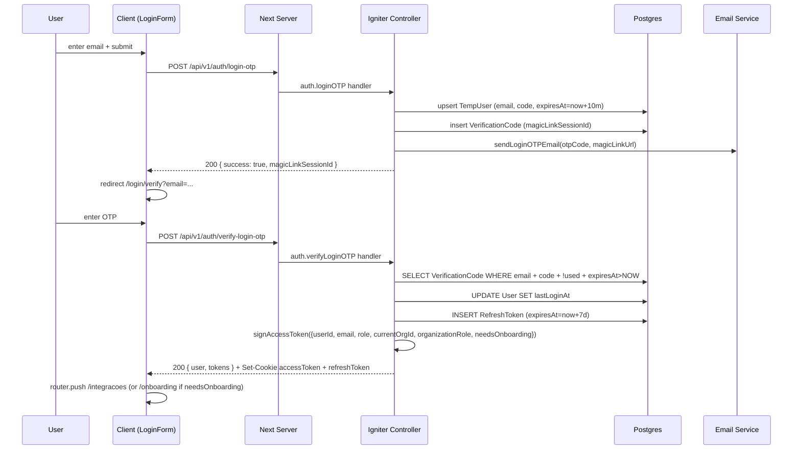

# Auth Technical Flow

## OTP Login Sequence

## OTP Lifecycle
- **Generation:** 6 digitos numericos via `generateOTPCode()` em `src/lib/auth/otp.ts`. Armazenado **PLAINTEXT** em `VerificationCode.code` e em `TempUser.code` (achado conhecido da Release 1 Wave 3).
- **TTL:**
  - Login OTP: **10 minutos** (`auth.controller.ts:1537` -> `Date.now() + 10*60*1000`)
  - Signup OTP: **10 minutos** (`auth.controller.ts:1251`)
  - Verify-email / send-verification: **15 minutos** (`auth.controller.ts:1107` e `:1421`)
  - Magic link JWT: **10 minutos** (default em `signMagicLinkToken`, `src/lib/auth/jwt.ts:287`)
- **Used flag:** `VerificationCode.usedAt` setado no successful verify (single-use).
- **Cleanup:** [TODO: verify if scheduled job exists in `src/server/services/jobs/` — no obvious cron found via grep]

## JWT
- **Algorithm:** HS256 (default `jsonwebtoken.sign` sem `algorithm` explicito)
- **Secret:** `process.env.JWT_SECRET` (obrigatorio, throws se ausente). Refresh usa `JWT_REFRESH_SECRET` ou cai no `JWT_SECRET`.
- **Issuer/Audience:** `issuer: 'quayer'`, `audience: 'quayer-api'`
- **Access token payload:** `{ userId, email, role, currentOrgId?, organizationRole?, needsOnboarding?, type: 'access', iat, exp }`
- **Access token lifetime:** **15 minutos** (`ACCESS_TOKEN_EXPIRY = '15m'` em `src/lib/auth/jwt.ts:24`)
- **Refresh token lifetime:** **7 dias** (`REFRESH_TOKEN_EXPIRY = '7d'`). Refresh tokens persistidos na tabela `RefreshToken` com `expiresAt` e `revokedAt`.
- **Refresh flow:** POST `/api/v1/auth/refresh` (`auth.controller.ts:503`). Verifica refresh token, valida `revokedAt`/`expiresAt`, emite novo par de tokens.
- **Magic link token:** payload `{ email, tokenId, type: 'magic-link-login' | 'magic-link-signup', name? }`, TTL 10m.
- **2FA challenge token:** `{ userId, type: '2fa-challenge' }`, TTL 5m.

## Session
- **Cookie principal:** `accessToken` (camelCase, NAO `access_token`)
- **Cookie refresh:** `refreshToken`, scoped a `path=/api/v1/auth/refresh`
- **Flags:** `HttpOnly`, `Secure` em producao, `SameSite=Lax`, `path=/`
- **Leitura:** `cookies()` em Server Components; client raramente le (Next router push apos login).

## Middleware
- **Arquivo:** `src/middleware.ts`
- **PUBLIC_PATHS** (linha 15): `/login`, `/register`, `/signup`, `/connect`, `/forgot-password`, `/reset-password`, `/google-callback`, `/verify-email`, `/verify`
- **ONBOARDING_PATHS:** `/onboarding`
- **PROTECTED_PATHS:** `/integracoes`, `/conversas`, `/admin`, `/dashboard`, `/instances`, `/organizations`, `/projects`, `/settings`, `/onboarding`
- **ADMIN_ONLY_PATHS:** `/admin`
- **Redirects:**
  - Sem token em rota protegida -> `/login?redirect=<pathname>`
  - Token invalido/expirado -> `/login?redirect=<pathname>&error=session_expired` + delete cookies
  - `payload.needsOnboarding && !isOnboardingPath` -> `/onboarding`
  - `!payload.needsOnboarding && isOnboardingPath` -> `/integracoes`
  - Rota `/admin` sem role SystemAdmin -> `/integracoes` (silencioso)
- **Headers injetados:** `x-user-id`, `x-user-email`, `x-user-role`, `x-needs-onboarding`, `x-current-org-id`, `x-organization-role`
- **IP block:** removido do middleware (Edge runtime nao pode fazer fetch bloqueante); aplicado na camada de API.
- **Verify:** `verifyAccessToken` de `@/lib/auth/jwt.edge` (variant Edge-safe)

## Endpoints Reference
| Endpoint | Method | Request body | Response |
|---|---|---|---|
| /api/v1/auth/login-otp | POST | { email } | { success, magicLinkSessionId } |
| /api/v1/auth/verify-login-otp | POST | { email, code } | { user, tokens } ou { requires2FA, challengeToken } |
| /api/v1/auth/signup-otp | POST | { email, name } | { success, magicLinkSessionId } |
| /api/v1/auth/verify-signup-otp | POST | { email, code } | { user, tokens } |
| /api/v1/auth/verify-magic-link | POST | { token } | { user, tokens } ou { requires2FA, ... } |
| /api/v1/auth/check-magic-link-status | POST | { sessionId } | { verified, expired, tokens? } |
| /api/v1/auth/send-verification | POST | { email } | { success } |
| /api/v1/auth/verify-email | POST | { email, code } | { user, tokens } |
| /api/v1/auth/resend-verification | POST | { email } | { success } |
| /api/v1/auth/refresh | POST | (refreshToken cookie) | { tokens } |
| /api/v1/auth/logout | POST | - | { success } |
| /api/v1/auth/me | GET | - | { user, organizations } |
| /api/v1/auth/profile | PATCH | { name?, image?, ... } | { user } |
| /api/v1/auth/preferences | PATCH | { ... } | { preferences } |
| /api/v1/auth/switch-organization | POST | { organizationId } | { tokens } |
| /api/v1/auth/onboarding/complete | POST | { organizationName, ... } | { user, tokens } |
| /api/v1/auth/google | GET | - | redirect Google OAuth |
| /api/v1/auth/google/callback | POST | { code } | { user, tokens } |
| /api/v1/auth/users | GET | - | { users[] } (admin) |

[TODO: verify TOTP endpoints (`/totp/setup`, `/totp/verify`, `/totp/challenge`, `/totp/recovery`, `/totp/disable`, `/totp/regenerate-codes`) wired in same controller; phone-OTP endpoints also exist]

## Troubleshooting
- **OTP nao chega:** verificar `EMAIL_PROVIDER` env, Mailhog em local (`http://localhost:8025`), logs do controller (`auth.controller.ts:1282` para signup, `:1565` para login).
- **JWT invalido:** verificar `JWT_SECRET` setado, checar expiracao (15m), limpar cookie `accessToken`.
- **Session expirada:** middleware redireciona para `/login?error=session_expired`. Refresh flow em `/api/v1/auth/refresh` deveria ser acionado antes do expiry pelo client (verificar se ha interceptor automatico — [TODO: checar `src/lib/api-client/`]).
- **Magic link link quebrado:** verificar `NEXT_PUBLIC_APP_URL` ou `APP_URL` env (`auth.controller.ts:109`); fallback `https://quayer.com`.
- **2FA bloqueia login:** challenge JWT TTL=5min; tentativas rate-limited (TTL 10min via Redis em `auth.controller.ts:199`).

## References
- `src/middleware.ts`
- `src/lib/auth/jwt.ts`, `src/lib/auth/jwt.edge.ts`
- `src/server/core/auth/controllers/auth.controller.ts`
- `docs/auth/USER_JOURNEY.md`
- `docs/auth/FEATURE_FLAGS.md`
