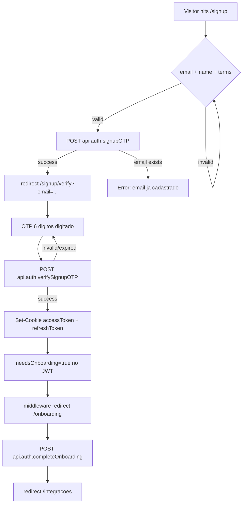
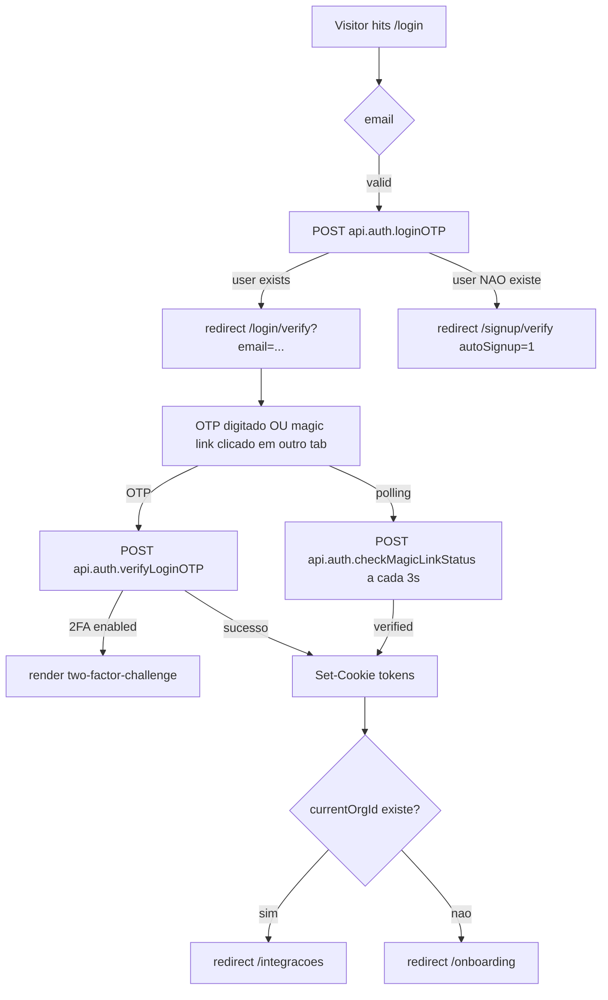
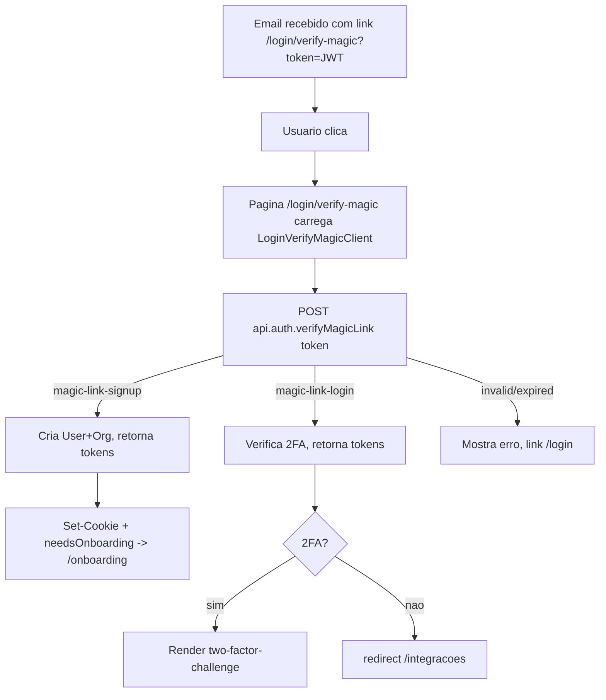
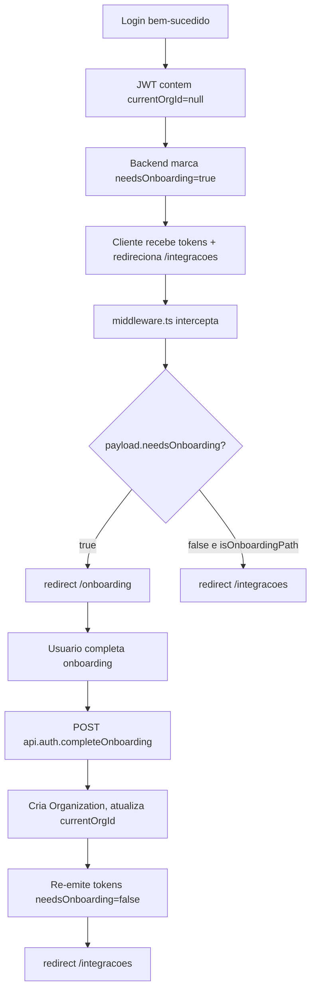

# Auth User Journeys

Reflects state AFTER Release 2 cleanup. Magic-link routes are KEEP (wired into email generation by `auth.controller.ts` for both login and signup flows). The `/register`, `/forgot-password`, `/reset-password` route names still appear in `src/middleware.ts` PUBLIC_PATHS but the user-facing pages have been removed.

## Journey 1: New User Signup (OTP)

Steps detail:
- **Step B:** `src/client/components/auth/signup-form.tsx` (form principal de signup)
- **Step C:** `api.auth.signupOTP.useMutation({ body: { email, name } })` -> POST `/api/v1/auth/signup-otp` (handler em `src/server/core/auth/controllers/auth.controller.ts:1223`). Cria `TempUser` + `VerificationCode` (TTL 10min) e envia email com OTP + magic link.
- **Step D:** Pagina `src/app/(auth)/signup/verify/page.tsx` -> `signup-otp-form.tsx`
- **Step F:** `api.auth.verifySignupOTP.useMutation({ body: { email, code } })` -> POST `/api/v1/auth/verify-signup-otp` (handler em `auth.controller.ts:1291`). Cria `User` + `Organization`, gera tokens (refresh TTL 7d).
- **Step I:** `src/middleware.ts` linha 104: `if (payload.needsOnboarding && !isOnboardingPath) -> redirect /onboarding`.
- **Step J:** `src/app/(auth)/onboarding/...` -> `api.auth.completeOnboarding` POST `/api/v1/auth/onboarding/complete`.

## Journey 2: Existing User Login (OTP)

Steps detail:
- **Step B:** `src/client/components/auth/login-form-final.tsx` -> `login-otp-form.tsx`
- **Step C:** POST `/api/v1/auth/login-otp` (`auth.controller.ts:1462`). Se email nao existe, dispara fluxo de signup automatico (`signupOtpCode`).
- **Step D:** `src/app/(auth)/login/verify/page.tsx`
- **Step F:** POST `/api/v1/auth/verify-login-otp` (`auth.controller.ts:1581`). Retorna `requires2FA: true` se TOTP ativo.
- **Step Fp:** `checkMagicLinkStatus` -> POST `/api/v1/auth/check-magic-link-status` (polling cross-tab, `auth.controller.ts:1937`).
- **Step G2:** `src/client/components/auth/two-factor-challenge.tsx`.

## Journey 3: Magic Link

Steps detail:
- **Step A:** Email gerado em `auth.controller.ts:1559` (`magicLinkUrl = ${appBaseUrl}/login/verify-magic?token=${magicLinkToken}`). Token JWT assinado por `signMagicLinkToken` (TTL 10min) em `src/lib/auth/jwt.ts:285`.
- **Step C:** `src/app/(auth)/login/verify-magic/LoginVerifyMagicClient.tsx`.
- **Step D:** POST `/api/v1/auth/verify-magic-link` (`auth.controller.ts:1705`). Verifica `payload.type === 'magic-link-login' | 'magic-link-signup'`.
- **Signup magic link:** `${appBaseUrl}/signup/verify-magic?token=...` (`auth.controller.ts:1279`).

## Journey 4: User Without Active Organization

Steps detail:
- **Step E:** `src/middleware.ts` linhas 100-114.
- **Step J:** POST `/api/v1/auth/onboarding/complete` (`auth.controller.ts:2074`).

## References
- `.claude/skills/auth-pages.md` [TODO: verify file exists]
- `docs/auth/AUTH_FLOW.md`
- `docs/auth/FEATURE_FLAGS.md`
- `docs/auth/CLEANUP_AUDIT.md`
