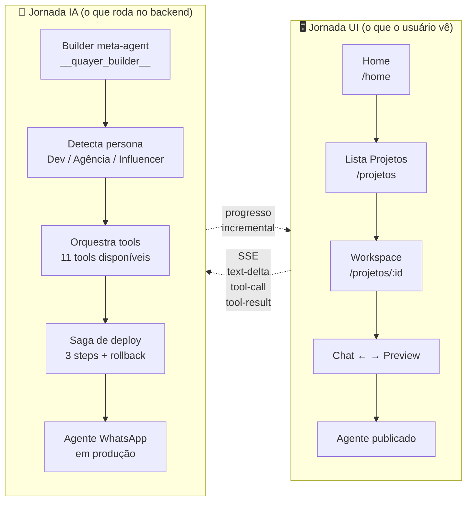
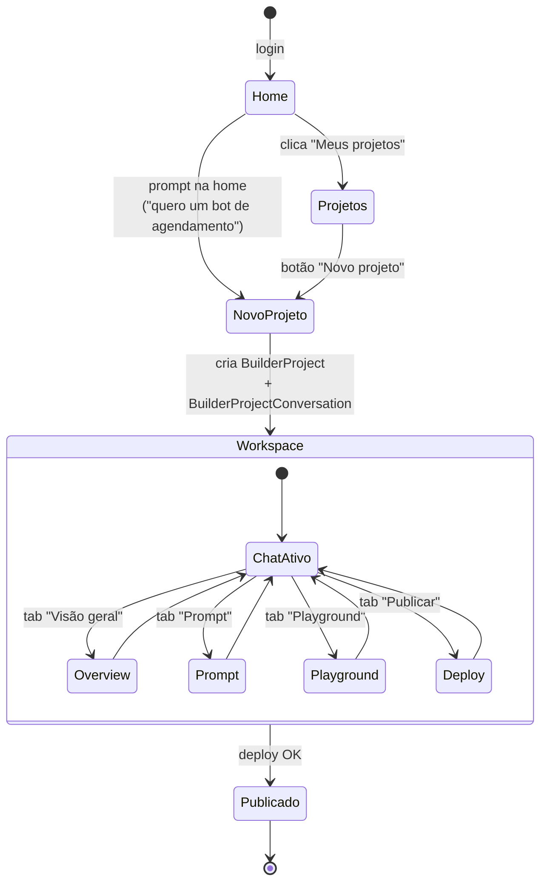
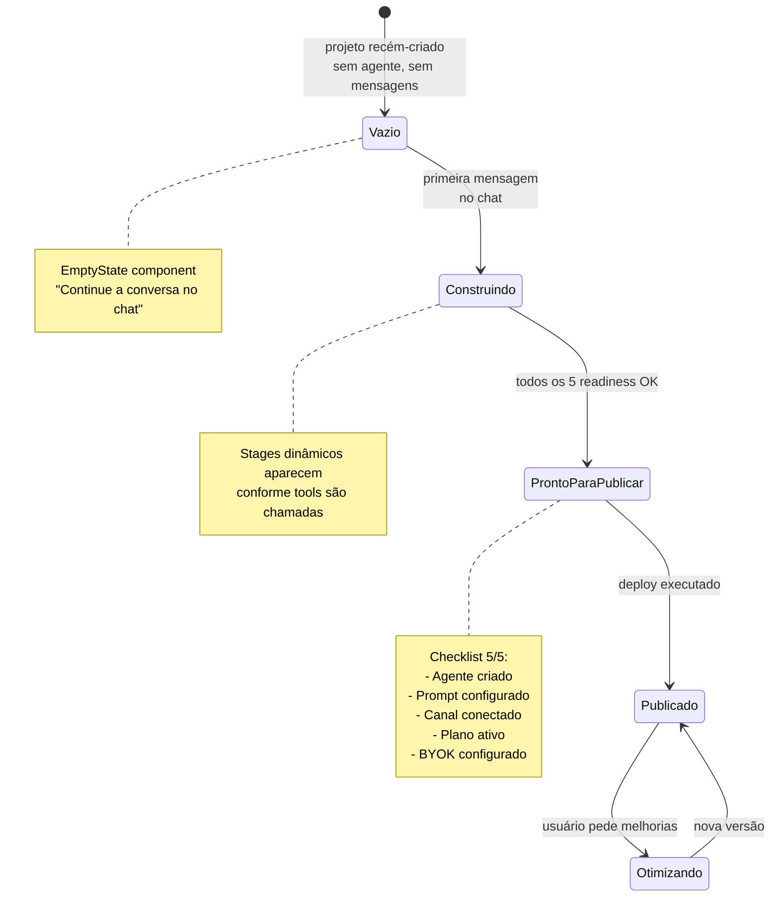
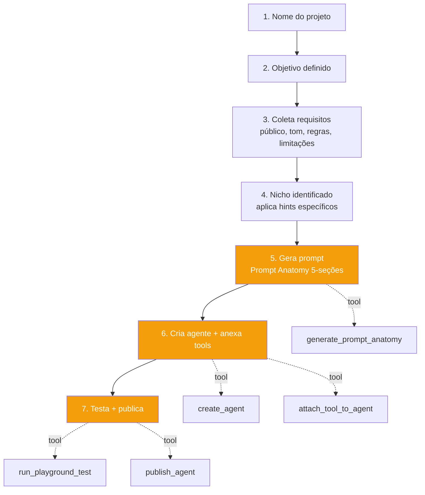
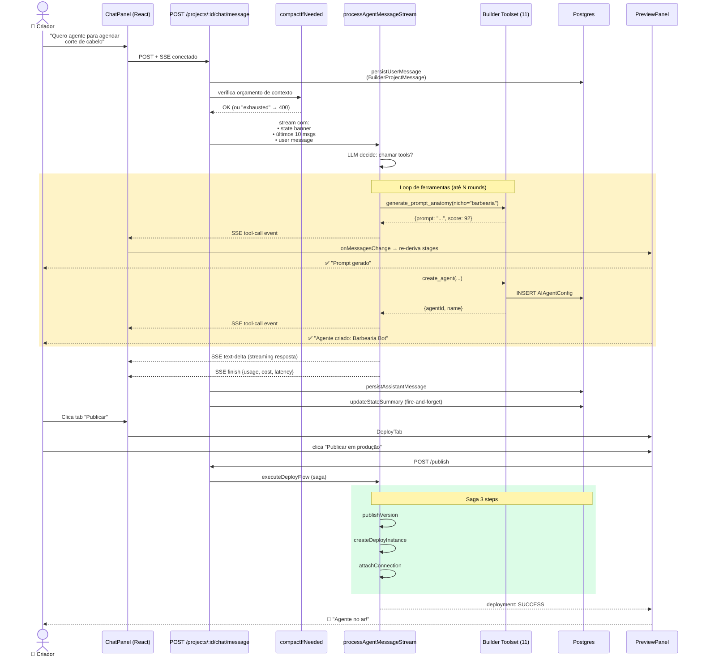
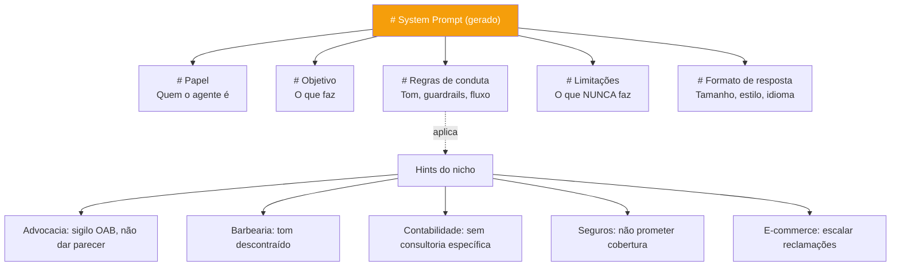
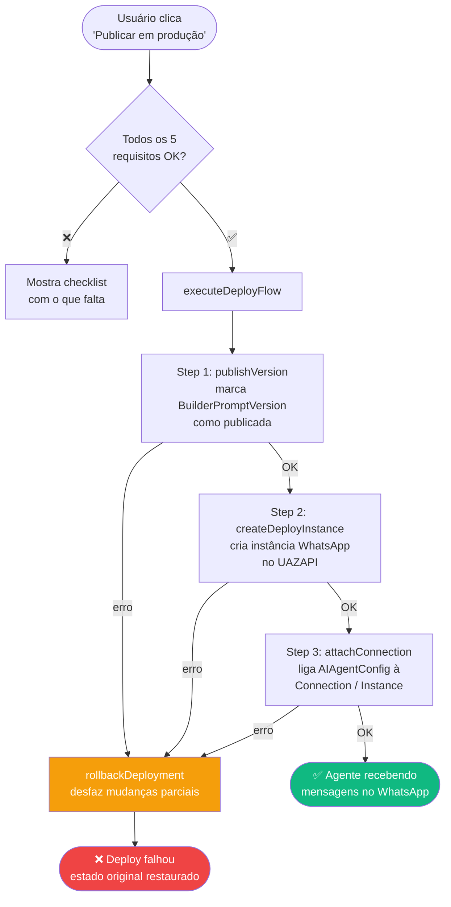
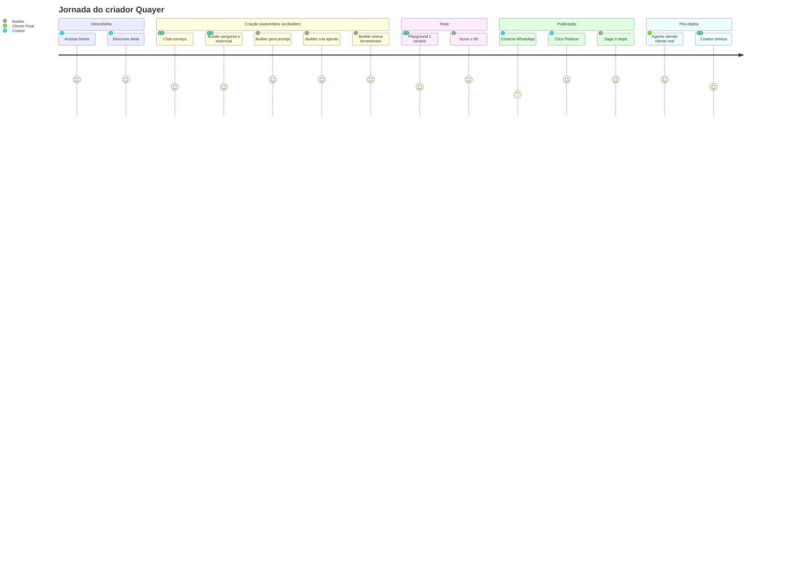

# Builder AI — Jornada Completa (UI + IA)

> Documento visual da jornada do usuário criando um agente WhatsApp no Quayer Builder.
> Cobre **o que o usuário vê (UI)** e **o que a IA faz por baixo (orquestração + tools)**.

**Data:** 2026-04-17
**Fonte de verdade:**
- UI: [src/client/components/projetos/workspace.tsx](../../src/client/components/projetos/workspace.tsx)
- AI: [src/server/ai-module/builder/](../../src/server/ai-module/builder/)
- System prompt: [whatsapp-agent-system-prompt.ts](../../src/server/ai-module/builder/prompts/whatsapp-agent-system-prompt.ts)

---

## 1. Mapa Macro — As 2 Jornadas em Paralelo



**Princípio fundamental:** A Quayer é "Vercel do WhatsApp" — em minutos o criador descreve o que quer, a IA orquestra tudo, e o agente entra no ar.

---

## 2. Jornada UI — Telas e Transições

### 2.1 Fluxo de telas



### 2.2 Layout do Workspace (split 50/50)

```
┌──────────────────────────────────────────────────────────────┐
│  ← Nome do projeto [status-badge]           [toggle] [⋯]     │  ← Header sticky
├────────────────────────────┬─────────────────────────────────┤
│                            │ [Visão] [Prompt] [Playground]   │
│    💬 ChatPanel            │ [Publicar]                       │
│                            │─────────────────────────────────│
│  Mensagens + tool cards    │                                 │
│  (streaming SSE)           │       PreviewPanel              │
│                            │     (tab ativa renderiza)       │
│                            │                                 │
│                            │                                 │
│  ┌──────────────────────┐  │                                 │
│  │ textarea + 🎤 + 🚀  │  │                                 │
│  └──────────────────────┘  │                                 │
└────────────────────────────┴─────────────────────────────────┘
       50% (esquerda)                50% (direita)
```

### 2.3 As 4 tabs do PreviewPanel

| Tab | Arquivo | O que mostra | Ação principal |
|---|---|---|---|
| **Visão geral** | [overview-tab.tsx](../../src/client/components/projetos/preview/tabs/overview/overview-tab.tsx) | Mission control: stages dinâmicos derivados de tool calls + readiness checklist + métricas | Checar progresso |
| **Prompt** | [prompt-tab.tsx](../../src/client/components/projetos/preview/tabs/prompt/prompt-tab.tsx) | Editor do system prompt + insights + histórico de versões | Editar prompt manualmente |
| **Playground** | [playground-tab.tsx](../../src/client/components/projetos/tabs/playground-tab.tsx) | Simulador de conversas + cenários de teste | Testar antes de publicar |
| **Publicar** | [deploy-tab.tsx](../../src/client/components/projetos/preview/tabs/deploy/deploy-tab.tsx) | Wizard 3 steps: checklist → publish → summary | Deploy em produção |

### 2.4 Estados visuais do Overview



---

## 3. Jornada IA — O Builder Meta-Agent

### 3.1 Quem é o Builder?

O Builder **não é** outro LLM separado. É um **meta-agente reservado** (`__quayer_builder__`) dentro do mesmo runtime de agentes do Quayer. Ele recebe o prompt do usuário, detecta a persona, e orquestra os **11 tools do Builder** para montar o agente final.

**Arquivo chave:** [src/server/ai-module/builder/prompts/whatsapp-agent-system-prompt.ts](../../src/server/ai-module/builder/prompts/whatsapp-agent-system-prompt.ts)

### 3.2 As 3 personas que o Builder detecta

```mermaid
flowchart TD
    Start[Mensagem do usuário chega] --> Detect{Analisa sinais}
    Detect -->|"API", "terminal", "Claude Code"| Dev[PERSONA DEV<br/>Tom: técnico, direto]
    Detect -->|"clientes", "agência", "white-label"| Agency[PERSONA AGÊNCIA<br/>Tom: consultivo, ROI]
    Detect -->|"seguidores", "curso", "recorrência"| Influencer[PERSONA INFLUENCER<br/>Tom: simples, sem jargão]
    Detect -->|Ambíguo| Ask[Pergunta explícita<br/>"Para você, cliente<br/>ou audiência?"]

    Dev --> Flow[Executa Fluxo 7 Etapas]
    Agency --> Flow
    Influencer --> Flow
    Ask --> Flow
```

### 3.3 O fluxo de 7 etapas (interno, orquestrado pelo Builder)



**Princípios do Builder (do system prompt):**
1. Uma pergunta por vez.
2. Assume defaults razoáveis — confirma depois.
3. Experiência "Manus-style" — uma frase do criador → agente pronto.
4. **Aprovação explícita** antes de criar.
5. Instagram e campanhas em massa → "está no roadmap".

### 3.4 Os 11 tools do Builder (mapa completo)

| Tool | Etapa | O que faz | Visível no Overview |
|---|---|---|---|
| `search_web` | 1-2 | Pesquisa nicho / concorrentes | ❌ |
| `generate_prompt_anatomy` | 5 | Gera prompt (Papel, Objetivo, Regras, Limitações, Formato) | ✅ "Prompt gerado" |
| `create_agent` | 6 | Cria AIAgentConfig no banco | ✅ "Agente criado" |
| `update_agent_prompt` | 6 | Atualiza prompt existente | ✅ "Prompt atualizado" |
| `attach_tool_to_agent` | 6 | Anexa tool built-in (transfer_to_human, create_lead…) | ✅ "Ferramenta configurada" |
| `create_custom_tool` | 6 | Cria tool customizada via webhook | ✅ "Ferramenta customizada criada" |
| `list_whatsapp_instances` | 7 | Lista instâncias WhatsApp da org | ✅ "Canais consultados" |
| `create_whatsapp_instance` | 7 | Cria nova instância UAZAPI | ✅ "Canal WhatsApp conectado" |
| `run_playground_test` | 7 | Executa cenário de teste | ✅ "Teste executado" |
| `get_agent_status` | 7 | Verifica blockers (plano, BYOK, canal) | ❌ |
| `publish_agent` | 7 | Publica (ativa produção) | ✅ "Agente publicado" |

**Fonte:** [TOOL_STAGE_MAP](../../src/client/components/projetos/preview/tabs/overview/helpers/tool-stage-map.ts) — mapeia tool → label mostrado no Overview.

---

## 4. Fluxo Completo — UI ↔ IA em uma sequência



**Observações:**
- Cada `tool-call` recebido no frontend atualiza `liveMessages` → `deriveStagesFromMessages` re-executa → Overview mostra novo stage.
- O state banner (`stateSummary`) é um resumo em linguagem natural do projeto atual, injetado antes do histórico para o Builder "lembrar" mesmo quando a janela de contexto comprime.
- A saga de deploy tem **rollback automático** se qualquer step falhar ([rollback.handler.ts](../../src/server/ai-module/builder/deploy/rollback.handler.ts)).

---

## 5. Anatomia do Prompt Final (o que o Builder gera)

O Builder **nunca mostra o prompt completo** ao usuário por padrão. Ele mostra só um resumo. Mas a estrutura obrigatória é:



Validadores (executados automaticamente no `generate_prompt_anatomy`):
- **Blacklist** — palavras proibidas por nicho ([blacklist.ts](../../src/server/ai-module/builder/validators/blacklist.ts))
- **Ambiguity** — detecta instruções vagas ([ambiguity.ts](../../src/server/ai-module/builder/validators/ambiguity.ts))
- **Journey** — verifica se cobre fluxo esperado ([journey.ts](../../src/server/ai-module/builder/validators/journey.ts))
- **WhatsApp Prompt Anatomy** — valida as 5 seções ([whatsapp-prompt-anatomy.ts](../../src/server/ai-module/builder/validators/whatsapp-prompt-anatomy.ts))

---

## 6. Deploy Saga — Da conversa ao WhatsApp em produção



**Arquivo:** [deploy-flow.orchestrator.ts](../../src/server/ai-module/builder/deploy/deploy-flow.orchestrator.ts)

**Requisitos pré-deploy (checklist no ConnectionStep):**
1. ✅ Agente criado (`project.aiAgent !== null`)
2. ✅ Prompt configurado (>50 caracteres)
3. ✅ Canal WhatsApp conectado (`create_whatsapp_instance` executado)
4. ⏳ Plano ativo (ainda não wired)
5. ⏳ BYOK configurado (ainda não wired)

---

## 7. O que o criador VÊ vs o que acontece

| Momento | O que o criador vê (UI) | O que está rodando (IA) |
|---|---|---|
| Digita "quero bot de barbearia" | Bubble de chat + spinner | `persistUserMessage` → `buildAugmentedMessageContent` |
| Primeira resposta aparece | Texto em streaming (typewriter) | `processAgentMessageStream` emite `text-delta` |
| Card "🔧 Gerando prompt..." | Tool card laranja com loading | `generate_prompt_anatomy` executando |
| Card muda para "✅ Prompt gerado" | Resultado resumido | Validadores (blacklist, ambiguity, journey) OK |
| Overview acende "Agente criado" | Stage verde aparece | `create_agent` retornou + `deriveStagesFromMessages` |
| Checklist 3/5 no Publicar | Itens marcados | `deriveChecklist` lê `project.aiAgent` + tool calls |
| Clica "Publicar" | Modal de confirmação | Aguardando ação humana |
| "🚀 Agente no ar!" | SuccessCard celebra | Saga 3 steps concluída |

---

## 8. TL;DR visual — Uma frase → WhatsApp



---

## 9. Gaps conhecidos (backlog)

Baseado no código:
- `prompt-tab.tsx` tem TODO: wire `POST /api/v1/builder/projects/:id/rename`
- Deep-linking de tabs ainda não é feito (local state, não URL)
- Checklist de "Plano ativo" e "BYOK configurado" ainda `met: false` hard-coded em [derive-readiness.ts](../../src/client/components/projetos/preview/tabs/overview/helpers/derive-readiness.ts)
- Histórico de versões no Deploy Tab carrega vazio (`setVersions([])` stub)
- `agent-cloner` (v1.5) e Instagram/campanhas (v2) — roadmap

---

## Referências no código

- **Workspace shell:** [workspace.tsx](../../src/client/components/projetos/workspace.tsx)
- **Chat SSE (frontend):** [use-chat-stream.ts](../../src/client/components/projetos/chat/hooks/use-chat-stream.ts)
- **Chat route (backend):** [chat.routes.ts](../../src/server/ai-module/builder/chat/chat.routes.ts)
- **Stream handler:** [stream-agent-response.ts](../../src/server/ai-module/builder/chat/handlers/stream-agent-response.ts)
- **System prompt:** [whatsapp-agent-system-prompt.ts](../../src/server/ai-module/builder/prompts/whatsapp-agent-system-prompt.ts)
- **Tools registry:** [tools/index.ts](../../src/server/ai-module/builder/tools/index.ts)
- **Deploy saga:** [deploy-flow.orchestrator.ts](../../src/server/ai-module/builder/deploy/deploy-flow.orchestrator.ts)
- **Stage derivation:** [derive-stages.ts](../../src/client/components/projetos/preview/tabs/overview/helpers/derive-stages.ts)
- **Arquitetura existente:** [BUILDER_AGENT_ARCHITECTURE.md](./BUILDER_AGENT_ARCHITECTURE.md)
