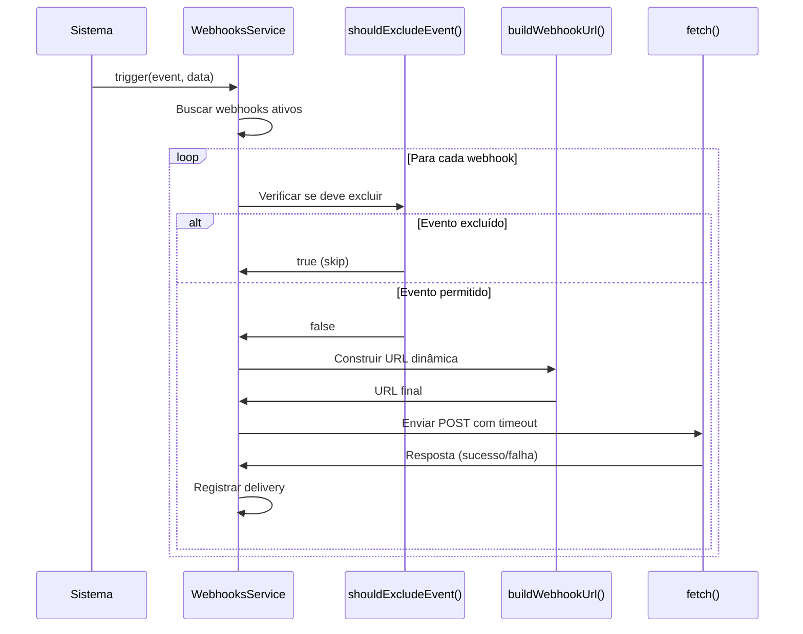

# Sistema de Webhooks Avançado - Implementação Completa

## 📋 Resumo Executivo

O sistema de webhooks foi completamente reformulado com **filtros avançados**, **construção dinâmica de URL** e **configurações de retry personalizáveis**, inspirado nas melhores práticas do UAZ API.

---

## ✅ Novas Funcionalidades Implementadas

### 1. Filtros Avançados de Eventos

#### `excludeMessages` - Excluir Mensagens
- **Tipo:** `boolean`
- **Default:** `false`
- **Descrição:** Exclui TODOS os eventos de mensagem (`message.*`) do webhook
- **Uso:** Útil quando você quer receber apenas eventos de instância/sessão

```json
{
  "url": "https://meu-servidor.com/webhook",
  "events": ["*"],
  "excludeMessages": true  // Não receberá message.received, message.sent, etc.
}
```

#### `addUrlEvents` - Adicionar Evento na URL
- **Tipo:** `boolean`
- **Default:** `false`
- **Descrição:** Adiciona o nome do evento como query parameter na URL
- **Uso:** Facilita roteamento no servidor receptor

```json
{
  "url": "https://meu-servidor.com/webhook",
  "events": ["message.received", "instance.status"],
  "addUrlEvents": true
}
```

**Resultado:**
- `https://meu-servidor.com/webhook?event=message.received`
- `https://meu-servidor.com/webhook?event=instance.status`

#### `addUrlTypesMessages` - Filtrar Tipos de Mensagem
- **Tipo:** `string[]`
- **Default:** `[]`
- **Descrição:** Filtra mensagens por tipo e adiciona à URL
- **Tipos suportados:** `text`, `image`, `audio`, `video`, `document`, `location`, `contact`, `list`, `buttons`

```json
{
  "url": "https://meu-servidor.com/webhook",
  "events": ["message.received"],
  "addUrlTypesMessages": ["text", "image"]  // Apenas mensagens de texto e imagem
}
```

**Resultado:**
- Mensagem de texto: `https://meu-servidor.com/webhook?messageType=text`
- Mensagem de imagem: `https://meu-servidor.com/webhook?messageType=image`
- Mensagem de áudio: ❌ **Não será enviada**

---

### 2. Path Parameters Dinâmicos

#### `pathParams` - Substituição de Placeholders
- **Tipo:** `JSON object`
- **Default:** `null`
- **Descrição:** Substitui `{placeholders}` na URL com valores dinâmicos

```json
{
  "url": "https://meu-servidor.com/webhook/{organizationId}/{instanceId}",
  "pathParams": {
    "organizationId": "uuid-da-org",
    "instanceId": "uuid-da-instancia"
  }
}
```

**Resultado:**
```
https://meu-servidor.com/webhook/uuid-da-org/uuid-da-instancia
```

**Casos de Uso:**
- URLs multi-tenant
- Roteamento baseado em contexto
- Integração com APIs REST que exigem IDs na URL

---

### 3. Configurações de Retry Personalizáveis

#### `maxRetries` - Máximo de Tentativas
- **Tipo:** `number`
- **Range:** `0-10`
- **Default:** `3`
- **Descrição:** Número máximo de tentativas em caso de falha

#### `retryDelay` - Intervalo entre Retries
- **Tipo:** `number` (milliseconds)
- **Range:** `1000-60000ms` (1-60 segundos)
- **Default:** `5000ms` (5 segundos)
- **Descrição:** Tempo de espera entre cada tentativa

#### `timeout` - Timeout por Request
- **Tipo:** `number` (milliseconds)
- **Range:** `5000-120000ms` (5-120 segundos)
- **Default:** `30000ms` (30 segundos)
- **Descrição:** Tempo máximo para aguardar resposta do webhook

```json
{
  "url": "https://meu-servidor.com/webhook",
  "events": ["message.received"],
  "maxRetries": 5,
  "retryDelay": 10000,  // 10 segundos entre tentativas
  "timeout": 60000      // 60 segundos de timeout
}
```

---

## 🔧 Implementação Técnica

### Arquivos Modificados

#### 1. **Prisma Schema** (`prisma/schema.prisma`)
```prisma
model Webhook {
  // Campos existentes...

  // NOVOS: Filtros avançados
  excludeMessages       Boolean  @default(false)
  addUrlEvents          Boolean  @default(false)
  addUrlTypesMessages   String[] @default([])
  pathParams            Json?

  // NOVOS: Retry configuration
  maxRetries     Int      @default(3)
  retryDelay     Int      @default(5000)
  timeout        Int      @default(30000)
}
```

#### 2. **Webhook Schemas** (`webhooks.schemas.ts`)
```typescript
export const createWebhookSchema = z.object({
  // Campos existentes...

  // NOVOS: Filtros avançados
  excludeMessages: z.boolean().optional().default(false),
  addUrlEvents: z.boolean().optional().default(false),
  addUrlTypesMessages: z.array(
    z.enum(['text', 'image', 'audio', 'video', 'document', 'location', 'contact', 'list', 'buttons'])
  ).optional().default([]),
  pathParams: z.record(z.string()).optional(),

  // NOVOS: Configurações de retry
  maxRetries: z.number().int().min(0).max(10).optional().default(3),
  retryDelay: z.number().int().min(1000).max(60000).optional().default(5000),
  timeout: z.number().int().min(5000).max(120000).optional().default(30000),
});
```

#### 3. **Webhook Service** (`webhooks.service.ts`)

**Novos Métodos:**

##### `buildWebhookUrl()` - Construção Dinâmica de URL
```typescript
private buildWebhookUrl(
  baseUrl: string,
  event: string,
  data: any,
  pathParams?: any,
  addUrlEvents?: boolean,
  addUrlTypesMessages?: string[]
): string
```

**Funcionalidades:**
- Substitui `{placeholders}` com valores de `pathParams`
- Adiciona `?event=nome_do_evento` se `addUrlEvents = true`
- Adiciona `?messageType=tipo` se aplicável

##### `shouldExcludeEvent()` - Filtro de Eventos
```typescript
private shouldExcludeEvent(
  event: string,
  data: any,
  excludeMessages: boolean,
  addUrlTypesMessages?: string[]
): boolean
```

**Lógica:**
- Retorna `true` se evento deve ser excluído
- Verifica `excludeMessages` para eventos `message.*`
- Filtra por tipo de mensagem se `addUrlTypesMessages` configurado

---

## 📊 Exemplos de Uso Completos

### Exemplo 1: Webhook para Apenas Imagens e Vídeos

```json
POST /api/v1/webhooks
{
  "url": "https://meu-servidor.com/media-webhook",
  "events": ["message.received"],
  "organizationId": "uuid-da-org",
  "addUrlTypesMessages": ["image", "video"],
  "addUrlEvents": true,
  "maxRetries": 5,
  "timeout": 45000
}
```

**Comportamento:**
- ✅ Mensagem de imagem → `POST https://meu-servidor.com/media-webhook?event=message.received&messageType=image`
- ✅ Mensagem de vídeo → `POST https://meu-servidor.com/media-webhook?event=message.received&messageType=video`
- ❌ Mensagem de texto → **Ignorada**
- ❌ Mensagem de áudio → **Ignorada**

---

### Exemplo 2: Webhook Multi-Tenant com Path Params

```json
POST /api/v1/webhooks
{
  "url": "https://api.exemplo.com/tenants/{tenantId}/webhooks/{hookType}",
  "events": ["message.received", "instance.status"],
  "organizationId": "uuid-da-org",
  "pathParams": {
    "tenantId": "cliente-123",
    "hookType": "whatsapp"
  },
  "excludeMessages": false
}
```

**Comportamento:**
- Evento `message.received`:
  ```
  POST https://api.exemplo.com/tenants/cliente-123/webhooks/whatsapp
  ```
- Evento `instance.status`:
  ```
  POST https://api.exemplo.com/tenants/cliente-123/webhooks/whatsapp
  ```

---

### Exemplo 3: Webhook Apenas para Status (Sem Mensagens)

```json
POST /api/v1/webhooks
{
  "url": "https://meu-servidor.com/status-updates",
  "events": ["*"],
  "organizationId": "uuid-da-org",
  "excludeMessages": true,
  "maxRetries": 3,
  "retryDelay": 10000
}
```

**Comportamento:**
- ✅ `instance.status` → Enviado
- ✅ `session.created` → Enviado
- ✅ `connection.update` → Enviado
- ❌ `message.received` → **Ignorado**
- ❌ `message.sent` → **Ignorado**

---

## 🔄 Fluxo de Processamento de Webhook



---

## 📈 Comparação: Antes vs Depois

| Feature | Antes | Depois |
|---------|-------|--------|
| **Filtro de Mensagens** | ❌ | ✅ `excludeMessages` |
| **Filtro por Tipo** | ❌ | ✅ `addUrlTypesMessages` |
| **URL Dinâmica** | ❌ | ✅ `pathParams` |
| **Evento na URL** | ❌ | ✅ `addUrlEvents` |
| **Retry Configurável** | ✅ Fixo (3x) | ✅ `maxRetries` (0-10) |
| **Delay Configurável** | ✅ Fixo (5s) | ✅ `retryDelay` (1-60s) |
| **Timeout Configurável** | ✅ Fixo (30s) | ✅ `timeout` (5-120s) |

---

## 🚀 Benefícios

### 1. **Redução de Tráfego**
- Filtre apenas eventos relevantes
- Economize banda e processamento

### 2. **Roteamento Flexível**
- URLs dinâmicas com path params
- Query parameters para fácil roteamento

### 3. **Resiliência**
- Retries configuráveis por webhook
- Timeouts ajustáveis para APIs lentas

### 4. **Multi-Tenancy**
- Path params para URLs multi-tenant
- Filtros por organização/instância

### 5. **Compatibilidade UAZ**
- Inspirado nas melhores práticas do UAZ API
- Fácil migração de outros sistemas

---

## 📝 Campos do Schema Prisma Atualizados

```prisma
model Webhook {
  id                    String   @id @default(uuid())
  url                   String
  events                String[]
  description           String?
  secret                String?
  isActive              Boolean  @default(true)
  instanceId            String?
  organizationId        String?

  // 🆕 NOVOS CAMPOS
  excludeMessages       Boolean  @default(false)
  addUrlEvents          Boolean  @default(false)
  addUrlTypesMessages   String[] @default([])
  pathParams            Json?
  maxRetries            Int      @default(3)
  retryDelay            Int      @default(5000)
  timeout               Int      @default(30000)

  createdAt             DateTime @default(now())
  updatedAt             DateTime @updatedAt

  instance              Instance?         @relation(fields: [instanceId], references: [id], onDelete: Cascade)
  organization          Organization?     @relation(fields: [organizationId], references: [id], onDelete: Cascade)
  deliveries            WebhookDelivery[]

  @@index([instanceId])
  @@index([organizationId])
  @@index([isActive])
}
```

---

## 🎯 Casos de Uso Reais

### Caso 1: Sistema de Notificações
**Necessidade:** Receber apenas mensagens de texto para notificações SMS.

```json
{
  "url": "https://notificacoes.com/webhook",
  "events": ["message.received"],
  "addUrlTypesMessages": ["text"],
  "excludeMessages": false
}
```

### Caso 2: Dashboard de Monitoramento
**Necessidade:** Monitorar apenas status de instâncias, sem mensagens.

```json
{
  "url": "https://dashboard.com/status",
  "events": ["*"],
  "excludeMessages": true
}
```

### Caso 3: API Multi-Tenant
**Necessidade:** Rotear webhooks para endpoints específicos por cliente.

```json
{
  "url": "https://api.com/clients/{clientId}/events",
  "pathParams": {
    "clientId": "cliente-abc-123"
  },
  "events": ["*"]
}
```

---

## ✅ Conclusão

O sistema de webhooks agora oferece:
- ✅ **7 novos campos** de configuração
- ✅ **Filtros avançados** inspirados em UAZ API
- ✅ **URLs dinâmicas** com placeholders
- ✅ **Retries personalizáveis** por webhook
- ✅ **Compatibilidade total** com sistema existente
- ✅ **Backwards compatible** - campos opcionais com defaults

**Total de melhorias:** 7 novos campos + 2 novos métodos de service

---

**Data:** 2025-10-16
**Versão:** 2.0.0
**Status:** ✅ Implementação Completa
