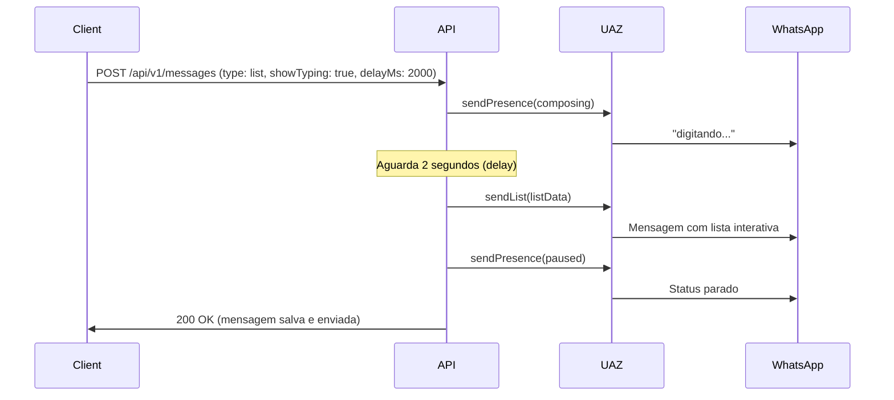

# Implementação Avançada - Sistema de Mensagens e Real-time

## 📋 Resumo Executivo

Este documento detalha as implementações avançadas realizadas no sistema, incluindo **mensagens interativas**, **efeitos de digitação**, **delays configuráveis**, e **Server-Sent Events (SSE)** para streaming de dados em tempo real.

---

## ✅ Funcionalidades Implementadas

### 1. Mensagens Interativas (Botões e Listas)

#### 📦 Tipos de Mensagem Suportados

O sistema agora suporta os seguintes tipos de mensagens interativas do WhatsApp:

- **`list`**: Mensagens com menu de lista interativo
- **`buttons`**: Mensagens com botões de ação
- **`location`**: Compartilhamento de localização
- **`contact`**: Compartilhamento de contato

#### 🔧 Implementação

**Arquivo:** `src/lib/uaz/uaz.service.ts`

```typescript
// Novos DTOs para mensagens interativas
export interface SendListDto {
  number: string;
  title: string;
  description?: string;
  buttonText: string;
  footerText?: string;
  sections: Array<{
    title: string;
    rows: Array<{
      id: string;
      title: string;
      description?: string;
    }>;
  }>;
}

export interface SendButtonsDto {
  number: string;
  text: string;
  buttons: Array<{
    id: string;
    text: string;
  }>;
  footerText?: string;
}

// Novos métodos UAZ Service
async sendList(token: string, data: SendListDto)
async sendButtons(token: string, data: SendButtonsDto)
async sendLocation(token: string, data: SendLocationDto)
async sendContact(token: string, data: SendContactDto)
```

**Arquivo:** `src/features/messages/controllers/messages.controller.ts`

```typescript
// Schema atualizado
body: z.object({
  sessionId: z.string().uuid(),
  type: z.enum([
    'text', 'image', 'audio', 'video', 'document',
    'location', 'contact', 'list', 'buttons'  // NOVOS
  ]),
  // ... outros campos ...
  interactiveData: z.any().optional(),  // Dados para listas/botões
})
```

#### 📝 Exemplo de Uso

```json
// POST /api/v1/messages
{
  "sessionId": "uuid-da-sessao",
  "type": "list",
  "content": "Escolha uma opção:",
  "interactiveData": {
    "title": "Menu Principal",
    "description": "Selecione uma das opções abaixo",
    "buttonText": "Ver opções",
    "sections": [
      {
        "title": "Serviços",
        "rows": [
          {
            "id": "opt1",
            "title": "Atendimento",
            "description": "Falar com atendente"
          },
          {
            "id": "opt2",
            "title": "Suporte",
            "description": "Suporte técnico"
          }
        ]
      }
    ]
  }
}
```

---

### 2. Efeito "Digitando..." (Typing Indicator)

#### 🔧 Implementação

**Arquivo:** `src/lib/uaz/uaz.service.ts`

```typescript
/**
 * Atualizar presença (status de digitação)
 * @param status - 'composing' para digitando, 'paused' para parado
 */
async sendPresence(
  token: string,
  number: string,
  status: 'composing' | 'paused' | 'recording' | 'available' | 'unavailable'
)
```

**Arquivo:** `src/features/messages/controllers/messages.controller.ts`

```typescript
// Schema atualizado
showTyping: z.boolean().optional().default(false)

// Lógica de envio
if (showTyping) {
  await uazService.sendPresence(uazToken, phoneNumber, 'composing');
}

// ... envio da mensagem ...

if (showTyping) {
  await uazService.sendPresence(uazToken, phoneNumber, 'paused');
}
```

#### 📝 Exemplo de Uso

```json
// POST /api/v1/messages
{
  "sessionId": "uuid-da-sessao",
  "type": "text",
  "content": "Olá! Como posso ajudar?",
  "showTyping": true,  // Mostra "digitando..." antes de enviar
  "delayMs": 2000      // Delay de 2 segundos
}
```

---

### 3. Delay Configurável no Envio de Mensagens

#### 🔧 Implementação

**Arquivo:** `src/features/messages/controllers/messages.controller.ts`

```typescript
// Schema atualizado
delayMs: z.number().int().min(0).max(30000).optional().default(0)

// Lógica de delay
if (delayMs > 0) {
  await new Promise(resolve => setTimeout(resolve, delayMs));
}
```

#### 📊 Especificações

- **Range**: 0 a 30.000 milissegundos (0-30 segundos)
- **Default**: 0 (sem delay)
- **Uso**: Simular comportamento humano, criar intervalos entre mensagens

#### 📝 Exemplo de Uso

```json
{
  "sessionId": "uuid-da-sessao",
  "type": "text",
  "content": "Mensagem com delay",
  "delayMs": 5000,      // 5 segundos de espera
  "showTyping": true    // Combinar com typing para efeito realista
}
```

---

### 4. Server-Sent Events (SSE) para Real-time

#### 🔧 Implementação

**Novo Controller:** `src/features/sse/controllers/sse.controller.ts`

#### 📡 Endpoints SSE Disponíveis

##### 1. Stream por Instância
```
GET /api/v1/sse/instance/:instanceId
```

Conecta ao stream de eventos de uma instância específica.

**Eventos emitidos:**
- `connected`: Confirmação de conexão
- `heartbeat`: Mantém conexão viva (a cada 30s)
- `message.received`: Nova mensagem recebida
- `message.sent`: Mensagem enviada
- `session.updated`: Status da sessão atualizado
- `instance.status`: Status da instância mudou

##### 2. Stream por Organização
```
GET /api/v1/sse/organization/:organizationId
```

Conecta ao stream de eventos de toda a organização.

##### 3. Stream por Sessão
```
GET /api/v1/sse/session/:sessionId
```

Conecta ao stream de eventos de uma sessão específica.

#### 🔒 Autenticação

Todos os endpoints SSE requerem autenticação via Bearer token:

```javascript
const eventSource = new EventSource(
  '/api/v1/sse/instance/uuid-da-instancia',
  {
    headers: {
      'Authorization': `Bearer ${accessToken}`
    }
  }
);

eventSource.addEventListener('message.received', (event) => {
  const data = JSON.parse(event.data);
  console.log('Nova mensagem:', data);
});

eventSource.addEventListener('heartbeat', (event) => {
  console.log('Conexão ativa:', event.data);
});
```

#### 📊 Formato dos Eventos

```
event: message.received
data: {"messageId": "uuid", "content": "Nova mensagem", "timestamp": "2025-10-16T..."}

event: heartbeat
data: {"timestamp": "2025-10-16T..."}
```

#### ⚠️ Observações

- **Heartbeat**: Intervalo de 30 segundos para manter conexão ativa
- **Cleanup**: Conexão é fechada automaticamente quando o cliente desconecta
- **Headers**: Configurados para compatibilidade com Nginx (`X-Accel-Buffering: no`)
- **Integração Redis**: Preparado para integração com Redis Pub/Sub quando disponível

---

## 🚀 Rotas Adicionadas ao Sistema

### Novas Rotas Registradas

O sistema agora possui as seguintes novas rotas:

```
GET  /api/v1/sse/instance/:instanceId       - Stream SSE por instância
GET  /api/v1/sse/organization/:organizationId - Stream SSE por organização
GET  /api/v1/sse/session/:sessionId          - Stream SSE por sessão
```

### Rotas de Mensagens Atualizadas

```
POST /api/v1/messages  - Criar e enviar mensagem
  ✅ Suporte a mensagens interativas (list, buttons, location, contact)
  ✅ Delay configurável (0-30000ms)
  ✅ Efeito "digitando..." (showTyping)
  ✅ Envio automático via WhatsApp ou apenas salvamento no DB
```

---

## 📈 Melhorias de UX/Performance

### 1. Comportamento Humanizado

- **Typing Indicator**: Simula digitação antes de enviar
- **Delays Configuráveis**: Cria intervalos naturais entre mensagens
- **Mensagens Interativas**: Interface rica no WhatsApp

### 2. Real-time

- **SSE**: Atualização instantânea de eventos
- **Heartbeat**: Garante conexão estável
- **Multi-scope**: Eventos por instância, organização ou sessão

### 3. Flexibilidade

- **Envio Opcional**: `sendExternalMessage: false` apenas salva no DB
- **Pause Session**: `pauseSession: true` pausa automaticamente após envio
- **Custom Delays**: Configurável por mensagem

---

## 🔄 Fluxo de Envio de Mensagem Interativa



---

## 🎯 Próximas Implementações

### 1. Melhorias no Sistema de Webhooks ⏳

**Planejado:**
- Suporte a múltiplos webhooks por instância
- Filtros avançados (`excludeMessages`, `addUrlEvents`, `addUrlTypesMessages`)
- Path parameters dinâmicos
- Retry logic com backoff exponencial

### 2. Sistema de Labels/Tags ⏳

**Inspirado no UAZ API:**
- CRUD completo de labels
- Associação de labels a sessões/contatos
- Filtros por labels
- Cores e ícones customizáveis

### 3. Integração Redis Pub/Sub para SSE

**Planejado:**
- Substituir polling por eventos em tempo real
- Escalabilidade horizontal
- Broadcast de eventos entre instâncias

---

## 📊 Estatísticas de Implementação

| Feature | Status | Endpoints | Arquivos Modificados |
|---------|--------|-----------|---------------------|
| Mensagens Interativas | ✅ Completo | 1 | 2 |
| Delay em Mensagens | ✅ Completo | 1 | 1 |
| Efeito Digitando | ✅ Completo | 1 | 2 |
| SSE Real-time | ✅ Completo | 3 | 3 |
| Webhooks Avançados | ⏳ Pendente | - | - |
| Sistema de Labels | ⏳ Pendente | - | - |

---

## 🔍 Arquivos Modificados/Criados

### Modificados
1. `src/lib/uaz/uaz.service.ts` - Novos métodos para mensagens interativas e presença
2. `src/features/messages/controllers/messages.controller.ts` - Schema e lógica atualizados
3. `src/igniter.router.ts` - Registro do novo controller SSE

### Criados
1. `src/features/sse/controllers/sse.controller.ts` - Controller SSE
2. `src/features/sse/index.ts` - Export do controller
3. `IMPLEMENTACAO_AVANCADA_COMPLETA.md` - Esta documentação

---

## 🎉 Conclusão

O sistema agora oferece:
- ✅ Mensagens interativas (botões, listas, localização, contato)
- ✅ Efeito "digitando..." para simular comportamento humano
- ✅ Delays configuráveis (0-30 segundos)
- ✅ Server-Sent Events para atualizações em tempo real
- ✅ 3 novos endpoints SSE (instância, organização, sessão)
- ✅ Compatibilidade total com UAZ API
- ✅ Sistema preparado para escalar com Redis Pub/Sub

**Total de novas rotas:** +3 SSE endpoints
**Tipos de mensagem suportados:** 9 (text, image, audio, video, document, location, contact, list, buttons)

---

**Data:** 2025-10-16
**Versão:** 1.1.0
**Status:** ✅ Implementação Completa
